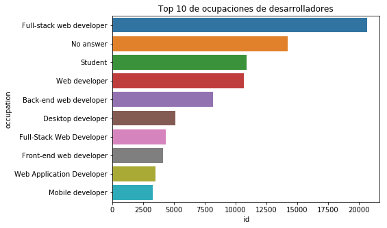
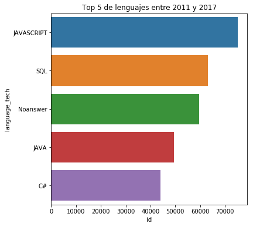

# Trabajo final Sistema de Bases de Datos Masivos

**Universidad Nacional de Colombia**


* Andrés Felipe Toro Quintero

* Sebastian Parrado

* Yair Tadeo Valencia Estupiñan

En este trabajo se demostrará y aplicará los conocimientos adquiridos en el curso de Sistemas de bases de datos masivos, a través del  procesamiento de las  encuestas que Stack Overflow, sitio web ampliamente utilizado por la comunidad de desarrolladores de software, hace a sus usuarios para observar y analizar tendencias en la industria de la tecnología y el software.

Para nuestro propósito utilizaremos 7 conjuntos de datos masivos completamente libres y accesibles a través de BigQuery, de las encuestas desde 2011 a 2017.

## Procedimiento Preliminar

Se cargaron las librerías necesarias para el procesamiento y análisis de las bases de datos. Adicionalmente se incluyó una conexión vía Api con la plataforma de Bigquery, importando las librerias de Google, creando las credenciales y el proyecto que permitieran el ingres a la plataforma, para finalmente hacer el llamado de cada una de las tablas.


```python
# Cargar librerías

import pandas as pd
import numpy as np
import glob
import matplotlib.pyplot as plt
import matplotlib as mpl
from IPython.display import Image
from IPython.core.display import HTML
import seaborn as sns
%matplotlib inline
```


```python
# se importan bigquery y el lector de servicio

from google.cloud import bigquery as bq # importar libreria bigquery
from google.oauth2 import service_account #importar libreria para correr el json de claves
```


```python
# Se indica donde están las credenciales

credentials = service_account.Credentials.from_service_account_file( 'C:/Users/usuario/client_secrets_prueba.json')
```


```python
project_id = 'prueba1-243720' # Se indica el proyecto
```


```python
# Indico como voy a llamar el proyecto con bq

client = bq.Client(credentials= credentials,project=project_id) 
```


```python
# Encuenta 2012

# Correr un comando SQL desde python, llevar a un df la consulta

query_job2011 = client.query("""
SELECT *
FROM `fh-bigquery.stackoverflow.survey_results_2011`
  """)

datos2011 = query_job2011.result()
datos_2011 = datos2011.to_dataframe()
```


```python
# Encuenta 2012

# Correr un comando SQL desde python, llevar a un df la consulta

query_job2012 = client.query("""
SELECT *
FROM `fh-bigquery.stackoverflow.survey_results_2012`
  """)
datos2012 = query_job2012.result()
datos_2012 = datos2012.to_dataframe()
```


```python
# Encuenta 2013

# Correr un comando SQL desde python, llevar a un df la consulta

query_job2013 = client.query("""
SELECT *
FROM `fh-bigquery.stackoverflow.survey_results_2013`
  """)
datos2013 = query_job2013.result()
datos_2013 = datos2013.to_dataframe()
```


```python
# Encuenta 2014

# Correr un comando SQL desde python, llevar a un df la consulta

query_job2014 = client.query("""
SELECT *
FROM `fh-bigquery.stackoverflow.survey_results_2014`
  """)
datos2014 = query_job2014.result()
datos_2014 = datos2014.to_dataframe()
```


```python
# Encuenta 2015

# Correr un comando SQL desde python, llevar a un df la consulta

query_job2015 = client.query("""
SELECT *
FROM `fh-bigquery.stackoverflow.survey_results_2015`
  """)
datos2015 = query_job2015.result()
datos_2015 = datos2015.to_dataframe()
```


```python
# Encuenta 2016

# Correr un comando SQL desde python, llevar a un df la consulta

query_job2016 = client.query("""
SELECT *
FROM `fh-bigquery.stackoverflow.survey_results_2016`
  """)
datos2016 = query_job2016.result()
datos_2016 = datos2016.to_dataframe()
```


```python
# Encuenta 2017

# Correr un comando SQL desde python, llevar a un df la consulta

query_job2017 = client.query("""
SELECT *
FROM `fh-bigquery.stackoverflow.survey_results_public_2017`
  """)
datos2017 = query_job2017.result()
datos_2017 = datos2017.to_dataframe()
```

## Limpieza de Datos

Para Para el proceso de extracción, transformación y carga se hizo un ejercicio inicial de exploración de los datos, con el principal objetivo de identificar los campos comunes entre las encuestas que nos permitieran construir una Bodega de datos homogénea.
Si bien en cada encuesta los campos poseen nombres distintos, su contenido común se puede resumir en las siguientes variables:
* Country: Nombre del país de origen del desarrollador 
* Salary: Contiene el rango salarial devengado por el desarrollador. 
* Occupation: Ocupación del desarrollador al momento de la encuesta
* Job_Satisfaction: Nivel de satisfacción del desarrollador con su actual empleo
* Year Programing Exp: Años de experiencia desarrollando
* Desktop System: Sistemas operativos usados por el desarrollador
* Language Tech: Lenguajes usados por el desarrollador


```python
# 2017

# Tamaño de los datos de 2017

datos_2017.shape
```


    (51392, 154)


```python
# Los encabezados - nombres de columnas del 2017

datos_2017.columns.values
```


    array(['Respondent', 'Professional', 'ProgramHobby', 'Country',
           'University', 'EmploymentStatus', 'FormalEducation',
           'MajorUndergrad', 'HomeRemote', 'CompanySize', 'CompanyType',
           'YearsProgram', 'YearsCodedJob', 'YearsCodedJobPast',
           'DeveloperType', 'WebDeveloperType', 'MobileDeveloperType',
           'NonDeveloperType', 'CareerSatisfaction', 'JobSatisfaction',
           'ExCoderReturn', 'ExCoderNotForMe', 'ExCoderBalance',
           'ExCoder10Years', 'ExCoderBelonged', 'ExCoderSkills',
           'ExCoderWillNotCode', 'ExCoderActive', 'PronounceGIF',
           'ProblemSolving', 'BuildingThings', 'LearningNewTech',
           'BoringDetails', 'JobSecurity', 'DiversityImportant', 'AnnoyingUI',
           'FriendsDevelopers', 'RightWrongWay', 'UnderstandComputers',
           'SeriousWork', 'InvestTimeTools', 'WorkPayCare',
           'KinshipDevelopers', 'ChallengeMyself', 'CompetePeers',
           'ChangeWorld', 'JobSeekingStatus', 'HoursPerWeek', 'LastNewJob',
           'AssessJobIndustry', 'AssessJobRole', 'AssessJobExp',
           'AssessJobDept', 'AssessJobTech', 'AssessJobProjects',
           'AssessJobCompensation', 'AssessJobOffice', 'AssessJobCommute',
           'AssessJobRemote', 'AssessJobLeaders', 'AssessJobProfDevel',
           'AssessJobDiversity', 'AssessJobProduct', 'AssessJobFinances',
           'ImportantBenefits', 'ClickyKeys', 'JobProfile', 'ResumePrompted',
           'LearnedHiring', 'ImportantHiringAlgorithms',
           'ImportantHiringTechExp', 'ImportantHiringCommunication',
           'ImportantHiringOpenSource', 'ImportantHiringPMExp',
           'ImportantHiringCompanies', 'ImportantHiringTitles',
           'ImportantHiringEducation', 'ImportantHiringRep',
           'ImportantHiringGettingThingsDone', 'Currency', 'Overpaid',
           'TabsSpaces', 'EducationImportant', 'EducationTypes',
           'SelfTaughtTypes', 'TimeAfterBootcamp', 'CousinEducation',
           'WorkStart', 'HaveWorkedLanguage', 'WantWorkLanguage',
           'HaveWorkedFramework', 'WantWorkFramework', 'HaveWorkedDatabase',
           'WantWorkDatabase', 'HaveWorkedPlatform', 'WantWorkPlatform',
           'IDE', 'AuditoryEnvironment', 'Methodology', 'VersionControl',
           'CheckInCode', 'ShipIt', 'OtherPeoplesCode', 'ProjectManagement',
           'EnjoyDebugging', 'InTheZone', 'DifficultCommunication',
           'CollaborateRemote', 'MetricAssess', 'EquipmentSatisfiedMonitors',
           'EquipmentSatisfiedCPU', 'EquipmentSatisfiedRAM',
           'EquipmentSatisfiedStorage', 'EquipmentSatisfiedRW',
           'InfluenceInternet', 'InfluenceWorkstation', 'InfluenceHardware',
           'InfluenceServers', 'InfluenceTechStack', 'InfluenceDeptTech',
           'InfluenceVizTools', 'InfluenceDatabase', 'InfluenceCloud',
           'InfluenceConsultants', 'InfluenceRecruitment',
           'InfluenceCommunication', 'StackOverflowDescribes',
           'StackOverflowSatisfaction', 'StackOverflowDevices',
           'StackOverflowFoundAnswer', 'StackOverflowCopiedCode',
           'StackOverflowJobListing', 'StackOverflowCompanyPage',
           'StackOverflowJobSearch', 'StackOverflowNewQuestion',
           'StackOverflowAnswer', 'StackOverflowMetaChat',
           'StackOverflowAdsRelevant', 'StackOverflowAdsDistracting',
           'StackOverflowModeration', 'StackOverflowCommunity',
           'StackOverflowHelpful', 'StackOverflowBetter',
           'StackOverflowWhatDo', 'StackOverflowMakeMoney', 'Gender',
           'HighestEducationParents', 'Race', 'SurveyLong',
           'QuestionsInteresting', 'QuestionsConfusing', 'InterestedAnswers',
           'Salary', 'ExpectedSalary'], dtype=object)


```python
# Agregar nueva variable --> Año: 2017

datos_2017['Year'] = 2017
datos_2017['number'] = np.arange(len(datos_2017))
datos_2017['id'] = datos_2017['number'].map(str) + '_' + datos_2017['Year'].map(str)
```


```python
# Seleccionar variables de interés 2017

datos_2017_bodega = datos_2017[['id', 'Year', 'Country', 'YearsProgram', 'DeveloperType', 'HaveWorkedLanguage',
                                'HaveWorkedPlatform', 'JobSatisfaction', 'Salary']]
```


```python
# Cambiar nombre de columnas 2017

datos_2017_bodega.columns = ['id', 'year', 'country', 'years_programming_exp', 'occupation', 'language_tech','desktop_system',
                             'job_satisfaction', 'salary']
```


```python
# Reemplazar valores "None" y "NA" con Nan

datos_2017_bodega = datos_2017_bodega.replace('NA', np.nan)
datos_2017_bodega = datos_2017_bodega.replace([None], np.nan)
```


```python
# Organizamos variable de Lenguajes de Programación 2017

# Dividimos la columna de lenguaje

datos_2017_bodega[['lang1', 'lang2', 'lang3', 'lang4', 'lang5', 'lang6', 'lang7', 'lang8', 'lang9', 'lang10', 'lang11', 
                   'lang12', 'lang13', 'lang14', 'lang15', 'lang16', 'lang17', 'lang18', 'lang19', 'lang20', 'lang21', 
                   'lang22', 'lang23', 'lang24', 'lang25', 'lang26', 'lang27','lang28', 'lang29', 'lang30', 'lang31', 
                   'lang32', 'lang33', 'lang34', 'lang35']] = datos_2017_bodega['language_tech'].str.split(';', expand = True)

# Eliminamos todas las columnas de ocupación

datos_2017_bodega.drop(datos_2017_bodega[['language_tech']], axis=1, inplace=True)

# Agrupamos todos los valores de ocupaciones

datos_2017_bodega = pd.melt(datos_2017_bodega, 
                            id_vars = ['id', 'year', 'country', 'years_programming_exp', 'job_satisfaction', 
                                       'salary', 'occupation', 'desktop_system'],
                            value_name = 'language_tech').drop('variable',1)

# Eliminamos duplicados

datos_2017_bodega = datos_2017_bodega.drop_duplicates()
```


```python
# Convertir tipo float

datos_2017_bodega['salary'] = datos_2017_bodega['salary'].astype(float)
```


```python
# Creamos rangos salariales necesarios para la unificación final

bins = [0, 20000, 40000, 60000, 80000, 100000, 120000, 140000, 10000000]
labels = ['<$20,000', '$20,000 - $40,000', '$40,000 - $60,000', '$60,000 - $80,000', '$80,000 - $100,000', '$100,000 - $120,000',
         '$120,000 - $140,000', '>$140,000']
datos_2017_bodega['salary'] = pd.cut(datos_2017_bodega['salary'], bins=bins, labels=labels)
```


```python
# Reemplazamos los Nan por 'Not apply'

datos_2017_bodega['salary'] = datos_2017_bodega['salary'].replace(np.nan, 'Not apply', regex=True)
```


```python
# Los primeros 10 datos del 2017

datos_2017_bodega.head(10)
```


<div>
<style scoped>
    .dataframe tbody tr th:only-of-type {
        vertical-align: middle;
    }

    .dataframe tbody tr th {
        vertical-align: top;
    }

    .dataframe thead th {
        text-align: right;
    }
</style>
<table border="1" class="dataframe">
  <thead>
    <tr style="text-align: right;">
      <th></th>
      <th>id</th>
      <th>year</th>
      <th>country</th>
      <th>years_programming_exp</th>
      <th>job_satisfaction</th>
      <th>salary</th>
      <th>occupation</th>
      <th>desktop_system</th>
      <th>language_tech</th>
    </tr>
  </thead>
  <tbody>
    <tr>
      <th>0</th>
      <td>0_2017</td>
      <td>2017</td>
      <td>India</td>
      <td>8 to 9 years</td>
      <td>9</td>
      <td>Not apply</td>
      <td>Web developer; Mobile developer; Machine learn...</td>
      <td>NaN</td>
      <td>NaN</td>
    </tr>
    <tr>
      <th>1</th>
      <td>1_2017</td>
      <td>2017</td>
      <td>India</td>
      <td>Less than a year</td>
      <td>1</td>
      <td>Not apply</td>
      <td>Database administrator</td>
      <td>iOS; Windows Desktop</td>
      <td>SQL</td>
    </tr>
    <tr>
      <th>2</th>
      <td>2_2017</td>
      <td>2017</td>
      <td>United States</td>
      <td>20 or more years</td>
      <td>NaN</td>
      <td>Not apply</td>
      <td>NaN</td>
      <td>NaN</td>
      <td>NaN</td>
    </tr>
    <tr>
      <th>3</th>
      <td>3_2017</td>
      <td>2017</td>
      <td>Pakistan</td>
      <td>3 to 4 years</td>
      <td>NaN</td>
      <td>Not apply</td>
      <td>NaN</td>
      <td>NaN</td>
      <td>NaN</td>
    </tr>
    <tr>
      <th>4</th>
      <td>4_2017</td>
      <td>2017</td>
      <td>India</td>
      <td>3 to 4 years</td>
      <td>6</td>
      <td>Not apply</td>
      <td>Developer with a statistics or mathematics bac...</td>
      <td>NaN</td>
      <td>NaN</td>
    </tr>
    <tr>
      <th>5</th>
      <td>5_2017</td>
      <td>2017</td>
      <td>Finland</td>
      <td>18 to 19 years</td>
      <td>10</td>
      <td>Not apply</td>
      <td>Web developer</td>
      <td>NaN</td>
      <td>NaN</td>
    </tr>
    <tr>
      <th>6</th>
      <td>6_2017</td>
      <td>2017</td>
      <td>Bangladesh</td>
      <td>11 to 12 years</td>
      <td>4</td>
      <td>Not apply</td>
      <td>NaN</td>
      <td>NaN</td>
      <td>NaN</td>
    </tr>
    <tr>
      <th>7</th>
      <td>7_2017</td>
      <td>2017</td>
      <td>Lithuania</td>
      <td>1 to 2 years</td>
      <td>NaN</td>
      <td>Not apply</td>
      <td>NaN</td>
      <td>NaN</td>
      <td>NaN</td>
    </tr>
    <tr>
      <th>8</th>
      <td>8_2017</td>
      <td>2017</td>
      <td>United States</td>
      <td>18 to 19 years</td>
      <td>NaN</td>
      <td>Not apply</td>
      <td>NaN</td>
      <td>NaN</td>
      <td>NaN</td>
    </tr>
    <tr>
      <th>9</th>
      <td>9_2017</td>
      <td>2017</td>
      <td>India</td>
      <td>14 to 15 years</td>
      <td>4</td>
      <td>Not apply</td>
      <td>Machine learning specialist; Developer with a ...</td>
      <td>NaN</td>
      <td>NaN</td>
    </tr>
  </tbody>
</table>
</div>


```python
# 2016

# Tamaño de los datos del 2016

datos_2016.shape
```


    (56030, 66)


```python
# Los encabezados - nombres de columnas del 2016

datos_2016.columns.values
```


    array(['int64_field_0', 'collector', 'country', 'un_subregion',
           'so_region', 'age_range', 'age_midpoint', 'gender',
           'self_identification', 'occupation', 'occupation_group',
           'experience_range', 'experience_midpoint', 'salary_range',
           'salary_midpoint', 'big_mac_index', 'tech_do', 'tech_want',
           'aliens', 'programming_ability', 'employment_status', 'industry',
           'company_size_range', 'team_size_range', 'women_on_team', 'remote',
           'job_satisfaction', 'job_discovery', 'dev_environment',
           'commit_frequency', 'hobby', 'dogs_vs_cats', 'desktop_os',
           'unit_testing', 'rep_range', 'visit_frequency',
           'why_learn_new_tech', 'education', 'open_to_new_job',
           'new_job_value', 'job_search_annoyance', 'interview_likelihood',
           'how_to_improve_interview_process', 'star_wars_vs_star_trek',
           'agree_tech', 'agree_notice', 'agree_problemsolving',
           'agree_diversity', 'agree_adblocker', 'agree_alcohol',
           'agree_loveboss', 'agree_nightcode', 'agree_legacy', 'agree_mars',
           'important_variety', 'important_control', 'important_sameend',
           'important_newtech', 'important_buildnew',
           'important_buildexisting', 'important_promotion',
           'important_companymission', 'important_wfh', 'important_ownoffice',
           'developer_challenges', 'why_stack_overflow'], dtype=object)


```python
# Agregar nueva variable --> Año: 2016

datos_2016['Year'] = 2016
datos_2016['number'] = np.arange(len(datos_2016))
datos_2016['id'] = datos_2016['number'].map(str) + '_' + datos_2016['Year'].map(str)
```


```python
# Seleccionar variables de interés 2016

datos_2016_bodega = datos_2016[['id', 'Year', 'country', 'experience_range', 'occupation', 'tech_do', 'desktop_os', 
                             'job_satisfaction', 'salary_range']]
```


```python
# Cambiar nombre de columnas 2016

datos_2016_bodega.columns = ['id', 'year', 'country', 'years_programming_exp', 'occupation', 'language_tech','desktop_system',
                             'job_satisfaction', 'salary']
```


```python
# Reemplazar valores "None" y "NA" con Nan

datos_2016_bodega = datos_2016_bodega.replace('NA', np.nan)
datos_2016_bodega = datos_2016_bodega.replace([None], np.nan)
datos_2016_bodega = datos_2016_bodega.replace(np.nan, 'No answer', regex=True)
```


```python
## Organizamos variable de Lenguajes de Programación 2016

# Dividimos la columna de lenguaje

datos_2016_bodega[['lang1', 'lang2', 'lang3', 'lang4', 'lang5', 'lang6', 'lang7', 'lang8', 'lang9', 'lang10', 'lang11', 
                   'lang12', 'lang13', 'lang14', 'lang15', 'lang16', 'lang17', 'lang18', 'lang19', 'lang20', 'lang21', 
                   'lang22', 'lang23', 'lang24', 'lang25', 'lang26', 'lang27','lang28', 'lang29', 'lang30', 'lang31', 
                   'lang32', 'lang33', 'lang34', 'lang35', 'lang36', 'lang37', 'lang38', 'lang39', 'lang40', 'lang41', 
                   'lang42']] = datos_2016_bodega['language_tech'].str.split(';', expand = True)

# Eliminamos todas las columnas de ocupación

datos_2016_bodega.drop(datos_2016_bodega[['language_tech']], axis=1, inplace=True)

# Agrupamos todos los valores de ocupaciones

datos_2016_bodega = pd.melt(datos_2016_bodega, 
                            id_vars = ['id', 'year', 'country', 'years_programming_exp', 'job_satisfaction', 
                                       'salary', 'occupation', 'desktop_system'],
                            value_name = 'language_tech').drop('variable',1)
                    
# Eliminamos duplicados

datos_2016_bodega = datos_2016_bodega.drop_duplicates()
```


```python
# Los primeros 10 datos del 2016

datos_2016_bodega.head(10)
```


<div>
<style scoped>
    .dataframe tbody tr th:only-of-type {
        vertical-align: middle;
    }

    .dataframe tbody tr th {
        vertical-align: top;
    }

    .dataframe thead th {
        text-align: right;
    }
</style>
<table border="1" class="dataframe">
  <thead>
    <tr style="text-align: right;">
      <th></th>
      <th>id</th>
      <th>year</th>
      <th>country</th>
      <th>years_programming_exp</th>
      <th>job_satisfaction</th>
      <th>salary</th>
      <th>occupation</th>
      <th>desktop_system</th>
      <th>language_tech</th>
    </tr>
  </thead>
  <tbody>
    <tr>
      <th>0</th>
      <td>0_2016</td>
      <td>2016</td>
      <td>United Kingdom</td>
      <td>11+ years</td>
      <td>No answer</td>
      <td>Less than $10,000</td>
      <td>Executive (VP of Eng., CTO, CIO, etc.)</td>
      <td>Ubuntu</td>
      <td>Ruby</td>
    </tr>
    <tr>
      <th>1</th>
      <td>1_2016</td>
      <td>2016</td>
      <td>United Kingdom</td>
      <td>11+ years</td>
      <td>No answer</td>
      <td>Rather not say</td>
      <td>other</td>
      <td>Ubuntu</td>
      <td>Go</td>
    </tr>
    <tr>
      <th>2</th>
      <td>2_2016</td>
      <td>2016</td>
      <td>United Kingdom</td>
      <td>6 - 10 years</td>
      <td>No answer</td>
      <td>$60,000 - $70,000</td>
      <td>Enterprise level services developer</td>
      <td>No answer</td>
      <td>Clojure</td>
    </tr>
    <tr>
      <th>3</th>
      <td>3_2016</td>
      <td>2016</td>
      <td>Sweden</td>
      <td>11+ years</td>
      <td>No answer</td>
      <td>No answer</td>
      <td>Student</td>
      <td>Other Linux</td>
      <td>C</td>
    </tr>
    <tr>
      <th>4</th>
      <td>4_2016</td>
      <td>2016</td>
      <td>United States</td>
      <td>Less than 1 year</td>
      <td>No answer</td>
      <td>$20,000 - $30,000</td>
      <td>Student</td>
      <td>Mac OS X</td>
      <td>No answer</td>
    </tr>
    <tr>
      <th>5</th>
      <td>5_2016</td>
      <td>2016</td>
      <td>United States</td>
      <td>Less than 1 year</td>
      <td>No answer</td>
      <td>Rather not say</td>
      <td>Designer</td>
      <td>Other Linux</td>
      <td>Clojure</td>
    </tr>
    <tr>
      <th>6</th>
      <td>6_2016</td>
      <td>2016</td>
      <td>United Kingdom</td>
      <td>11+ years</td>
      <td>No answer</td>
      <td>$120,000 - $130,000</td>
      <td>Enterprise level services developer</td>
      <td>No answer</td>
      <td>C</td>
    </tr>
    <tr>
      <th>7</th>
      <td>7_2016</td>
      <td>2016</td>
      <td>Ivory Coast</td>
      <td>11+ years</td>
      <td>No answer</td>
      <td>More than $200,000</td>
      <td>other</td>
      <td>Fedora</td>
      <td>Android</td>
    </tr>
    <tr>
      <th>8</th>
      <td>8_2016</td>
      <td>2016</td>
      <td>Turkey</td>
      <td>1 - 2 years</td>
      <td>No answer</td>
      <td>$10,000 - $20,000</td>
      <td>Desktop developer</td>
      <td>Windows 10</td>
      <td>Android</td>
    </tr>
    <tr>
      <th>9</th>
      <td>9_2016</td>
      <td>2016</td>
      <td>United States</td>
      <td>11+ years</td>
      <td>No answer</td>
      <td>Rather not say</td>
      <td>Embedded application developer</td>
      <td>No answer</td>
      <td>C</td>
    </tr>
  </tbody>
</table>
</div>


```python
# 2015

# Tamaño de los datos del 2015

datos_2015.shape
```


    (26088, 222)


```python
# Los encabezados - nombres de columnas del 2015
datos_2015.columns.values
```


    array(['string_field_0', 'string_field_1', 'string_field_2',
           'string_field_3', 'string_field_4', 'string_field_5',
           'string_field_6', 'string_field_7', 'string_field_8',
           'string_field_9', 'string_field_10', 'string_field_11',
           'string_field_12', 'string_field_13', 'string_field_14',
           'string_field_15', 'string_field_16', 'string_field_17',
           'string_field_18', 'string_field_19', 'string_field_20',
           'string_field_21', 'string_field_22', 'string_field_23',
           'string_field_24', 'string_field_25', 'string_field_26',
           'string_field_27', 'string_field_28', 'string_field_29',
           'string_field_30', 'string_field_31', 'string_field_32',
           'string_field_33', 'string_field_34', 'string_field_35',
           'string_field_36', 'string_field_37', 'string_field_38',
           'string_field_39', 'string_field_40', 'string_field_41',
           'string_field_42', 'string_field_43', 'string_field_44',
           'string_field_45', 'string_field_46', 'string_field_47',
           'string_field_48', 'string_field_49', 'string_field_50',
           'string_field_51', 'string_field_52', 'string_field_53',
           'string_field_54', 'string_field_55', 'string_field_56',
           'string_field_57', 'string_field_58', 'string_field_59',
           'string_field_60', 'string_field_61', 'string_field_62',
           'string_field_63', 'string_field_64', 'string_field_65',
           'string_field_66', 'string_field_67', 'string_field_68',
           'string_field_69', 'string_field_70', 'string_field_71',
           'string_field_72', 'string_field_73', 'string_field_74',
           'string_field_75', 'string_field_76', 'string_field_77',
           'string_field_78', 'string_field_79', 'string_field_80',
           'string_field_81', 'string_field_82', 'string_field_83',
           'string_field_84', 'string_field_85', 'string_field_86',
           'string_field_87', 'string_field_88', 'string_field_89',
           'string_field_90', 'string_field_91', 'string_field_92',
           'string_field_93', 'string_field_94', 'string_field_95',
           'string_field_96', 'string_field_97', 'string_field_98',
           'string_field_99', 'string_field_100', 'string_field_101',
           'string_field_102', 'string_field_103', 'string_field_104',
           'string_field_105', 'string_field_106', 'string_field_107',
           'string_field_108', 'string_field_109', 'string_field_110',
           'string_field_111', 'string_field_112', 'string_field_113',
           'string_field_114', 'string_field_115', 'string_field_116',
           'string_field_117', 'string_field_118', 'string_field_119',
           'string_field_120', 'string_field_121', 'string_field_122',
           'string_field_123', 'string_field_124', 'string_field_125',
           'string_field_126', 'string_field_127', 'string_field_128',
           'string_field_129', 'string_field_130', 'string_field_131',
           'string_field_132', 'string_field_133', 'string_field_134',
           'string_field_135', 'string_field_136', 'string_field_137',
           'string_field_138', 'string_field_139', 'string_field_140',
           'string_field_141', 'string_field_142', 'string_field_143',
           'string_field_144', 'string_field_145', 'string_field_146',
           'string_field_147', 'string_field_148', 'string_field_149',
           'string_field_150', 'string_field_151', 'string_field_152',
           'string_field_153', 'string_field_154', 'string_field_155',
           'string_field_156', 'string_field_157', 'string_field_158',
           'string_field_159', 'string_field_160', 'string_field_161',
           'string_field_162', 'string_field_163', 'string_field_164',
           'string_field_165', 'string_field_166', 'string_field_167',
           'string_field_168', 'string_field_169', 'string_field_170',
           'string_field_171', 'string_field_172', 'string_field_173',
           'string_field_174', 'string_field_175', 'string_field_176',
           'string_field_177', 'string_field_178', 'string_field_179',
           'string_field_180', 'string_field_181', 'string_field_182',
           'string_field_183', 'string_field_184', 'string_field_185',
           'string_field_186', 'string_field_187', 'string_field_188',
           'string_field_189', 'string_field_190', 'string_field_191',
           'string_field_192', 'string_field_193', 'string_field_194',
           'string_field_195', 'string_field_196', 'string_field_197',
           'string_field_198', 'string_field_199', 'string_field_200',
           'string_field_201', 'string_field_202', 'string_field_203',
           'string_field_204', 'string_field_205', 'string_field_206',
           'string_field_207', 'string_field_208', 'string_field_209',
           'string_field_210', 'string_field_211', 'string_field_212',
           'string_field_213', 'string_field_214', 'string_field_215',
           'string_field_216', 'string_field_217', 'string_field_218',
           'string_field_219', 'string_field_220', 'string_field_221'],
          dtype=object)


```python
# Hay que buscar la fila que tiene los encabezados

datos_2015[datos_2015['string_field_0'].str.contains("Country")==True]
```


<div>
<style scoped>
    .dataframe tbody tr th:only-of-type {
        vertical-align: middle;
    }

    .dataframe tbody tr th {
        vertical-align: top;
    }

    .dataframe thead th {
        text-align: right;
    }
</style>
<table border="1" class="dataframe">
  <thead>
    <tr style="text-align: right;">
      <th></th>
      <th>string_field_0</th>
      <th>string_field_1</th>
      <th>string_field_2</th>
      <th>string_field_3</th>
      <th>string_field_4</th>
      <th>string_field_5</th>
      <th>string_field_6</th>
      <th>string_field_7</th>
      <th>string_field_8</th>
      <th>string_field_9</th>
      <th>...</th>
      <th>string_field_212</th>
      <th>string_field_213</th>
      <th>string_field_214</th>
      <th>string_field_215</th>
      <th>string_field_216</th>
      <th>string_field_217</th>
      <th>string_field_218</th>
      <th>string_field_219</th>
      <th>string_field_220</th>
      <th>string_field_221</th>
    </tr>
  </thead>
  <tbody>
    <tr>
      <th>8602</th>
      <td>Country</td>
      <td>Age</td>
      <td>Gender</td>
      <td>Tabs or Spaces</td>
      <td>Years IT / Programming Experience</td>
      <td>Occupation</td>
      <td>Desktop Operating System</td>
      <td>Desktop Operating System: write-in</td>
      <td>Current Lang &amp; Tech: Android</td>
      <td>Current Lang &amp; Tech: Arduino</td>
      <td>...</td>
      <td>Why use Stack Overflow: I don't use Stack Over...</td>
      <td>How often are Stack Overflow's answers helpful</td>
      <td>Why answer: Help a programmer in need</td>
      <td>Why answer: Help future programmers</td>
      <td>Why answer: Demonstrate expertise</td>
      <td>Why answer: Self promotion</td>
      <td>Why answer: Sense of responsibility to developers</td>
      <td>Why answer: No idea</td>
      <td>Why answer: I don't answer and I don't want to</td>
      <td>Why answer: I don't answer but I want to</td>
    </tr>
  </tbody>
</table>
<p>1 rows × 222 columns</p>
</div>


```python
# Cambiar nombres de columnas en datos 2015

datos_2015.columns = datos_2015.iloc[8602]
datos_2015 = datos_2015.reindex(datos_2015.index.drop(8602))
```


```python
# Verificando que los nuevos encabezados

datos_2015.columns.values
```


    array(['Country', 'Age', 'Gender', 'Tabs or Spaces',
           'Years IT / Programming Experience', 'Occupation',
           'Desktop Operating System', 'Desktop Operating System: write-in',
           'Current Lang & Tech: Android', 'Current Lang & Tech: Arduino',
           'Current Lang & Tech: AngularJS', 'Current Lang & Tech: C',
           'Current Lang & Tech: C++', 'Current Lang & Tech: C++11',
           'Current Lang & Tech: C#', 'Current Lang & Tech: Cassandra',
           'Current Lang & Tech: CoffeeScript',
           'Current Lang & Tech: Cordova', 'Current Lang & Tech: Clojure',
           'Current Lang & Tech: Cloud', 'Current Lang & Tech: Dart',
           'Current Lang & Tech: F#', 'Current Lang & Tech: Go',
           'Current Lang & Tech: Hadoop', 'Current Lang & Tech: Haskell',
           'Current Lang & Tech: iOS', 'Current Lang & Tech: Java',
           'Current Lang & Tech: JavaScript', 'Current Lang & Tech: LAMP',
           'Current Lang & Tech: Matlab', 'Current Lang & Tech: MongoDB',
           'Current Lang & Tech: Node.js', 'Current Lang & Tech: Objective-C',
           'Current Lang & Tech: Perl', 'Current Lang & Tech: PHP',
           'Current Lang & Tech: Python', 'Current Lang & Tech: R',
           'Current Lang & Tech: Redis', 'Current Lang & Tech: Ruby',
           'Current Lang & Tech: Rust', 'Current Lang & Tech: Salesforce',
           'Current Lang & Tech: Scala', 'Current Lang & Tech: Sharepoint',
           'Current Lang & Tech: Spark', 'Current Lang & Tech: SQL',
           'Current Lang & Tech: SQL Server', 'Current Lang & Tech: Swift',
           'Current Lang & Tech: Visual Basic',
           'Current Lang & Tech: Windows Phone',
           'Current Lang & Tech: Wordpress', 'Current Lang & Tech: Write-In',
           'Future Lang & Tech: Android', 'Future Lang & Tech: Arduino',
           'Future Lang & Tech: AngularJS', 'Future Lang & Tech: C',
           'Future Lang & Tech: C++', 'Future Lang & Tech: C++11',
           'Future Lang & Tech: C#', 'Future Lang & Tech: Cassandra',
           'Future Lang & Tech: CoffeeScript', 'Future Lang & Tech: Cordova',
           'Future Lang & Tech: Clojure', 'Future Lang & Tech: Cloud',
           'Future Lang & Tech: Dart', 'Future Lang & Tech: F#',
           'Future Lang & Tech: Go', 'Future Lang & Tech: Hadoop',
           'Future Lang & Tech: Haskell', 'Future Lang & Tech: iOS',
           'Future Lang & Tech: Java', 'Future Lang & Tech: JavaScript',
           'Future Lang & Tech: LAMP', 'Future Lang & Tech: Matlab',
           'Future Lang & Tech: MongoDB', 'Future Lang & Tech: Node.js',
           'Future Lang & Tech: Objective-C', 'Future Lang & Tech: Perl',
           'Future Lang & Tech: PHP', 'Future Lang & Tech: Python',
           'Future Lang & Tech: R', 'Future Lang & Tech: Redis',
           'Future Lang & Tech: Ruby', 'Future Lang & Tech: Rust',
           'Future Lang & Tech: Salesforce', 'Future Lang & Tech: Scala',
           'Future Lang & Tech: Sharepoint', 'Future Lang & Tech: Spark',
           'Future Lang & Tech: SQL', 'Future Lang & Tech: SQL Server',
           'Future Lang & Tech: Swift', 'Future Lang & Tech: Visual Basic',
           'Future Lang & Tech: Windows Phone',
           'Future Lang & Tech: Wordpress', 'Future Lang & Tech: Write-In',
           'Training & Education: No formal training',
           'Training & Education: On the job',
           'Training & Education: Boot camp or night school',
           'Training & Education: Online Class',
           'Training & Education: Mentorship',
           'Training & Education: Industry certification',
           'Training & Education: Some college, but no CS degree',
           'Training & Education: BS in CS',
           'Training & Education: Masters in CS',
           'Training & Education: PhD in CS', 'Training & Education: Other',
           'Compensation', 'Compensation: midpoint', 'Employment Status',
           'Industry', 'Job Satisfaction', 'Purchasing Power',
           'Remote Status', 'Changed Jobs in last 12 Months',
           'Open to new job opportunities',
           'Most important aspect of new job opportunity: Salary',
           'Most important aspect of new job opportunity: Equity',
           'Most important aspect of new job opportunity: Important decisions',
           'Most important aspect of new job opportunity: Health insurance',
           'Most important aspect of new job opportunity: Industry',
           'Most important aspect of new job opportunity: Tech stack',
           'Most important aspect of new job opportunity: Company size',
           'Most important aspect of new job opportunity: Company stage',
           'Most important aspect of new job opportunity: Work - Life balance',
           'Most important aspect of new job opportunity: Advancement',
           'Most important aspect of new job opportunity: Job title',
           'Most important aspect of new job opportunity: Office location',
           'Most important aspect of new job opportunity: Quality of colleagues',
           'Most important aspect of new job opportunity: Company culture',
           'Most important aspect of new job opportunity: Company reputation',
           'Most important aspect of new job opportunity: Building something that matters',
           'Most important aspect of new job opportunity: Remote working',
           'Most important aspect of new job opportunity: Flexible work options',
           'How important is remote when evaluating new job opportunity?',
           'Most annoying about job search: Finding time',
           "Most annoying about job search: Finding job I'm qualified for",
           'Most annoying about job search: Finding interesting job',
           'Most annoying about job search: Interesting companies rarely respond',
           'Most annoying about job search: Writing and updating CV',
           'Most annoying about job search: Taking time off work to interview',
           'Most annoying about job search: The Interview',
           'How often contacted by recruiters',
           'Perception of recruiter contact',
           'Perception of contact form: Email',
           'Perception of contact form: LinkedIn',
           'Perception of contact form: Xing',
           'Perception of contact form: Phone',
           'Perception of contact form: Stack Overflow Careers',
           'Perception of contact form: Twitter',
           'Perception of contact form: Facebook',
           'Appealing message traits: Message is personalized',
           'Appealing message traits: Code or projects mentioned',
           'Appealing message traits: Stack Overflow activity mentioned',
           'Appealing message traits: Team described',
           'Appealing message traits: Company culture described',
           'Appealing message traits: Salary information',
           'Appealing message traits: Benefits & Perks',
           'Appealing message traits: Stack Overflow Company Page',
           'Most urgent info about job opportunity: Salary',
           'Most urgent info about job opportunity: Benefits',
           'Most urgent info about job opportunity: Company name',
           'Most urgent info about job opportunity: Tech stack',
           'Most urgent info about job opportunity: Office location',
           'Most urgent info about job opportunity: Job title',
           'Most urgent info about job opportunity: Colleagues',
           'Most urgent info about job opportunity: Product details',
           'Who do you want to communicate with about a new job opportunity: Headhunter',
           'Who do you want to communicate with about a new job opportunity: In-house recruiter',
           'Who do you want to communicate with about a new job opportunity: In-house tech recruiter',
           'Who do you want to communicate with about a new job opportunity: Manager',
           'Who do you want to communicate with about a new job opportunity: Developer',
           'How can companies improve interview process: More live code',
           'How can companies improve interview process: Flexible interview schedule',
           'How can companies improve interview process: Remote interviews',
           'How can companies improve interview process: Introduce me to boss',
           'How can companies improve interview process: Introduce me to team',
           'How can companies improve interview process: Gimme coffee',
           'How can companies improve interview process: Show me workplace',
           'How can companies improve interview process: Fewer brainteasers',
           'How can companies improve interview process: Better preparation',
           'Why try Stack Overflow Careers: No spam',
           'Why try Stack Overflow Careers: Jobs site for programmers',
           'Why try Stack Overflow Careers: Selection of revelant jobs',
           'Why try Stack Overflow Careers: Showcase Stack Overflow activity',
           'Why try Stack Overflow Careers: Jobs are on Stack Overflow',
           'Why try Stack Overflow Careers: Other',
           'How many caffeinated beverages per day?',
           'How many hours programming as hobby per week?',
           'How frequently land on or read Stack Overflow',
           'Preferred text editor', 'Preferred text editor: write-in',
           'Prefered IDE theme', 'Source control used: Git',
           'Source control used: Mercurial', 'Source control used: SVN',
           'Source control used: CVS', 'Source control used: Perforce',
           'Source control used: TFS', 'Source control used: DCVS',
           'Source control used: Bitkeeper',
           'Source control used: Legacy / Custom',
           "Source control used: I don't use source control",
           'Source control used: write-in', 'Prefered Source Control',
           'Prefered Source Control: write-in',
           'Why use Stack Overflow: Help for job',
           'Why use Stack Overflow: To give help',
           "Why use Stack Overflow: Can't do job without it",
           'Why use Stack Overflow: Maintain online presence',
           'Why use Stack Overflow: Demonstrate expertise',
           'Why use Stack Overflow: Communicate with others',
           'Why use Stack Overflow: Receive help on personal projects',
           'Why use Stack Overflow: Love to learn',
           "Why use Stack Overflow: I don't use Stack Overflow",
           "How often are Stack Overflow's answers helpful",
           'Why answer: Help a programmer in need',
           'Why answer: Help future programmers',
           'Why answer: Demonstrate expertise', 'Why answer: Self promotion',
           'Why answer: Sense of responsibility to developers',
           'Why answer: No idea',
           "Why answer: I don't answer and I don't want to",
           "Why answer: I don't answer but I want to"], dtype=object)


```python
# Agregar nueva variable --> Año: 2015

datos_2015['Year'] = 2015
datos_2015['number'] = np.arange(len(datos_2015))
datos_2015['id'] = datos_2015['number'].map(str) + '_' + datos_2015['Year'].map(str)
```


```python
# Seleccionar variables de interés

datos_2015_aux = datos_2015[['id', 'Year', 'Country', 'Years IT / Programming Experience', 'Occupation', 
                             'Desktop Operating System', 'Job Satisfaction', 'Compensation', 'Current Lang & Tech: Android', 
                             'Current Lang & Tech: Arduino', 'Current Lang & Tech: AngularJS', 'Current Lang & Tech: C',
                             'Current Lang & Tech: C++', 'Current Lang & Tech: C++11', 'Current Lang & Tech: C#', 
                             'Current Lang & Tech: Cassandra', 'Current Lang & Tech: CoffeeScript', 
                             'Current Lang & Tech: Cordova', 'Current Lang & Tech: Clojure', 'Current Lang & Tech: Cloud', 
                             'Current Lang & Tech: Dart', 'Current Lang & Tech: F#', 'Current Lang & Tech: Go', 
                             'Current Lang & Tech: Hadoop', 'Current Lang & Tech: Haskell', 'Current Lang & Tech: iOS', 
                             'Current Lang & Tech: Java', 'Current Lang & Tech: JavaScript', 'Current Lang & Tech: LAMP', 
                             'Current Lang & Tech: Matlab', 'Current Lang & Tech: MongoDB', 'Current Lang & Tech: Node.js',
                             'Current Lang & Tech: Objective-C', 'Current Lang & Tech: Perl', 'Current Lang & Tech: PHP', 
                             'Current Lang & Tech: Python', 'Current Lang & Tech: R', 'Current Lang & Tech: Redis', 
                             'Current Lang & Tech: Ruby', 'Current Lang & Tech: Rust', 'Current Lang & Tech: Salesforce', 
                             'Current Lang & Tech: Scala', 'Current Lang & Tech: Sharepoint', 'Current Lang & Tech: Spark',
                             'Current Lang & Tech: SQL', 'Current Lang & Tech: SQL Server', 'Current Lang & Tech: Swift', 
                             'Current Lang & Tech: Visual Basic', 'Current Lang & Tech: Windows Phone',
                             'Current Lang & Tech: Wordpress', 'Current Lang & Tech: Write-In']]

# Reemplazar valores "None" y "NA" con Nan

datos_2015_aux = datos_2015_aux.replace('NA', np.nan)
datos_2015_aux = datos_2015_aux.replace([None], np.nan)
datos_2015_aux = datos_2015_aux.replace(np.nan, 'No answer', regex=True)
```


```python
# Organizar estructura de datos 2015

datos_2015_bodega = pd.melt(datos_2015_aux, 
                            id_vars = ['id', 'Year', 'Country', 'Years IT / Programming Experience', 'Occupation', 
                                       'Desktop Operating System', 'Job Satisfaction', 'Compensation'], 
                            value_name = 'Language & Tech')

# Ordenando columnas para conservar el orden

datos_2015_bodega = datos_2015_bodega[['id', 'Year', 'Country', 'Years IT / Programming Experience', 'Job Satisfaction', 
                                       'Compensation', 'Occupation','Desktop Operating System', 'Language & Tech']]

# Eliminamos duplicados

datos_2015_bodega = datos_2015_bodega.drop_duplicates()
```


```python
# Cambiar nombre de columnas 2015

datos_2015_bodega.columns = ['id', 'year', 'country', 'years_programming_exp', 'job_satisfaction', 'salary', 
                             'occupation', 'desktop_system', 'language_tech']
```


```python
# Reemplazando un string

datos_2015_bodega['language_tech'] = datos_2015_bodega['language_tech'].str.replace('Current Lang & Tech: ', '')
```


```python
# Los primeros 5 datos del 2015

datos_2015_bodega.head(100000)
```


<div>
<style scoped>
    .dataframe tbody tr th:only-of-type {
        vertical-align: middle;
    }

    .dataframe tbody tr th {
        vertical-align: top;
    }

    .dataframe thead th {
        text-align: right;
    }
</style>
<table border="1" class="dataframe">
  <thead>
    <tr style="text-align: right;">
      <th></th>
      <th>id</th>
      <th>year</th>
      <th>country</th>
      <th>years_programming_exp</th>
      <th>job_satisfaction</th>
      <th>salary</th>
      <th>occupation</th>
      <th>desktop_system</th>
      <th>language_tech</th>
    </tr>
  </thead>
  <tbody>
    <tr>
      <th>0</th>
      <td>0_2015</td>
      <td>2015</td>
      <td>Belgium</td>
      <td>11+ years</td>
      <td>I'm somewhat satisfied with my job</td>
      <td>No answer</td>
      <td>Back-end web developer</td>
      <td>Windows 7</td>
      <td>Android</td>
    </tr>
    <tr>
      <th>1</th>
      <td>1_2015</td>
      <td>2015</td>
      <td>India</td>
      <td>1 - 2 years</td>
      <td>I love my job</td>
      <td>No answer</td>
      <td>Back-end web developer</td>
      <td>Ubuntu</td>
      <td>No answer</td>
    </tr>
    <tr>
      <th>2</th>
      <td>2_2015</td>
      <td>2015</td>
      <td>N/A</td>
      <td>11+ years</td>
      <td>No answer</td>
      <td>No answer</td>
      <td>Back-end web developer</td>
      <td>Windows 7</td>
      <td>No answer</td>
    </tr>
    <tr>
      <th>3</th>
      <td>3_2015</td>
      <td>2015</td>
      <td>Germany</td>
      <td>6 - 10 years</td>
      <td>No answer</td>
      <td>No answer</td>
      <td>Back-end web developer</td>
      <td>Windows 7</td>
      <td>No answer</td>
    </tr>
    <tr>
      <th>4</th>
      <td>4_2015</td>
      <td>2015</td>
      <td>India</td>
      <td>6 - 10 years</td>
      <td>No answer</td>
      <td>No answer</td>
      <td>Back-end web developer</td>
      <td>Windows 8</td>
      <td>No answer</td>
    </tr>
    <tr>
      <th>5</th>
      <td>5_2015</td>
      <td>2015</td>
      <td>Germany</td>
      <td>1 - 2 years</td>
      <td>No answer</td>
      <td>No answer</td>
      <td>Data scientist</td>
      <td>Ubuntu</td>
      <td>No answer</td>
    </tr>
    <tr>
      <th>6</th>
      <td>6_2015</td>
      <td>2015</td>
      <td>N/A</td>
      <td>6 - 10 years</td>
      <td>No answer</td>
      <td>No answer</td>
      <td>Designer</td>
      <td>Windows 7</td>
      <td>No answer</td>
    </tr>
    <tr>
      <th>7</th>
      <td>7_2015</td>
      <td>2015</td>
      <td>China</td>
      <td>2 - 5 years</td>
      <td>No answer</td>
      <td>No answer</td>
      <td>Designer</td>
      <td>Other Linux</td>
      <td>Android</td>
    </tr>
    <tr>
      <th>8</th>
      <td>8_2015</td>
      <td>2015</td>
      <td>N/A</td>
      <td>2 - 5 years</td>
      <td>No answer</td>
      <td>No answer</td>
      <td>Desktop developer</td>
      <td>Windows 7</td>
      <td>No answer</td>
    </tr>
    <tr>
      <th>9</th>
      <td>9_2015</td>
      <td>2015</td>
      <td>India</td>
      <td>Less than 1 year</td>
      <td>No answer</td>
      <td>No answer</td>
      <td>Desktop developer</td>
      <td>Windows 7</td>
      <td>No answer</td>
    </tr>
    <tr>
      <th>10</th>
      <td>10_2015</td>
      <td>2015</td>
      <td>United Kingdom</td>
      <td>11+ years</td>
      <td>No answer</td>
      <td>No answer</td>
      <td>Desktop developer</td>
      <td>Windows 7</td>
      <td>No answer</td>
    </tr>
    <tr>
      <th>11</th>
      <td>11_2015</td>
      <td>2015</td>
      <td>United States</td>
      <td>2 - 5 years</td>
      <td>I love my job</td>
      <td>No answer</td>
      <td>Embedded application developer</td>
      <td>Windows 7</td>
      <td>No answer</td>
    </tr>
    <tr>
      <th>12</th>
      <td>12_2015</td>
      <td>2015</td>
      <td>Poland</td>
      <td>Less than 1 year</td>
      <td>No answer</td>
      <td>No answer</td>
      <td>Embedded application developer</td>
      <td>Mint</td>
      <td>No answer</td>
    </tr>
    <tr>
      <th>13</th>
      <td>13_2015</td>
      <td>2015</td>
      <td>India</td>
      <td>1 - 2 years</td>
      <td>No answer</td>
      <td>No answer</td>
      <td>Front-end web developer</td>
      <td>Windows 7</td>
      <td>No answer</td>
    </tr>
    <tr>
      <th>14</th>
      <td>14_2015</td>
      <td>2015</td>
      <td>India</td>
      <td>2 - 5 years</td>
      <td>No answer</td>
      <td>No answer</td>
      <td>Front-end web developer</td>
      <td>Windows 7</td>
      <td>No answer</td>
    </tr>
    <tr>
      <th>15</th>
      <td>15_2015</td>
      <td>2015</td>
      <td>Switzerland</td>
      <td>11+ years</td>
      <td>No answer</td>
      <td>No answer</td>
      <td>Front-end web developer</td>
      <td>Mac OS X</td>
      <td>No answer</td>
    </tr>
    <tr>
      <th>16</th>
      <td>16_2015</td>
      <td>2015</td>
      <td>Turkey</td>
      <td>1 - 2 years</td>
      <td>No answer</td>
      <td>No answer</td>
      <td>Front-end web developer</td>
      <td>Fedora</td>
      <td>No answer</td>
    </tr>
    <tr>
      <th>17</th>
      <td>17_2015</td>
      <td>2015</td>
      <td>Germany</td>
      <td>6 - 10 years</td>
      <td>I'm somewhat satisfied with my job</td>
      <td>No answer</td>
      <td>Full-stack web developer</td>
      <td>Ubuntu</td>
      <td>No answer</td>
    </tr>
    <tr>
      <th>18</th>
      <td>18_2015</td>
      <td>2015</td>
      <td>N/A</td>
      <td>11+ years</td>
      <td>I love my job</td>
      <td>No answer</td>
      <td>Full-stack web developer</td>
      <td>Windows 8</td>
      <td>No answer</td>
    </tr>
    <tr>
      <th>19</th>
      <td>19_2015</td>
      <td>2015</td>
      <td>Germany</td>
      <td>1 - 2 years</td>
      <td>No answer</td>
      <td>No answer</td>
      <td>Full-stack web developer</td>
      <td>Mac OS X</td>
      <td>No answer</td>
    </tr>
    <tr>
      <th>20</th>
      <td>20_2015</td>
      <td>2015</td>
      <td>India</td>
      <td>2 - 5 years</td>
      <td>No answer</td>
      <td>No answer</td>
      <td>Full-stack web developer</td>
      <td>Windows 7</td>
      <td>No answer</td>
    </tr>
    <tr>
      <th>21</th>
      <td>21_2015</td>
      <td>2015</td>
      <td>Iran</td>
      <td>6 - 10 years</td>
      <td>No answer</td>
      <td>No answer</td>
      <td>Full-stack web developer</td>
      <td>Windows 7</td>
      <td>Android</td>
    </tr>
    <tr>
      <th>22</th>
      <td>22_2015</td>
      <td>2015</td>
      <td>Netherlands</td>
      <td>6 - 10 years</td>
      <td>No answer</td>
      <td>No answer</td>
      <td>Full-stack web developer</td>
      <td>Windows 8</td>
      <td>No answer</td>
    </tr>
    <tr>
      <th>23</th>
      <td>23_2015</td>
      <td>2015</td>
      <td>Russian Federation</td>
      <td>2 - 5 years</td>
      <td>No answer</td>
      <td>No answer</td>
      <td>Full-stack web developer</td>
      <td>Ubuntu</td>
      <td>No answer</td>
    </tr>
    <tr>
      <th>24</th>
      <td>24_2015</td>
      <td>2015</td>
      <td>United Kingdom</td>
      <td>Less than 1 year</td>
      <td>No answer</td>
      <td>No answer</td>
      <td>Full-stack web developer</td>
      <td>Windows 7</td>
      <td>No answer</td>
    </tr>
    <tr>
      <th>25</th>
      <td>25_2015</td>
      <td>2015</td>
      <td>India</td>
      <td>2 - 5 years</td>
      <td>No answer</td>
      <td>No answer</td>
      <td>Mobile developer</td>
      <td>Ubuntu</td>
      <td>Android</td>
    </tr>
    <tr>
      <th>26</th>
      <td>26_2015</td>
      <td>2015</td>
      <td>Italy</td>
      <td>11+ years</td>
      <td>No answer</td>
      <td>No answer</td>
      <td>Mobile developer</td>
      <td>Windows 8</td>
      <td>No answer</td>
    </tr>
    <tr>
      <th>27</th>
      <td>27_2015</td>
      <td>2015</td>
      <td>Vietnam</td>
      <td>1 - 2 years</td>
      <td>No answer</td>
      <td>No answer</td>
      <td>Mobile developer - Android</td>
      <td>Windows 7</td>
      <td>Android</td>
    </tr>
    <tr>
      <th>28</th>
      <td>28_2015</td>
      <td>2015</td>
      <td>India</td>
      <td>1 - 2 years</td>
      <td>No answer</td>
      <td>No answer</td>
      <td>Mobile developer - iOS</td>
      <td>Mac OS X</td>
      <td>No answer</td>
    </tr>
    <tr>
      <th>29</th>
      <td>29_2015</td>
      <td>2015</td>
      <td>Austria</td>
      <td>2 - 5 years</td>
      <td>I'm neither satisfied nor dissatisfied with my...</td>
      <td>No answer</td>
      <td>Student</td>
      <td>Windows 8</td>
      <td>No answer</td>
    </tr>
    <tr>
      <th>...</th>
      <td>...</td>
      <td>...</td>
      <td>...</td>
      <td>...</td>
      <td>...</td>
      <td>...</td>
      <td>...</td>
      <td>...</td>
      <td>...</td>
    </tr>
    <tr>
      <th>729881</th>
      <td>25532_2015</td>
      <td>2015</td>
      <td>India</td>
      <td>1 - 2 years</td>
      <td>I love my job</td>
      <td>$120,000 - $140,000</td>
      <td>No answer</td>
      <td>Other Linux</td>
      <td>Python</td>
    </tr>
    <tr>
      <th>729882</th>
      <td>25533_2015</td>
      <td>2015</td>
      <td>United States</td>
      <td>11+ years</td>
      <td>I love my job</td>
      <td>$120,000 - $140,000</td>
      <td>Full-stack web developer</td>
      <td>Windows 8</td>
      <td>Python</td>
    </tr>
    <tr>
      <th>729885</th>
      <td>25536_2015</td>
      <td>2015</td>
      <td>United States</td>
      <td>11+ years</td>
      <td>I'm somewhat satisfied with my job</td>
      <td>$120,000 - $140,000</td>
      <td>Data scientist</td>
      <td>Other Linux</td>
      <td>Python</td>
    </tr>
    <tr>
      <th>729892</th>
      <td>25543_2015</td>
      <td>2015</td>
      <td>Israel</td>
      <td>11+ years</td>
      <td>I love my job</td>
      <td>$120,000 - $140,000</td>
      <td>Machine learning developer</td>
      <td>Windows 7</td>
      <td>Python</td>
    </tr>
    <tr>
      <th>729894</th>
      <td>25545_2015</td>
      <td>2015</td>
      <td>United States</td>
      <td>11+ years</td>
      <td>I love my job</td>
      <td>$120,000 - $140,000</td>
      <td>Back-end web developer</td>
      <td>Mac OS X</td>
      <td>Python</td>
    </tr>
    <tr>
      <th>729903</th>
      <td>25554_2015</td>
      <td>2015</td>
      <td>United States</td>
      <td>11+ years</td>
      <td>I'm somewhat dissatisfied with my job</td>
      <td>$120,000 - $140,000</td>
      <td>Embedded application developer</td>
      <td>Windows 7</td>
      <td>Python</td>
    </tr>
    <tr>
      <th>729904</th>
      <td>25555_2015</td>
      <td>2015</td>
      <td>United States</td>
      <td>11+ years</td>
      <td>I love my job</td>
      <td>$120,000 - $140,000</td>
      <td>Mobile developer</td>
      <td>Mac OS X</td>
      <td>Python</td>
    </tr>
    <tr>
      <th>729912</th>
      <td>25563_2015</td>
      <td>2015</td>
      <td>United States</td>
      <td>2 - 5 years</td>
      <td>I'm somewhat satisfied with my job</td>
      <td>$120,000 - $140,000</td>
      <td>Desktop developer</td>
      <td>Windows 8</td>
      <td>Python</td>
    </tr>
    <tr>
      <th>729915</th>
      <td>25566_2015</td>
      <td>2015</td>
      <td>Australia</td>
      <td>11+ years</td>
      <td>I'm somewhat satisfied with my job</td>
      <td>$120,000 - $140,000</td>
      <td>Full-stack web developer</td>
      <td>Ubuntu</td>
      <td>Python</td>
    </tr>
    <tr>
      <th>729919</th>
      <td>25570_2015</td>
      <td>2015</td>
      <td>Canada</td>
      <td>6 - 10 years</td>
      <td>I love my job</td>
      <td>$120,000 - $140,000</td>
      <td>Back-end web developer</td>
      <td>Mac OS X</td>
      <td>Python</td>
    </tr>
    <tr>
      <th>729921</th>
      <td>25572_2015</td>
      <td>2015</td>
      <td>United States</td>
      <td>2 - 5 years</td>
      <td>I love my job</td>
      <td>$120,000 - $140,000</td>
      <td>Front-end web developer</td>
      <td>Mac OS X</td>
      <td>Python</td>
    </tr>
    <tr>
      <th>729922</th>
      <td>25573_2015</td>
      <td>2015</td>
      <td>United States</td>
      <td>11+ years</td>
      <td>I love my job</td>
      <td>$120,000 - $140,000</td>
      <td>Full-stack web developer</td>
      <td>Mac OS X</td>
      <td>Python</td>
    </tr>
    <tr>
      <th>729923</th>
      <td>25574_2015</td>
      <td>2015</td>
      <td>United States</td>
      <td>6 - 10 years</td>
      <td>I love my job</td>
      <td>$120,000 - $140,000</td>
      <td>Mobile developer - iOS</td>
      <td>Mac OS X</td>
      <td>Python</td>
    </tr>
    <tr>
      <th>729926</th>
      <td>25577_2015</td>
      <td>2015</td>
      <td>United States</td>
      <td>11+ years</td>
      <td>I love my job</td>
      <td>$120,000 - $140,000</td>
      <td>Developer with a statistics or mathematics bac...</td>
      <td>Mac OS X</td>
      <td>Python</td>
    </tr>
    <tr>
      <th>729933</th>
      <td>25584_2015</td>
      <td>2015</td>
      <td>United States</td>
      <td>2 - 5 years</td>
      <td>I love my job</td>
      <td>$120,000 - $140,000</td>
      <td>Machine learning developer</td>
      <td>Mac OS X</td>
      <td>Python</td>
    </tr>
    <tr>
      <th>729935</th>
      <td>25586_2015</td>
      <td>2015</td>
      <td>United States</td>
      <td>11+ years</td>
      <td>I'm somewhat satisfied with my job</td>
      <td>$120,000 - $140,000</td>
      <td>Full-stack web developer</td>
      <td>Windows 7</td>
      <td>Python</td>
    </tr>
    <tr>
      <th>729937</th>
      <td>25588_2015</td>
      <td>2015</td>
      <td>Germany</td>
      <td>1 - 2 years</td>
      <td>I love my job</td>
      <td>$120,000 - $140,000</td>
      <td>No answer</td>
      <td>Windows 7</td>
      <td>Python</td>
    </tr>
    <tr>
      <th>729941</th>
      <td>25592_2015</td>
      <td>2015</td>
      <td>United Kingdom</td>
      <td>11+ years</td>
      <td>I'm somewhat satisfied with my job</td>
      <td>$120,000 - $140,000</td>
      <td>Full-stack web developer</td>
      <td>Windows 7</td>
      <td>Python</td>
    </tr>
    <tr>
      <th>729945</th>
      <td>25596_2015</td>
      <td>2015</td>
      <td>United States</td>
      <td>11+ years</td>
      <td>I'm somewhat satisfied with my job</td>
      <td>$120,000 - $140,000</td>
      <td>Back-end web developer</td>
      <td>Windows 7</td>
      <td>Python</td>
    </tr>
    <tr>
      <th>729947</th>
      <td>25598_2015</td>
      <td>2015</td>
      <td>United States</td>
      <td>11+ years</td>
      <td>I'm somewhat dissatisfied with my job</td>
      <td>$120,000 - $140,000</td>
      <td>Enterprise level services developer</td>
      <td>Debian</td>
      <td>Python</td>
    </tr>
    <tr>
      <th>729952</th>
      <td>25603_2015</td>
      <td>2015</td>
      <td>United States</td>
      <td>6 - 10 years</td>
      <td>I'm neither satisfied nor dissatisfied with my...</td>
      <td>$120,000 - $140,000</td>
      <td>Developer with a statistics or mathematics bac...</td>
      <td>Mac OS X</td>
      <td>Python</td>
    </tr>
    <tr>
      <th>729954</th>
      <td>25605_2015</td>
      <td>2015</td>
      <td>United States</td>
      <td>11+ years</td>
      <td>I'm somewhat satisfied with my job</td>
      <td>$120,000 - $140,000</td>
      <td>Back-end web developer</td>
      <td>Mac OS X</td>
      <td>Python</td>
    </tr>
    <tr>
      <th>729956</th>
      <td>25607_2015</td>
      <td>2015</td>
      <td>United States</td>
      <td>6 - 10 years</td>
      <td>I'm somewhat satisfied with my job</td>
      <td>$120,000 - $140,000</td>
      <td>Back-end web developer</td>
      <td>Mac OS X</td>
      <td>Python</td>
    </tr>
    <tr>
      <th>729957</th>
      <td>25608_2015</td>
      <td>2015</td>
      <td>United States</td>
      <td>11+ years</td>
      <td>I love my job</td>
      <td>$120,000 - $140,000</td>
      <td>Developer with a statistics or mathematics bac...</td>
      <td>Windows 7</td>
      <td>Python</td>
    </tr>
    <tr>
      <th>729960</th>
      <td>25611_2015</td>
      <td>2015</td>
      <td>United States</td>
      <td>6 - 10 years</td>
      <td>I'm somewhat satisfied with my job</td>
      <td>$120,000 - $140,000</td>
      <td>Mobile developer - iOS</td>
      <td>Mac OS X</td>
      <td>Python</td>
    </tr>
    <tr>
      <th>729962</th>
      <td>25613_2015</td>
      <td>2015</td>
      <td>United Kingdom</td>
      <td>11+ years</td>
      <td>I'm somewhat satisfied with my job</td>
      <td>$120,000 - $140,000</td>
      <td>System administrator</td>
      <td>Mac OS X</td>
      <td>Python</td>
    </tr>
    <tr>
      <th>729969</th>
      <td>25620_2015</td>
      <td>2015</td>
      <td>United States</td>
      <td>2 - 5 years</td>
      <td>I love my job</td>
      <td>$120,000 - $140,000</td>
      <td>Back-end web developer</td>
      <td>Ubuntu</td>
      <td>Python</td>
    </tr>
    <tr>
      <th>729971</th>
      <td>25622_2015</td>
      <td>2015</td>
      <td>United Kingdom</td>
      <td>11+ years</td>
      <td>I'm somewhat satisfied with my job</td>
      <td>$120,000 - $140,000</td>
      <td>DevOps</td>
      <td>Windows 8</td>
      <td>Python</td>
    </tr>
    <tr>
      <th>729975</th>
      <td>25626_2015</td>
      <td>2015</td>
      <td>United States</td>
      <td>6 - 10 years</td>
      <td>I'm somewhat satisfied with my job</td>
      <td>$120,000 - $140,000</td>
      <td>Full-stack web developer</td>
      <td>Mac OS X</td>
      <td>Python</td>
    </tr>
    <tr>
      <th>729976</th>
      <td>25627_2015</td>
      <td>2015</td>
      <td>United States</td>
      <td>6 - 10 years</td>
      <td>I love my job</td>
      <td>$120,000 - $140,000</td>
      <td>Mobile developer</td>
      <td>Mac OS X</td>
      <td>Python</td>
    </tr>
  </tbody>
</table>
<p>100000 rows × 9 columns</p>
</div>


```python
# 2014

# Tamaño de los datos del 2014

datos_2014.shape
```


    (7645, 120)


```python
# Reemplazar valores "None" y "NA" con Nan

datos_2014 = datos_2014.replace('NA', np.nan)
datos_2014 = datos_2014.replace([None], np.nan)
datos_2014 = datos_2014.replace(np.nan, 'No answer', regex=True)
```


```python
# Los encabezados - nombres de columnas del 2014

datos_2014.columns.values
```


    array(['string_field_0', 'string_field_1', 'string_field_2',
           'string_field_3', 'string_field_4', 'string_field_5',
           'string_field_6', 'string_field_7', 'string_field_8',
           'string_field_9', 'string_field_10', 'string_field_11',
           'string_field_12', 'string_field_13', 'string_field_14',
           'string_field_15', 'string_field_16', 'string_field_17',
           'string_field_18', 'string_field_19', 'string_field_20',
           'string_field_21', 'string_field_22', 'string_field_23',
           'string_field_24', 'string_field_25', 'string_field_26',
           'string_field_27', 'string_field_28', 'string_field_29',
           'string_field_30', 'string_field_31', 'string_field_32',
           'string_field_33', 'string_field_34', 'string_field_35',
           'string_field_36', 'string_field_37', 'string_field_38',
           'string_field_39', 'string_field_40', 'string_field_41',
           'string_field_42', 'string_field_43', 'string_field_44',
           'string_field_45', 'string_field_46', 'string_field_47',
           'string_field_48', 'string_field_49', 'string_field_50',
           'string_field_51', 'string_field_52', 'string_field_53',
           'string_field_54', 'string_field_55', 'string_field_56',
           'string_field_57', 'string_field_58', 'string_field_59',
           'string_field_60', 'string_field_61', 'string_field_62',
           'string_field_63', 'string_field_64', 'string_field_65',
           'string_field_66', 'string_field_67', 'string_field_68',
           'string_field_69', 'string_field_70', 'string_field_71',
           'string_field_72', 'string_field_73', 'string_field_74',
           'string_field_75', 'string_field_76', 'string_field_77',
           'string_field_78', 'string_field_79', 'string_field_80',
           'string_field_81', 'string_field_82', 'string_field_83',
           'string_field_84', 'string_field_85', 'string_field_86',
           'string_field_87', 'string_field_88', 'string_field_89',
           'string_field_90', 'string_field_91', 'string_field_92',
           'string_field_93', 'string_field_94', 'string_field_95',
           'string_field_96', 'string_field_97', 'string_field_98',
           'string_field_99', 'string_field_100', 'string_field_101',
           'string_field_102', 'string_field_103', 'string_field_104',
           'string_field_105', 'string_field_106', 'string_field_107',
           'string_field_108', 'string_field_109', 'string_field_110',
           'string_field_111', 'string_field_112', 'string_field_113',
           'string_field_114', 'string_field_115', 'string_field_116',
           'string_field_117', 'string_field_118', 'string_field_119'],
          dtype=object)


```python
# Los primeros 5 datos de 2014

datos_2014.head(5) # Se observa que los títulos están en la segunda fila
```


<div>
<style scoped>
    .dataframe tbody tr th:only-of-type {
        vertical-align: middle;
    }

    .dataframe tbody tr th {
        vertical-align: top;
    }

    .dataframe thead th {
        text-align: right;
    }
</style>
<table border="1" class="dataframe">
  <thead>
    <tr style="text-align: right;">
      <th></th>
      <th>string_field_0</th>
      <th>string_field_1</th>
      <th>string_field_2</th>
      <th>string_field_3</th>
      <th>string_field_4</th>
      <th>string_field_5</th>
      <th>string_field_6</th>
      <th>string_field_7</th>
      <th>string_field_8</th>
      <th>string_field_9</th>
      <th>...</th>
      <th>string_field_110</th>
      <th>string_field_111</th>
      <th>string_field_112</th>
      <th>string_field_113</th>
      <th>string_field_114</th>
      <th>string_field_115</th>
      <th>string_field_116</th>
      <th>string_field_117</th>
      <th>string_field_118</th>
      <th>string_field_119</th>
    </tr>
  </thead>
  <tbody>
    <tr>
      <th>0</th>
      <td>Response</td>
      <td>Other (please specify)</td>
      <td>Response</td>
      <td>Response</td>
      <td>Response</td>
      <td>Response</td>
      <td>Response</td>
      <td>Response</td>
      <td>Response</td>
      <td>Response</td>
      <td>...</td>
      <td>Response</td>
      <td>Open-Ended Response</td>
      <td>Response</td>
      <td>Read other people's questions to solve my prob...</td>
      <td>Ask questions to solve problems</td>
      <td>Answer questions I know the answer to</td>
      <td>Looking for a job</td>
      <td>Build my online reputation</td>
      <td>Other (please specify)</td>
      <td>Response</td>
    </tr>
    <tr>
      <th>1</th>
      <td>What Country do you live in?</td>
      <td>No answer</td>
      <td>Which US State or Territory do you live in?</td>
      <td>How old are you?</td>
      <td>What is your gender?</td>
      <td>How many years of IT/Programming experience do...</td>
      <td>Which of the following best describes your occ...</td>
      <td>Including bonus, what is your annual compensat...</td>
      <td>How would you best describe the industry you c...</td>
      <td>How many developers are employed at your company?</td>
      <td>...</td>
      <td>Did you participate in the Apptivate contest?</td>
      <td>What advertisers do you remember seeing on Sta...</td>
      <td>What is your current Stack Overflow reputation?</td>
      <td>How do you use Stack Overflow?</td>
      <td>No answer</td>
      <td>No answer</td>
      <td>No answer</td>
      <td>No answer</td>
      <td>No answer</td>
      <td>How often do you find solutions to your progra...</td>
    </tr>
    <tr>
      <th>2</th>
      <td>United States</td>
      <td>No answer</td>
      <td>California</td>
      <td>No answer</td>
      <td>No answer</td>
      <td>No answer</td>
      <td>No answer</td>
      <td>No answer</td>
      <td>No answer</td>
      <td>No answer</td>
      <td>...</td>
      <td>No answer</td>
      <td>No answer</td>
      <td>No answer</td>
      <td>No answer</td>
      <td>No answer</td>
      <td>No answer</td>
      <td>No answer</td>
      <td>No answer</td>
      <td>No answer</td>
      <td>No answer</td>
    </tr>
    <tr>
      <th>3</th>
      <td>United States</td>
      <td>No answer</td>
      <td>Minnesota</td>
      <td>No answer</td>
      <td>No answer</td>
      <td>No answer</td>
      <td>No answer</td>
      <td>No answer</td>
      <td>No answer</td>
      <td>No answer</td>
      <td>...</td>
      <td>No answer</td>
      <td>No answer</td>
      <td>No answer</td>
      <td>No answer</td>
      <td>No answer</td>
      <td>No answer</td>
      <td>No answer</td>
      <td>No answer</td>
      <td>No answer</td>
      <td>No answer</td>
    </tr>
    <tr>
      <th>4</th>
      <td>Armenia</td>
      <td>No answer</td>
      <td>No answer</td>
      <td>No answer</td>
      <td>No answer</td>
      <td>No answer</td>
      <td>No answer</td>
      <td>No answer</td>
      <td>No answer</td>
      <td>No answer</td>
      <td>...</td>
      <td>No answer</td>
      <td>No answer</td>
      <td>No answer</td>
      <td>No answer</td>
      <td>No answer</td>
      <td>No answer</td>
      <td>No answer</td>
      <td>No answer</td>
      <td>No answer</td>
      <td>No answer</td>
    </tr>
  </tbody>
</table>
<p>5 rows × 120 columns</p>
</div>


```python
# Cambiar nombres de columnas en datos 2014

datos_2014.columns = datos_2014.iloc[1]
datos_2014 = datos_2014.reindex(datos_2014.index.drop(1))
```


```python
# Agregar nueva variable --> Año: 2014

datos_2014['Year'] = 2014
datos_2014['number'] = np.arange(len(datos_2014))
datos_2014['id'] = datos_2014['number'].map(str) + '_' + datos_2014['Year'].map(str)
```


```python
# Buscamos el número de las columnas que necesitamos

for i, x in enumerate(datos_2014):
    print(i, x)
```

    0 What Country do you live in?
    1 No answer
    2 Which US State or Territory do you live in?
    3 How old are you?
    4 What is your gender?
    5 How many years of IT/Programming experience do you have?
    6 Which of the following best describes your occupation?
    7 Including bonus, what is your annual compensation in USD?
    8 How would you best describe the industry you currently work in?
    9 How many developers are employed at your company?
    10 Do you work remotely?
    11 Do you enjoy working remotely?
    12 Where do you work remotely most of the time?
    13 If your company has a native mobile app, what platforms do you support?
    14 No answer
    15 No answer
    16 No answer
    17 No answer
    18 No answer
    19 No answer
    20 In an average week, how do you spend your time at work?
    21 No answer
    22 No answer
    23 No answer
    24 No answer
    25 No answer
    26 No answer
    27 No answer
    28 No answer
    29 What is your involvement in purchasing products or services for the company you work for? (You can choose more than one)
    30 No answer
    31 No answer
    32 No answer
    33 No answer
    34 What types of purchases are you involved in?
    35 No answer
    36 No answer
    37 No answer
    38 No answer
    39 No answer
    40 No answer
    41 What is your budget for outside expenditures (hardware, software, consulting, etc) for 2014?
    42 Which of the following languages or technologies have you used significantly in the past year?
    43 No answer
    44 No answer
    45 No answer
    46 No answer
    47 No answer
    48 No answer
    49 No answer
    50 No answer
    51 No answer
    52 No answer
    53 No answer
    54 Which technologies are you excited about?
    55 No answer
    56 No answer
    57 No answer
    58 No answer
    59 No answer
    60 No answer
    61 No answer
    62 No answer
    63 No answer
    64 No answer
    65 No answer
    66 No answer
    67 Which desktop operating system do you use the most?
    68 Which technology products do you own? (You can choose more than one)
    69 No answer
    70 No answer
    71 No answer
    72 No answer
    73 No answer
    74 No answer
    75 No answer
    76 No answer
    77 No answer
    78 No answer
    79 No answer
    80 No answer
    81 No answer
    82 Have you changed jobs in the last 12 months?
    83 How did you find out about your current job?
    84 No answer
    85 Are you currently looking for a job or open to new opportunities?
    86 How often are you contacted by recruiters?
    87 How do you prefer to be contacted about job opportunities?
    88 No answer
    89 No answer
    90 No answer
    91 No answer
    92 In receiving an email about a job opportunity, what attributes of the message would make you more likely to respond?
    93 No answer
    94 No answer
    95 No answer
    96 No answer
    97 No answer
    98 No answer
    99 How often do you visit job boards?
    100 Have you visited / Are you aware of Stack Overflow Careers 2.0?
    101 Do you have a Stack Overflow Careers 2.0 Profile?
    102 Please rate the advertising you've seen on Stack Overflow
    103 No answer
    104 No answer
    105 No answer
    106 No answer
    107 No answer
    108 No answer
    109 Were you aware of the Apptivate contest?
    110 Did you participate in the Apptivate contest?
    111 What advertisers do you remember seeing on Stack Overflow?
    112 What is your current Stack Overflow reputation?
    113 How do you use Stack Overflow?
    114 No answer
    115 No answer
    116 No answer
    117 No answer
    118 No answer
    119 How often do you find solutions to your programming problems on Stack Overflow without asking a new question?
    120 Year
    121 number
    122 id
    


```python
# Seleccionamos variables de interés

datos_2014_aux = datos_2014.iloc[:,[122, 120, 0, 5, 6, 67, 99, 7, 42, 43, 44, 45, 46, 47, 48, 49, 50, 51, 52, 53]]
```


```python
# Cambiamos los encabezados faltantes

for i in range(8,19):
    datos_2014_aux.columns.values[i] = datos_2014_aux.iloc[0,i]

# Removemos columna con encabezados

datos_2014_aux = datos_2014_aux.reindex(datos_2014.index.drop(0))
```


```python
# Organizar estructura de datos 2014

datos_2014_bodega = pd.melt(datos_2014_aux, 
                            id_vars = ['id', 'Year', 'What Country do you live in?', 
                                       'How many years of IT/Programming experience do you have?', 
                                       'Which of the following best describes your occupation?',
                                       'Which desktop operating system do you use the most?',
                                       'How often do you visit job boards?',
                                       'Including bonus, what is your annual compensation in USD?'], 
                            value_name = 'Language & Tech')

# Ordenando columnas para conservar el orden

datos_2014_bodega = datos_2014_bodega[['id', 'Year', 'What Country do you live in?', 
                                       'How many years of IT/Programming experience do you have?',
                                       'How often do you visit job boards?', 
                                       'Including bonus, what is your annual compensation in USD?',
                                       'Which of the following best describes your occupation?',  
                                       'Which desktop operating system do you use the most?', 
                                       'Language & Tech']]

# Eliminamos duplicados

datos_2014_bodega = datos_2014_bodega.drop_duplicates()
```


```python
# Cambiar nombre de columnas 2014

datos_2014_bodega.columns = ['id', 'year', 'country', 'years_programming_exp', 'job_satisfaction', 'salary', 
                             'occupation', 'desktop_system', 'language_tech']
```


```python
# Los primeros 10 datos de 2014

datos_2014_bodega.head(10)
```


<div>
<style scoped>
    .dataframe tbody tr th:only-of-type {
        vertical-align: middle;
    }

    .dataframe tbody tr th {
        vertical-align: top;
    }

    .dataframe thead th {
        text-align: right;
    }
</style>
<table border="1" class="dataframe">
  <thead>
    <tr style="text-align: right;">
      <th></th>
      <th>id</th>
      <th>year</th>
      <th>country</th>
      <th>years_programming_exp</th>
      <th>job_satisfaction</th>
      <th>salary</th>
      <th>occupation</th>
      <th>desktop_system</th>
      <th>language_tech</th>
    </tr>
  </thead>
  <tbody>
    <tr>
      <th>0</th>
      <td>1_2014</td>
      <td>2014</td>
      <td>United States</td>
      <td>No answer</td>
      <td>No answer</td>
      <td>No answer</td>
      <td>No answer</td>
      <td>No answer</td>
      <td>No answer</td>
    </tr>
    <tr>
      <th>1</th>
      <td>2_2014</td>
      <td>2014</td>
      <td>United States</td>
      <td>No answer</td>
      <td>No answer</td>
      <td>No answer</td>
      <td>No answer</td>
      <td>No answer</td>
      <td>No answer</td>
    </tr>
    <tr>
      <th>2</th>
      <td>3_2014</td>
      <td>2014</td>
      <td>Armenia</td>
      <td>No answer</td>
      <td>No answer</td>
      <td>No answer</td>
      <td>No answer</td>
      <td>No answer</td>
      <td>No answer</td>
    </tr>
    <tr>
      <th>3</th>
      <td>4_2014</td>
      <td>2014</td>
      <td>India</td>
      <td>No answer</td>
      <td>No answer</td>
      <td>No answer</td>
      <td>No answer</td>
      <td>No answer</td>
      <td>No answer</td>
    </tr>
    <tr>
      <th>4</th>
      <td>5_2014</td>
      <td>2014</td>
      <td>Argentina</td>
      <td>No answer</td>
      <td>No answer</td>
      <td>No answer</td>
      <td>No answer</td>
      <td>No answer</td>
      <td>No answer</td>
    </tr>
    <tr>
      <th>5</th>
      <td>6_2014</td>
      <td>2014</td>
      <td>United Kingdom</td>
      <td>No answer</td>
      <td>No answer</td>
      <td>No answer</td>
      <td>No answer</td>
      <td>No answer</td>
      <td>No answer</td>
    </tr>
    <tr>
      <th>6</th>
      <td>7_2014</td>
      <td>2014</td>
      <td>United Kingdom</td>
      <td>No answer</td>
      <td>No answer</td>
      <td>No answer</td>
      <td>No answer</td>
      <td>No answer</td>
      <td>No answer</td>
    </tr>
    <tr>
      <th>7</th>
      <td>8_2014</td>
      <td>2014</td>
      <td>United Kingdom</td>
      <td>No answer</td>
      <td>No answer</td>
      <td>No answer</td>
      <td>No answer</td>
      <td>No answer</td>
      <td>No answer</td>
    </tr>
    <tr>
      <th>8</th>
      <td>9_2014</td>
      <td>2014</td>
      <td>India</td>
      <td>No answer</td>
      <td>No answer</td>
      <td>No answer</td>
      <td>No answer</td>
      <td>No answer</td>
      <td>No answer</td>
    </tr>
    <tr>
      <th>9</th>
      <td>10_2014</td>
      <td>2014</td>
      <td>Argentina</td>
      <td>No answer</td>
      <td>No answer</td>
      <td>No answer</td>
      <td>No answer</td>
      <td>No answer</td>
      <td>No answer</td>
    </tr>
  </tbody>
</table>
</div>


```python
# 2013

# Tamaño de los datos del 2013

datos_2013.shape
```


    (9744, 128)


```python
# Reemplazar valores "None" y "NA" con Nan

datos_2013 = datos_2013.replace('NA', np.nan)
datos_2013 = datos_2013.replace([None], np.nan)
datos_2013 = datos_2013.replace(np.nan, 'No answer', regex=True)
```


```python
# Los encabezados - nombres de columnas del 2013

datos_2013.columns.values
```


    array(['string_field_0', 'string_field_1', 'string_field_2',
           'string_field_3', 'string_field_4', 'string_field_5',
           'string_field_6', 'string_field_7', 'string_field_8',
           'string_field_9', 'string_field_10', 'string_field_11',
           'string_field_12', 'string_field_13', 'string_field_14',
           'string_field_15', 'string_field_16', 'string_field_17',
           'string_field_18', 'string_field_19', 'string_field_20',
           'string_field_21', 'string_field_22', 'string_field_23',
           'string_field_24', 'string_field_25', 'string_field_26',
           'string_field_27', 'string_field_28', 'string_field_29',
           'string_field_30', 'string_field_31', 'string_field_32',
           'string_field_33', 'string_field_34', 'string_field_35',
           'string_field_36', 'string_field_37', 'string_field_38',
           'string_field_39', 'string_field_40', 'string_field_41',
           'string_field_42', 'string_field_43', 'string_field_44',
           'string_field_45', 'string_field_46', 'string_field_47',
           'string_field_48', 'string_field_49', 'string_field_50',
           'string_field_51', 'string_field_52', 'string_field_53',
           'string_field_54', 'string_field_55', 'string_field_56',
           'string_field_57', 'string_field_58', 'string_field_59',
           'string_field_60', 'string_field_61', 'string_field_62',
           'string_field_63', 'string_field_64', 'string_field_65',
           'string_field_66', 'string_field_67', 'string_field_68',
           'string_field_69', 'string_field_70', 'string_field_71',
           'string_field_72', 'string_field_73', 'string_field_74',
           'string_field_75', 'string_field_76', 'string_field_77',
           'string_field_78', 'string_field_79', 'string_field_80',
           'string_field_81', 'string_field_82', 'string_field_83',
           'string_field_84', 'string_field_85', 'string_field_86',
           'string_field_87', 'string_field_88', 'string_field_89',
           'string_field_90', 'string_field_91', 'string_field_92',
           'string_field_93', 'string_field_94', 'string_field_95',
           'string_field_96', 'string_field_97', 'string_field_98',
           'string_field_99', 'string_field_100', 'string_field_101',
           'string_field_102', 'string_field_103', 'string_field_104',
           'string_field_105', 'string_field_106', 'string_field_107',
           'string_field_108', 'string_field_109', 'string_field_110',
           'string_field_111', 'string_field_112', 'string_field_113',
           'string_field_114', 'string_field_115', 'string_field_116',
           'string_field_117', 'string_field_118', 'string_field_119',
           'string_field_120', 'string_field_121', 'string_field_122',
           'string_field_123', 'string_field_124', 'string_field_125',
           'string_field_126', 'string_field_127'], dtype=object)


```python
# Los primeros 10 datos de 2013

datos_2013.head(10) # Los encabezados están en la primera fila
```


<div>
<style scoped>
    .dataframe tbody tr th:only-of-type {
        vertical-align: middle;
    }

    .dataframe tbody tr th {
        vertical-align: top;
    }

    .dataframe thead th {
        text-align: right;
    }
</style>
<table border="1" class="dataframe">
  <thead>
    <tr style="text-align: right;">
      <th></th>
      <th>string_field_0</th>
      <th>string_field_1</th>
      <th>string_field_2</th>
      <th>string_field_3</th>
      <th>string_field_4</th>
      <th>string_field_5</th>
      <th>string_field_6</th>
      <th>string_field_7</th>
      <th>string_field_8</th>
      <th>string_field_9</th>
      <th>...</th>
      <th>string_field_118</th>
      <th>string_field_119</th>
      <th>string_field_120</th>
      <th>string_field_121</th>
      <th>string_field_122</th>
      <th>string_field_123</th>
      <th>string_field_124</th>
      <th>string_field_125</th>
      <th>string_field_126</th>
      <th>string_field_127</th>
    </tr>
  </thead>
  <tbody>
    <tr>
      <th>0</th>
      <td>What Country or Region do you live in?</td>
      <td>Which US State or Territory do you live in?</td>
      <td>How old are you?</td>
      <td>How many years of IT/Programming experience do...</td>
      <td>How would you best describe the industry you c...</td>
      <td>How many people work for your company?</td>
      <td>Which of the following best describes your occ...</td>
      <td>Including yourself, how many developers are em...</td>
      <td>How large is the team that you work on?</td>
      <td>What other departments / roles do you interact...</td>
      <td>...</td>
      <td>No answer</td>
      <td>No answer</td>
      <td>No answer</td>
      <td>No answer</td>
      <td>What advertisers do you remember seeing on Sta...</td>
      <td>What is your current Stack Overflow reputation?</td>
      <td>How do you use Stack Overflow?</td>
      <td>No answer</td>
      <td>No answer</td>
      <td>No answer</td>
    </tr>
    <tr>
      <th>1</th>
      <td>Netherlands</td>
      <td>No answer</td>
      <td>30-34</td>
      <td>11</td>
      <td>Software Products</td>
      <td>No answer</td>
      <td>No answer</td>
      <td>No answer</td>
      <td>No answer</td>
      <td>No answer</td>
      <td>...</td>
      <td>No answer</td>
      <td>No answer</td>
      <td>No answer</td>
      <td>No answer</td>
      <td>No answer</td>
      <td>No answer</td>
      <td>No answer</td>
      <td>No answer</td>
      <td>No answer</td>
      <td>No answer</td>
    </tr>
    <tr>
      <th>2</th>
      <td>Other Europe</td>
      <td>No answer</td>
      <td>No answer</td>
      <td>No answer</td>
      <td>No answer</td>
      <td>No answer</td>
      <td>No answer</td>
      <td>No answer</td>
      <td>No answer</td>
      <td>No answer</td>
      <td>...</td>
      <td>No answer</td>
      <td>No answer</td>
      <td>No answer</td>
      <td>No answer</td>
      <td>No answer</td>
      <td>No answer</td>
      <td>No answer</td>
      <td>No answer</td>
      <td>No answer</td>
      <td>No answer</td>
    </tr>
    <tr>
      <th>3</th>
      <td>Australia</td>
      <td>No answer</td>
      <td>25-29</td>
      <td>6/10/2013</td>
      <td>Web Services</td>
      <td>No answer</td>
      <td>No answer</td>
      <td>No answer</td>
      <td>No answer</td>
      <td>No answer</td>
      <td>...</td>
      <td>No answer</td>
      <td>No answer</td>
      <td>No answer</td>
      <td>No answer</td>
      <td>No answer</td>
      <td>No answer</td>
      <td>No answer</td>
      <td>No answer</td>
      <td>No answer</td>
      <td>No answer</td>
    </tr>
    <tr>
      <th>4</th>
      <td>United States of America</td>
      <td>California</td>
      <td>30-34</td>
      <td>2/5/2013</td>
      <td>Web Services</td>
      <td>No answer</td>
      <td>No answer</td>
      <td>No answer</td>
      <td>No answer</td>
      <td>No answer</td>
      <td>...</td>
      <td>No answer</td>
      <td>No answer</td>
      <td>No answer</td>
      <td>No answer</td>
      <td>No answer</td>
      <td>No answer</td>
      <td>No answer</td>
      <td>No answer</td>
      <td>No answer</td>
      <td>No answer</td>
    </tr>
    <tr>
      <th>5</th>
      <td>United States of America</td>
      <td>Pennsylvania</td>
      <td>&lt; 20</td>
      <td>&lt;2</td>
      <td>Education</td>
      <td>No answer</td>
      <td>No answer</td>
      <td>No answer</td>
      <td>No answer</td>
      <td>No answer</td>
      <td>...</td>
      <td>No answer</td>
      <td>No answer</td>
      <td>No answer</td>
      <td>No answer</td>
      <td>No answer</td>
      <td>No answer</td>
      <td>No answer</td>
      <td>No answer</td>
      <td>No answer</td>
      <td>No answer</td>
    </tr>
    <tr>
      <th>6</th>
      <td>Other Europe</td>
      <td>No answer</td>
      <td>30-34</td>
      <td>6/10/2013</td>
      <td>Consulting</td>
      <td>No answer</td>
      <td>No answer</td>
      <td>No answer</td>
      <td>No answer</td>
      <td>No answer</td>
      <td>...</td>
      <td>No answer</td>
      <td>No answer</td>
      <td>No answer</td>
      <td>No answer</td>
      <td>No answer</td>
      <td>No answer</td>
      <td>No answer</td>
      <td>No answer</td>
      <td>No answer</td>
      <td>No answer</td>
    </tr>
    <tr>
      <th>7</th>
      <td>Other Europe</td>
      <td>No answer</td>
      <td>20-24</td>
      <td>6/10/2013</td>
      <td>Software Products</td>
      <td>No answer</td>
      <td>No answer</td>
      <td>No answer</td>
      <td>No answer</td>
      <td>No answer</td>
      <td>...</td>
      <td>No answer</td>
      <td>No answer</td>
      <td>No answer</td>
      <td>No answer</td>
      <td>No answer</td>
      <td>No answer</td>
      <td>No answer</td>
      <td>No answer</td>
      <td>No answer</td>
      <td>No answer</td>
    </tr>
    <tr>
      <th>8</th>
      <td>United States of America</td>
      <td>No answer</td>
      <td>No answer</td>
      <td>No answer</td>
      <td>No answer</td>
      <td>No answer</td>
      <td>No answer</td>
      <td>No answer</td>
      <td>No answer</td>
      <td>No answer</td>
      <td>...</td>
      <td>No answer</td>
      <td>No answer</td>
      <td>No answer</td>
      <td>No answer</td>
      <td>No answer</td>
      <td>No answer</td>
      <td>No answer</td>
      <td>No answer</td>
      <td>No answer</td>
      <td>No answer</td>
    </tr>
    <tr>
      <th>9</th>
      <td>Other Europe</td>
      <td>No answer</td>
      <td>51-60</td>
      <td>11</td>
      <td>Web Services</td>
      <td>No answer</td>
      <td>No answer</td>
      <td>No answer</td>
      <td>No answer</td>
      <td>No answer</td>
      <td>...</td>
      <td>No answer</td>
      <td>No answer</td>
      <td>No answer</td>
      <td>No answer</td>
      <td>No answer</td>
      <td>No answer</td>
      <td>No answer</td>
      <td>No answer</td>
      <td>No answer</td>
      <td>No answer</td>
    </tr>
  </tbody>
</table>
<p>10 rows × 128 columns</p>
</div>


```python
# Cambiar nombres de columnas en datos 2013

datos_2013.columns = datos_2013.iloc[0]
datos_2013 = datos_2013.reindex(datos_2013.index.drop(0))
```


```python
# Agregar nueva variable --> Año: 2013

datos_2013['Year'] = 2013
datos_2013['number'] = np.arange(len(datos_2013))
datos_2013['id'] = datos_2013['number'].map(str) + '_' + datos_2013['Year'].map(str)
```


```python
# Buscamos el número de las columnas que necesitamos para luego seleccionar las necesarias

for i, x in enumerate(datos_2013):
    print(i, x)
```

    0 What Country or Region do you live in?
    1 Which US State or Territory do you live in?
    2 How old are you?
    3 How many years of IT/Programming experience do you have?
    4 How would you best describe the industry you currently work in?
    5 How many people work for your company?
    6 Which of the following best describes your occupation?
    7 Including yourself, how many developers are employed at your company?
    8 How large is the team that you work on?
    9 What other departments / roles do you interact with regularly?
    10 No answer
    11 No answer
    12 No answer
    13 No answer
    14 No answer
    15 No answer
    16 No answer
    17 No answer
    18 No answer
    19 If your company has a native mobile app, what platforms do you support?
    20 No answer
    21 No answer
    22 No answer
    23 No answer
    24 No answer
    25 No answer
    26 If you make a software product, how does your company make money? (You can choose more than one)
    27 No answer
    28 No answer
    29 No answer
    30 No answer
    31 No answer
    32 No answer
    33 No answer
    34 In an average week, how do you spend your time?
    35 No answer
    36 No answer
    37 No answer
    38 No answer
    39 No answer
    40 No answer
    41 No answer
    42 What is your involvement in purchasing products or services for the company you work for? (You can choose more than one)
    43 No answer
    44 No answer
    45 No answer
    46 No answer
    47 No answer
    48 No answer
    49 What types of purchases are you involved in?
    50 No answer
    51 No answer
    52 No answer
    53 No answer
    54 No answer
    55 What is your budget for outside expenditures (hardware, software, consulting, etc) for 2013?
    56 Which of the following languages or technologies have you used significantly in the past year?
    57 No answer
    58 No answer
    59 No answer
    60 No answer
    61 No answer
    62 No answer
    63 No answer
    64 No answer
    65 No answer
    66 No answer
    67 No answer
    68 No answer
    69 No answer
    70 Which technologies are you excited about?
    71 No answer
    72 No answer
    73 No answer
    74 No answer
    75 No answer
    76 No answer
    77 No answer
    78 No answer
    79 No answer
    80 No answer
    81 Which desktop operating system do you use the most?
    82 Please rate how important each of the following characteristics of a company/job offer are to you.    Please select a MAXIMUM of 3 items as "Non-Negotiables" to help us identify the most important items, those where you would never consider a company if they didn't meet them.
    83 No answer
    84 No answer
    85 No answer
    86 No answer
    87 No answer
    88 No answer
    89 No answer
    90 No answer
    91 No answer
    92 No answer
    93 No answer
    94 No answer
    95 No answer
    96 No answer
    97 No answer
    98 Have you changed jobs in the last 12 months?
    99 What best describes your career / job satisfaction?
    100 Including bonus, what is your annual compensation in USD?
    101 Which technology products do you own? (You can choose more than one)
    102 No answer
    103 No answer
    104 No answer
    105 No answer
    106 No answer
    107 No answer
    108 No answer
    109 No answer
    110 No answer
    111 No answer
    112 No answer
    113 No answer
    114 No answer
    115 In the last 12 months, how much money have you spent on personal technology-related purchases?
    116 Please rate the advertising you've seen on Stack Overflow
    117 No answer
    118 No answer
    119 No answer
    120 No answer
    121 No answer
    122 What advertisers do you remember seeing on Stack Overflow?
    123 What is your current Stack Overflow reputation?
    124 How do you use Stack Overflow?
    125 No answer
    126 No answer
    127 No answer
    128 Year
    129 number
    130 id
    


```python
# Seleccionamos variables de interés

datos_2013_aux = datos_2013.iloc[:,[130, 128, 0, 3, 6, 81, 99, 100, 56, 57, 58, 59, 60, 61, 62, 63, 64, 65, 66, 67, 68, 69]]
```


```python
# Cambiamos los encabezados faltantes

for i in range(8,22):
    datos_2013_aux.columns.values[i] = datos_2013_aux.iloc[9742,i]

# Removemos columna con encabezados

datos_2013_aux = datos_2013_aux.reindex(datos_2013.index.drop(9743))
```


```python
# Organizar estructura de datos 2013

datos_2013_bodega = pd.melt(datos_2013_aux, 
                            id_vars = ['id', 'Year', 'What Country or Region do you live in?', 
                             'How many years of IT/Programming experience do you have?', 
                             'Which of the following best describes your occupation?',
                             'Which desktop operating system do you use the most?', 
                             'What best describes your career / job satisfaction?',
                             'Including bonus, what is your annual compensation in USD?'], value_name = 'Language & Tech')

# Ordenando columnas para conservar el orden

datos_2013_bodega = datos_2013_bodega[['id', 'Year', 'What Country or Region do you live in?', 
                                       'How many years of IT/Programming experience do you have?', 
                                       'What best describes your career / job satisfaction?', 
                                       'Including bonus, what is your annual compensation in USD?',
                                       'Which of the following best describes your occupation?', 
                                       'Which desktop operating system do you use the most?', 'Language & Tech']]

# Eliminamos duplicados

datos_2013_bodega = datos_2013_bodega.drop_duplicates()
```


```python
# Cambiar nombre de columnas 2013

datos_2013_bodega.columns = ['id', 'year', 'country', 'years_programming_exp',  'job_satisfaction', 'salary', 
                             'occupation', 'desktop_system', 'language_tech']
```


```python
# Los primeros 10 datos de 2013

datos_2013_bodega.head(10)
```


<div>
<style scoped>
    .dataframe tbody tr th:only-of-type {
        vertical-align: middle;
    }

    .dataframe tbody tr th {
        vertical-align: top;
    }

    .dataframe thead th {
        text-align: right;
    }
</style>
<table border="1" class="dataframe">
  <thead>
    <tr style="text-align: right;">
      <th></th>
      <th>id</th>
      <th>year</th>
      <th>country</th>
      <th>years_programming_exp</th>
      <th>job_satisfaction</th>
      <th>salary</th>
      <th>occupation</th>
      <th>desktop_system</th>
      <th>language_tech</th>
    </tr>
  </thead>
  <tbody>
    <tr>
      <th>0</th>
      <td>0_2013</td>
      <td>2013</td>
      <td>Netherlands</td>
      <td>11</td>
      <td>No answer</td>
      <td>No answer</td>
      <td>No answer</td>
      <td>No answer</td>
      <td>No answer</td>
    </tr>
    <tr>
      <th>1</th>
      <td>1_2013</td>
      <td>2013</td>
      <td>Other Europe</td>
      <td>No answer</td>
      <td>No answer</td>
      <td>No answer</td>
      <td>No answer</td>
      <td>No answer</td>
      <td>No answer</td>
    </tr>
    <tr>
      <th>2</th>
      <td>2_2013</td>
      <td>2013</td>
      <td>Australia</td>
      <td>6/10/2013</td>
      <td>No answer</td>
      <td>No answer</td>
      <td>No answer</td>
      <td>No answer</td>
      <td>No answer</td>
    </tr>
    <tr>
      <th>3</th>
      <td>3_2013</td>
      <td>2013</td>
      <td>United States of America</td>
      <td>2/5/2013</td>
      <td>No answer</td>
      <td>No answer</td>
      <td>No answer</td>
      <td>No answer</td>
      <td>No answer</td>
    </tr>
    <tr>
      <th>4</th>
      <td>4_2013</td>
      <td>2013</td>
      <td>United States of America</td>
      <td>&lt;2</td>
      <td>No answer</td>
      <td>No answer</td>
      <td>No answer</td>
      <td>No answer</td>
      <td>No answer</td>
    </tr>
    <tr>
      <th>5</th>
      <td>5_2013</td>
      <td>2013</td>
      <td>Other Europe</td>
      <td>6/10/2013</td>
      <td>No answer</td>
      <td>No answer</td>
      <td>No answer</td>
      <td>No answer</td>
      <td>No answer</td>
    </tr>
    <tr>
      <th>6</th>
      <td>6_2013</td>
      <td>2013</td>
      <td>Other Europe</td>
      <td>6/10/2013</td>
      <td>No answer</td>
      <td>No answer</td>
      <td>No answer</td>
      <td>No answer</td>
      <td>No answer</td>
    </tr>
    <tr>
      <th>7</th>
      <td>7_2013</td>
      <td>2013</td>
      <td>United States of America</td>
      <td>No answer</td>
      <td>No answer</td>
      <td>No answer</td>
      <td>No answer</td>
      <td>No answer</td>
      <td>No answer</td>
    </tr>
    <tr>
      <th>8</th>
      <td>8_2013</td>
      <td>2013</td>
      <td>Other Europe</td>
      <td>11</td>
      <td>No answer</td>
      <td>No answer</td>
      <td>No answer</td>
      <td>No answer</td>
      <td>No answer</td>
    </tr>
    <tr>
      <th>9</th>
      <td>9_2013</td>
      <td>2013</td>
      <td>Other Europe</td>
      <td>2/5/2013</td>
      <td>No answer</td>
      <td>No answer</td>
      <td>No answer</td>
      <td>No answer</td>
      <td>No answer</td>
    </tr>
  </tbody>
</table>
</div>


```python
# 2012

# Tamaño de los datos del 2012

datos_2012.shape
```


    (6245, 75)


```python
# Reemplazar valores "None" y "NA" con Nan

datos_2012 = datos_2012.replace('NA', np.nan)
datos_2012 = datos_2012.replace([None], np.nan)
datos_2012 = datos_2012.replace(np.nan, 'No answer', regex=True)
```


```python
# Los encabezados - nombres de columnas del 2012

datos_2012.columns.values
```


    array(['string_field_0', 'string_field_1', 'string_field_2',
           'string_field_3', 'string_field_4', 'string_field_5',
           'string_field_6', 'string_field_7', 'string_field_8',
           'string_field_9', 'string_field_10', 'string_field_11',
           'string_field_12', 'string_field_13', 'string_field_14',
           'string_field_15', 'string_field_16', 'string_field_17',
           'string_field_18', 'string_field_19', 'string_field_20',
           'string_field_21', 'string_field_22', 'string_field_23',
           'string_field_24', 'string_field_25', 'string_field_26',
           'string_field_27', 'string_field_28', 'string_field_29',
           'string_field_30', 'string_field_31', 'string_field_32',
           'string_field_33', 'string_field_34', 'string_field_35',
           'string_field_36', 'string_field_37', 'string_field_38',
           'string_field_39', 'string_field_40', 'string_field_41',
           'string_field_42', 'string_field_43', 'string_field_44',
           'string_field_45', 'string_field_46', 'string_field_47',
           'string_field_48', 'string_field_49', 'string_field_50',
           'string_field_51', 'string_field_52', 'string_field_53',
           'string_field_54', 'string_field_55', 'string_field_56',
           'string_field_57', 'string_field_58', 'string_field_59',
           'string_field_60', 'string_field_61', 'string_field_62',
           'string_field_63', 'string_field_64', 'string_field_65',
           'string_field_66', 'string_field_67', 'string_field_68',
           'string_field_69', 'string_field_70', 'string_field_71',
           'string_field_72', 'string_field_73', 'string_field_74'],
          dtype=object)


```python
# Los primeros 10 datos de 2013

datos_2012.head(10) # Los encabezados están en la segunda fila
```


<div>
<style scoped>
    .dataframe tbody tr th:only-of-type {
        vertical-align: middle;
    }

    .dataframe tbody tr th {
        vertical-align: top;
    }

    .dataframe thead th {
        text-align: right;
    }
</style>
<table border="1" class="dataframe">
  <thead>
    <tr style="text-align: right;">
      <th></th>
      <th>string_field_0</th>
      <th>string_field_1</th>
      <th>string_field_2</th>
      <th>string_field_3</th>
      <th>string_field_4</th>
      <th>string_field_5</th>
      <th>string_field_6</th>
      <th>string_field_7</th>
      <th>string_field_8</th>
      <th>string_field_9</th>
      <th>...</th>
      <th>string_field_65</th>
      <th>string_field_66</th>
      <th>string_field_67</th>
      <th>string_field_68</th>
      <th>string_field_69</th>
      <th>string_field_70</th>
      <th>string_field_71</th>
      <th>string_field_72</th>
      <th>string_field_73</th>
      <th>string_field_74</th>
    </tr>
  </thead>
  <tbody>
    <tr>
      <th>0</th>
      <td>Response</td>
      <td>Response</td>
      <td>Response</td>
      <td>Response</td>
      <td>Response</td>
      <td>Response</td>
      <td>Response</td>
      <td>Influencer</td>
      <td>Recommender</td>
      <td>Approver</td>
      <td>...</td>
      <td>The ads are relevant</td>
      <td>The ads are entertaining</td>
      <td>The ads are Informative</td>
      <td>I click on ads that interest me</td>
      <td>I've taken a trial/purchased a product from ads</td>
      <td>What ads? I use an ad blocker</td>
      <td>Open-Ended Response</td>
      <td>Response</td>
      <td>Response</td>
      <td>Other Stack Exchange (please specify)</td>
    </tr>
    <tr>
      <th>1</th>
      <td>What Country or Region do you live in?</td>
      <td>Which US State or Territory do you live in?</td>
      <td>How old are you?</td>
      <td>How many years of IT/Programming experience do...</td>
      <td>How would you best describe the industry you c...</td>
      <td>Which best describes the size of your company?</td>
      <td>Which of the following best describes your occ...</td>
      <td>What is your involvement in purchasing product...</td>
      <td>No answer</td>
      <td>No answer</td>
      <td>...</td>
      <td>Please rate the advertising you've seen on Sta...</td>
      <td>No answer</td>
      <td>No answer</td>
      <td>No answer</td>
      <td>No answer</td>
      <td>No answer</td>
      <td>What advertisers do you remember seeing on Sta...</td>
      <td>What is your current Stack Overflow reputation?</td>
      <td>Which of our sites do you frequent most?</td>
      <td>No answer</td>
    </tr>
    <tr>
      <th>2</th>
      <td>Other Europe</td>
      <td>No answer</td>
      <td>20-24</td>
      <td>40944</td>
      <td>Web Services</td>
      <td>No answer</td>
      <td>No answer</td>
      <td>No answer</td>
      <td>No answer</td>
      <td>No answer</td>
      <td>...</td>
      <td>No answer</td>
      <td>No answer</td>
      <td>No answer</td>
      <td>No answer</td>
      <td>No answer</td>
      <td>No answer</td>
      <td>No answer</td>
      <td>No answer</td>
      <td>No answer</td>
      <td>No answer</td>
    </tr>
    <tr>
      <th>3</th>
      <td>France</td>
      <td>No answer</td>
      <td>35-39</td>
      <td>11</td>
      <td>Software Products</td>
      <td>Mid Sized (100-999)</td>
      <td>Desktop Application Developer</td>
      <td>No answer</td>
      <td>No answer</td>
      <td>No answer</td>
      <td>...</td>
      <td>No answer</td>
      <td>No answer</td>
      <td>No answer</td>
      <td>No answer</td>
      <td>No answer</td>
      <td>No answer</td>
      <td>No answer</td>
      <td>No answer</td>
      <td>No answer</td>
      <td>No answer</td>
    </tr>
    <tr>
      <th>4</th>
      <td>Other Europe</td>
      <td>No answer</td>
      <td>20-24</td>
      <td>40944</td>
      <td>Gaming</td>
      <td>Mature Small Business (25-100)</td>
      <td>Desktop Application Developer</td>
      <td>No answer</td>
      <td>Recommender</td>
      <td>No answer</td>
      <td>...</td>
      <td>No answer</td>
      <td>No answer</td>
      <td>No answer</td>
      <td>No answer</td>
      <td>No answer</td>
      <td>No answer</td>
      <td>No answer</td>
      <td>No answer</td>
      <td>No answer</td>
      <td>No answer</td>
    </tr>
    <tr>
      <th>5</th>
      <td>India</td>
      <td>No answer</td>
      <td>No answer</td>
      <td>No answer</td>
      <td>No answer</td>
      <td>No answer</td>
      <td>No answer</td>
      <td>No answer</td>
      <td>No answer</td>
      <td>No answer</td>
      <td>...</td>
      <td>No answer</td>
      <td>No answer</td>
      <td>No answer</td>
      <td>No answer</td>
      <td>No answer</td>
      <td>No answer</td>
      <td>No answer</td>
      <td>No answer</td>
      <td>No answer</td>
      <td>No answer</td>
    </tr>
    <tr>
      <th>6</th>
      <td>United Kingdom</td>
      <td>No answer</td>
      <td>40-50</td>
      <td>11</td>
      <td>Web Services</td>
      <td>Mid Sized (100-999)</td>
      <td>Web Application Developer</td>
      <td>No answer</td>
      <td>Recommender</td>
      <td>No answer</td>
      <td>...</td>
      <td>No answer</td>
      <td>No answer</td>
      <td>No answer</td>
      <td>No answer</td>
      <td>No answer</td>
      <td>No answer</td>
      <td>No answer</td>
      <td>No answer</td>
      <td>No answer</td>
      <td>No answer</td>
    </tr>
    <tr>
      <th>7</th>
      <td>Canada</td>
      <td>No answer</td>
      <td>25-29</td>
      <td>11</td>
      <td>Web Services</td>
      <td>Start Up (1-25)</td>
      <td>Web Application Developer</td>
      <td>Influencer</td>
      <td>Recommender</td>
      <td>Approver</td>
      <td>...</td>
      <td>No answer</td>
      <td>No answer</td>
      <td>No answer</td>
      <td>No answer</td>
      <td>No answer</td>
      <td>No answer</td>
      <td>No answer</td>
      <td>No answer</td>
      <td>No answer</td>
      <td>No answer</td>
    </tr>
    <tr>
      <th>8</th>
      <td>Africa</td>
      <td>No answer</td>
      <td>25-29</td>
      <td>41070</td>
      <td>Software Products</td>
      <td>No answer</td>
      <td>No answer</td>
      <td>No answer</td>
      <td>No answer</td>
      <td>No answer</td>
      <td>...</td>
      <td>No answer</td>
      <td>No answer</td>
      <td>No answer</td>
      <td>No answer</td>
      <td>No answer</td>
      <td>No answer</td>
      <td>No answer</td>
      <td>No answer</td>
      <td>No answer</td>
      <td>No answer</td>
    </tr>
    <tr>
      <th>9</th>
      <td>France</td>
      <td>No answer</td>
      <td>20-24</td>
      <td>&lt;2</td>
      <td>Software Products</td>
      <td>Other (not working, consultant, etc.)</td>
      <td>Student</td>
      <td>No answer</td>
      <td>No answer</td>
      <td>No answer</td>
      <td>...</td>
      <td>No answer</td>
      <td>No answer</td>
      <td>No answer</td>
      <td>No answer</td>
      <td>No answer</td>
      <td>No answer</td>
      <td>No answer</td>
      <td>No answer</td>
      <td>No answer</td>
      <td>No answer</td>
    </tr>
  </tbody>
</table>
<p>10 rows × 75 columns</p>
</div>


```python
# Cambiar nombres de columnas en datos 2012

datos_2012.columns = datos_2012.iloc[1]
datos_2012 = datos_2012.reindex(datos_2012.index.drop(1))
```


```python
# Agregar nueva variable --> Año: 2013

datos_2012['Year'] = 2012
datos_2012['number'] = np.arange(len(datos_2012))
datos_2012['id'] = datos_2012['number'].map(str) + '_' + datos_2012['Year'].map(str)
```


```python
# Buscamos el número de las columnas que necesitamos para luego seleccionar las necesarias

for i, x in enumerate(datos_2012):
    print(i, x)
```

    0 What Country or Region do you live in?
    1 Which US State or Territory do you live in?
    2 How old are you?
    3 How many years of IT/Programming experience do you have?
    4 How would you best describe the industry you currently work in?
    5 Which best describes the size of your company?
    6 Which of the following best describes your occupation?
    7 What is your involvement in purchasing products or services for the company you work for? (You can choose more than one)
    8 No answer
    9 No answer
    10 No answer
    11 No answer
    12 No answer
    13 No answer
    14 What types of purchases are you involved in?
    15 No answer
    16 No answer
    17 No answer
    18 No answer
    19 No answer
    20 What is your budget for outside expenditures (hardware, software, consulting, etc) for 2011?
    21 What type of project are you developing?
    22 Which languages are you proficient in?
    23 No answer
    24 No answer
    25 No answer
    26 No answer
    27 No answer
    28 No answer
    29 No answer
    30 No answer
    31 No answer
    32 No answer
    33 No answer
    34 No answer
    35 No answer
    36 No answer
    37 Which desktop operating system do you use the most?
    38 What best describes your career / job satisfaction? 
    39 Including bonus, what is your annual compensation in USD?
    40 Have you visited / Are you aware of Stack Overflow Careers?
    41 Do you have a Stack Overflow Careers Profile?
    42 You answered you don't have a Careers profile, can you elaborate why?
    43 No answer
    44 Which technology products do you own? (You can choose more than one)
    45 No answer
    46 No answer
    47 No answer
    48 No answer
    49 No answer
    50 No answer
    51 No answer
    52 No answer
    53 No answer
    54 No answer
    55 No answer
    56 No answer
    57 No answer
    58 No answer
    59 No answer
    60 No answer
    61 No answer
    62 No answer
    63 No answer
    64 In the last 12 months, how much money have you spent on personal technology-related purchases? 
    65 Please rate the advertising you've seen on Stack Overflow
    66 No answer
    67 No answer
    68 No answer
    69 No answer
    70 No answer
    71 What advertisers do you remember seeing on Stack Overflow?
    72 What is your current Stack Overflow reputation?
    73 Which of our sites do you frequent most?
    74 No answer
    75 Year
    76 number
    77 id
    


```python
# Seleccionamos variables de interés

datos_2012_aux = datos_2012.iloc[:,[77, 75, 0, 3, 6, 37, 38, 39, 22, 23, 24, 25, 26, 27, 28, 29, 30, 31, 32, 33, 34, 35, 36]]
```


```python
# Cambiamos los encabezados faltantes

for i in range(8,23):
    datos_2012_aux.columns.values[i] = datos_2012_aux.iloc[0,i]

# Removemos columna con encabezados

datos_2012_aux = datos_2012_aux.reindex(datos_2012.index.drop(0))
```


```python
# Organizar estructura de datos 2013

datos_2012_bodega = pd.melt(datos_2012_aux, 
                            id_vars = ['id', 'Year', 'What Country or Region do you live in?', 
                                       'How many years of IT/Programming experience do you have?', 
                                       'Which of the following best describes your occupation?',
                                       'Which desktop operating system do you use the most?', 
                                       'What best describes your career / job satisfaction? ',
                                       'Including bonus, what is your annual compensation in USD?'], value_name = 'Language & Tech')

# Ordenando columnas para conservar el orden

datos_2012_bodega = datos_2012_bodega[['id', 'Year', 'What Country or Region do you live in?', 
                                       'How many years of IT/Programming experience do you have?', 
                                       'What best describes your career / job satisfaction? ', 
                                       'Including bonus, what is your annual compensation in USD?',
                                       'Which of the following best describes your occupation?', 
                                       'Which desktop operating system do you use the most?', 'Language & Tech']]

# Eliminamos duplicados

datos_2012_bodega = datos_2012_bodega.drop_duplicates()
```


```python
# Cambiar nombre de columnas 2012

datos_2012_bodega.columns = ['id', 'year', 'country', 'years_programming_exp',  'job_satisfaction', 'salary', 
                             'occupation', 'desktop_system', 'language_tech']
```


```python
# Los primeros 10 datos de 2012

datos_2012_bodega.head(10)
```


<div>
<style scoped>
    .dataframe tbody tr th:only-of-type {
        vertical-align: middle;
    }

    .dataframe tbody tr th {
        vertical-align: top;
    }

    .dataframe thead th {
        text-align: right;
    }
</style>
<table border="1" class="dataframe">
  <thead>
    <tr style="text-align: right;">
      <th></th>
      <th>id</th>
      <th>year</th>
      <th>country</th>
      <th>years_programming_exp</th>
      <th>job_satisfaction</th>
      <th>salary</th>
      <th>occupation</th>
      <th>desktop_system</th>
      <th>language_tech</th>
    </tr>
  </thead>
  <tbody>
    <tr>
      <th>0</th>
      <td>1_2012</td>
      <td>2012</td>
      <td>Other Europe</td>
      <td>40944</td>
      <td>No answer</td>
      <td>No answer</td>
      <td>No answer</td>
      <td>No answer</td>
      <td>No answer</td>
    </tr>
    <tr>
      <th>1</th>
      <td>2_2012</td>
      <td>2012</td>
      <td>France</td>
      <td>11</td>
      <td>No answer</td>
      <td>No answer</td>
      <td>Desktop Application Developer</td>
      <td>No answer</td>
      <td>No answer</td>
    </tr>
    <tr>
      <th>2</th>
      <td>3_2012</td>
      <td>2012</td>
      <td>Other Europe</td>
      <td>40944</td>
      <td>No answer</td>
      <td>No answer</td>
      <td>Desktop Application Developer</td>
      <td>No answer</td>
      <td>No answer</td>
    </tr>
    <tr>
      <th>3</th>
      <td>4_2012</td>
      <td>2012</td>
      <td>India</td>
      <td>No answer</td>
      <td>No answer</td>
      <td>No answer</td>
      <td>No answer</td>
      <td>No answer</td>
      <td>No answer</td>
    </tr>
    <tr>
      <th>4</th>
      <td>5_2012</td>
      <td>2012</td>
      <td>United Kingdom</td>
      <td>11</td>
      <td>No answer</td>
      <td>No answer</td>
      <td>Web Application Developer</td>
      <td>No answer</td>
      <td>No answer</td>
    </tr>
    <tr>
      <th>5</th>
      <td>6_2012</td>
      <td>2012</td>
      <td>Canada</td>
      <td>11</td>
      <td>No answer</td>
      <td>No answer</td>
      <td>Web Application Developer</td>
      <td>No answer</td>
      <td>No answer</td>
    </tr>
    <tr>
      <th>6</th>
      <td>7_2012</td>
      <td>2012</td>
      <td>Africa</td>
      <td>41070</td>
      <td>No answer</td>
      <td>No answer</td>
      <td>No answer</td>
      <td>No answer</td>
      <td>No answer</td>
    </tr>
    <tr>
      <th>7</th>
      <td>8_2012</td>
      <td>2012</td>
      <td>France</td>
      <td>&lt;2</td>
      <td>No answer</td>
      <td>No answer</td>
      <td>Student</td>
      <td>No answer</td>
      <td>No answer</td>
    </tr>
    <tr>
      <th>8</th>
      <td>9_2012</td>
      <td>2012</td>
      <td>United States of America</td>
      <td>11</td>
      <td>No answer</td>
      <td>No answer</td>
      <td>No answer</td>
      <td>No answer</td>
      <td>No answer</td>
    </tr>
    <tr>
      <th>9</th>
      <td>10_2012</td>
      <td>2012</td>
      <td>India</td>
      <td>No answer</td>
      <td>No answer</td>
      <td>No answer</td>
      <td>No answer</td>
      <td>No answer</td>
      <td>No answer</td>
    </tr>
  </tbody>
</table>
</div>


```python
# 2011

# Tamaño de los datos del 2011

datos_2011.shape
```


    (2815, 65)


```python
# Reemplazar valores "None" y "NA" con Nan

datos_2011 = datos_2011.replace('NA', np.nan)
datos_2011 = datos_2011.replace([None], np.nan)
datos_2011 = datos_2011.replace(np.nan, 'No answer', regex=True)
```


```python
# Los encabezados - nombres de columnas del 2011

datos_2011.columns.values
```


    array(['string_field_0', 'string_field_1', 'string_field_2',
           'string_field_3', 'string_field_4', 'string_field_5',
           'string_field_6', 'string_field_7', 'string_field_8',
           'string_field_9', 'string_field_10', 'string_field_11',
           'string_field_12', 'string_field_13', 'string_field_14',
           'string_field_15', 'string_field_16', 'string_field_17',
           'string_field_18', 'string_field_19', 'string_field_20',
           'string_field_21', 'string_field_22', 'string_field_23',
           'string_field_24', 'string_field_25', 'string_field_26',
           'string_field_27', 'string_field_28', 'string_field_29',
           'string_field_30', 'string_field_31', 'string_field_32',
           'string_field_33', 'string_field_34', 'string_field_35',
           'string_field_36', 'string_field_37', 'string_field_38',
           'string_field_39', 'string_field_40', 'string_field_41',
           'string_field_42', 'string_field_43', 'string_field_44',
           'string_field_45', 'string_field_46', 'string_field_47',
           'string_field_48', 'string_field_49', 'string_field_50',
           'string_field_51', 'string_field_52', 'string_field_53',
           'string_field_54', 'string_field_55', 'string_field_56',
           'string_field_57', 'string_field_58', 'string_field_59',
           'string_field_60', 'string_field_61', 'string_field_62',
           'string_field_63', 'string_field_64'], dtype=object)


```python
# Los primeros 10 datos de 2011

datos_2011.head(10) # Los encabezados están en la segunda fila
```


<div>
<style scoped>
    .dataframe tbody tr th:only-of-type {
        vertical-align: middle;
    }

    .dataframe tbody tr th {
        vertical-align: top;
    }

    .dataframe thead th {
        text-align: right;
    }
</style>
<table border="1" class="dataframe">
  <thead>
    <tr style="text-align: right;">
      <th></th>
      <th>string_field_0</th>
      <th>string_field_1</th>
      <th>string_field_2</th>
      <th>string_field_3</th>
      <th>string_field_4</th>
      <th>string_field_5</th>
      <th>string_field_6</th>
      <th>string_field_7</th>
      <th>string_field_8</th>
      <th>string_field_9</th>
      <th>...</th>
      <th>string_field_55</th>
      <th>string_field_56</th>
      <th>string_field_57</th>
      <th>string_field_58</th>
      <th>string_field_59</th>
      <th>string_field_60</th>
      <th>string_field_61</th>
      <th>string_field_62</th>
      <th>string_field_63</th>
      <th>string_field_64</th>
    </tr>
  </thead>
  <tbody>
    <tr>
      <th>0</th>
      <td>Response</td>
      <td>Response</td>
      <td>Response</td>
      <td>Response</td>
      <td>Response</td>
      <td>Response</td>
      <td>Response</td>
      <td>Response</td>
      <td>Influencer</td>
      <td>Recommender</td>
      <td>...</td>
      <td>AppleTV</td>
      <td>iPad</td>
      <td>Other netbook</td>
      <td>PS3</td>
      <td>Xbox</td>
      <td>Wii</td>
      <td>Other gaming system</td>
      <td>other (please specify)</td>
      <td>Response</td>
      <td>Response</td>
    </tr>
    <tr>
      <th>1</th>
      <td>What Country or Region do you live in?</td>
      <td>Which US State or Territory do you live in?</td>
      <td>How old are you?</td>
      <td>How many years of IT/Programming experience do...</td>
      <td>How would you best describe the industry you w...</td>
      <td>Which best describes the size of your company?</td>
      <td>Which of the following best describes your occ...</td>
      <td>How likely is it that a recommendation you mak...</td>
      <td>What is your involvement in purchasing? You ca...</td>
      <td>No answer</td>
      <td>...</td>
      <td>No answer</td>
      <td>No answer</td>
      <td>No answer</td>
      <td>No answer</td>
      <td>No answer</td>
      <td>No answer</td>
      <td>No answer</td>
      <td>No answer</td>
      <td>In the last 12 months, how much money have you...</td>
      <td>Which of our sites do you frequent most?</td>
    </tr>
    <tr>
      <th>2</th>
      <td>Germany</td>
      <td>No answer</td>
      <td>No answer</td>
      <td>No answer</td>
      <td>No answer</td>
      <td>No answer</td>
      <td>No answer</td>
      <td>No answer</td>
      <td>No answer</td>
      <td>No answer</td>
      <td>...</td>
      <td>No answer</td>
      <td>No answer</td>
      <td>No answer</td>
      <td>No answer</td>
      <td>No answer</td>
      <td>No answer</td>
      <td>No answer</td>
      <td>No answer</td>
      <td>No answer</td>
      <td>No answer</td>
    </tr>
    <tr>
      <th>3</th>
      <td>United States of America</td>
      <td>Florida</td>
      <td>25-29</td>
      <td>11</td>
      <td>Web Services</td>
      <td>No answer</td>
      <td>No answer</td>
      <td>No answer</td>
      <td>No answer</td>
      <td>No answer</td>
      <td>...</td>
      <td>No answer</td>
      <td>No answer</td>
      <td>No answer</td>
      <td>No answer</td>
      <td>No answer</td>
      <td>No answer</td>
      <td>No answer</td>
      <td>No answer</td>
      <td>No answer</td>
      <td>No answer</td>
    </tr>
    <tr>
      <th>4</th>
      <td>Other Europe</td>
      <td>No answer</td>
      <td>20-24</td>
      <td>41310</td>
      <td>Education</td>
      <td>No answer</td>
      <td>No answer</td>
      <td>No answer</td>
      <td>No answer</td>
      <td>No answer</td>
      <td>...</td>
      <td>No answer</td>
      <td>No answer</td>
      <td>No answer</td>
      <td>No answer</td>
      <td>No answer</td>
      <td>No answer</td>
      <td>No answer</td>
      <td>No answer</td>
      <td>No answer</td>
      <td>No answer</td>
    </tr>
    <tr>
      <th>5</th>
      <td>Australia</td>
      <td>No answer</td>
      <td>25-29</td>
      <td>&lt;2</td>
      <td>Other</td>
      <td>No answer</td>
      <td>No answer</td>
      <td>No answer</td>
      <td>No answer</td>
      <td>No answer</td>
      <td>...</td>
      <td>No answer</td>
      <td>No answer</td>
      <td>No answer</td>
      <td>No answer</td>
      <td>No answer</td>
      <td>No answer</td>
      <td>No answer</td>
      <td>No answer</td>
      <td>No answer</td>
      <td>No answer</td>
    </tr>
    <tr>
      <th>6</th>
      <td>United Kingdom</td>
      <td>No answer</td>
      <td>20-24</td>
      <td>41310</td>
      <td>Software Products</td>
      <td>No answer</td>
      <td>No answer</td>
      <td>No answer</td>
      <td>No answer</td>
      <td>No answer</td>
      <td>...</td>
      <td>No answer</td>
      <td>No answer</td>
      <td>No answer</td>
      <td>No answer</td>
      <td>No answer</td>
      <td>No answer</td>
      <td>No answer</td>
      <td>No answer</td>
      <td>No answer</td>
      <td>No answer</td>
    </tr>
    <tr>
      <th>7</th>
      <td>Africa</td>
      <td>No answer</td>
      <td>No answer</td>
      <td>No answer</td>
      <td>No answer</td>
      <td>No answer</td>
      <td>No answer</td>
      <td>No answer</td>
      <td>No answer</td>
      <td>No answer</td>
      <td>...</td>
      <td>No answer</td>
      <td>No answer</td>
      <td>No answer</td>
      <td>No answer</td>
      <td>No answer</td>
      <td>No answer</td>
      <td>No answer</td>
      <td>No answer</td>
      <td>No answer</td>
      <td>No answer</td>
    </tr>
    <tr>
      <th>8</th>
      <td>Other Europe</td>
      <td>No answer</td>
      <td>25-29</td>
      <td>41310</td>
      <td>Other</td>
      <td>No answer</td>
      <td>No answer</td>
      <td>No answer</td>
      <td>No answer</td>
      <td>No answer</td>
      <td>...</td>
      <td>No answer</td>
      <td>No answer</td>
      <td>No answer</td>
      <td>No answer</td>
      <td>No answer</td>
      <td>No answer</td>
      <td>No answer</td>
      <td>No answer</td>
      <td>No answer</td>
      <td>No answer</td>
    </tr>
    <tr>
      <th>9</th>
      <td>United Kingdom</td>
      <td>No answer</td>
      <td>No answer</td>
      <td>No answer</td>
      <td>No answer</td>
      <td>No answer</td>
      <td>No answer</td>
      <td>No answer</td>
      <td>No answer</td>
      <td>No answer</td>
      <td>...</td>
      <td>No answer</td>
      <td>No answer</td>
      <td>No answer</td>
      <td>No answer</td>
      <td>No answer</td>
      <td>No answer</td>
      <td>No answer</td>
      <td>No answer</td>
      <td>No answer</td>
      <td>No answer</td>
    </tr>
  </tbody>
</table>
<p>10 rows × 65 columns</p>
</div>


```python
# Cambiar nombres de columnas en datos 2011

datos_2011.columns = datos_2011.iloc[1]
datos_2011 = datos_2011.reindex(datos_2011.index.drop(1))
```


```python
# Agregar nueva variable --> Año: 2011

datos_2011['Year'] = 2011
datos_2011['number'] = np.arange(len(datos_2011))
datos_2011['id'] = datos_2011['number'].map(str) + '_' + datos_2011['Year'].map(str)
```


```python
# Buscamos el número de las columnas que necesitamos para luego seleccionar las necesarias

for i, x in enumerate(datos_2011):
    print(i, x)
```

    0 What Country or Region do you live in?
    1 Which US State or Territory do you live in?
    2 How old are you?
    3 How many years of IT/Programming experience do you have?
    4 How would you best describe the industry you work in?
    5 Which best describes the size of your company?
    6 Which of the following best describes your occupation?
    7 How likely is it that a recommendation you make will be acted upon?
    8 What is your involvement in purchasing? You can choose more than 1.
    9 No answer
    10 No answer
    11 No answer
    12 No answer
    13 No answer
    14 No answer
    15 What types of purchases are you involved in?
    16 No answer
    17 No answer
    18 No answer
    19 No answer
    20 No answer
    21 What is your budget for outside expenditures (hardware, software, consulting, etc) for 2011?
    22 No answer
    23 No answer
    24 No answer
    25 No answer
    26 No answer
    27 No answer
    28 No answer
    29 What type of project are you developing?
    30 Which languages are you proficient in?
    31 No answer
    32 No answer
    33 No answer
    34 No answer
    35 No answer
    36 No answer
    37 No answer
    38 No answer
    39 No answer
    40 No answer
    41 No answer
    42 No answer
    43 What operating system do you use the most?
    44 Please rate your job/career satisfaction
    45 Including bonus, what is your annual compensation in USD?
    46 Which technology products do you own? (You can choose more than one)
    47 No answer
    48 No answer
    49 No answer
    50 No answer
    51 No answer
    52 No answer
    53 No answer
    54 No answer
    55 No answer
    56 No answer
    57 No answer
    58 No answer
    59 No answer
    60 No answer
    61 No answer
    62 No answer
    63 In the last 12 months, how much money have you spent on personal technology-related purchases? 
    64 Which of our sites do you frequent most?
    65 Year
    66 number
    67 id
    


```python
# Seleccionamos variables de interés

datos_2011_aux = datos_2011.iloc[:,[67, 65, 0, 3, 6, 43, 44, 45, 30, 31, 32, 33, 34, 35, 36, 37, 38, 39, 30, 41, 42]]
```


```python
# Cambiamos los encabezados faltantes

for i in range(8,20):
    datos_2011_aux.columns.values[i] = datos_2011_aux.iloc[0,i]

# Removemos columna con encabezados

datos_2011_aux = datos_2011_aux.reindex(datos_2011.index.drop(0))
```


```python
# Organizar estructura de datos 2013

datos_2011_bodega = pd.melt(datos_2011_aux, 
                            id_vars = ['id', 'Year', 'What Country or Region do you live in?', 
                                       'How many years of IT/Programming experience do you have?', 
                                       'Which of the following best describes your occupation?',
                                       'What operating system do you use the most?', 
                                       'Please rate your job/career satisfaction',
                                       'Including bonus, what is your annual compensation in USD?'], value_name = 'Language & Tech')

# Ordenando columnas para conservar el orden

datos_2011_bodega = datos_2011_bodega[['id', 'Year', 'What Country or Region do you live in?', 
                                       'How many years of IT/Programming experience do you have?', 
                                       'Please rate your job/career satisfaction', 
                                       'Including bonus, what is your annual compensation in USD?',
                                       'Which of the following best describes your occupation?', 
                                       'What operating system do you use the most?', 'Language & Tech']]

# Eliminamos duplicados

datos_2011_bodega = datos_2011_bodega.drop_duplicates()
```


```python
# Cambiar nombre de columnas 2011

datos_2011_bodega.columns = ['id', 'year', 'country', 'years_programming_exp',  'job_satisfaction', 'salary', 
                             'occupation', 'desktop_system', 'language_tech']
```


```python
# Los primeros 10 datos de 2011

datos_2011_bodega.head(10)
```


<div>
<style scoped>
    .dataframe tbody tr th:only-of-type {
        vertical-align: middle;
    }

    .dataframe tbody tr th {
        vertical-align: top;
    }

    .dataframe thead th {
        text-align: right;
    }
</style>
<table border="1" class="dataframe">
  <thead>
    <tr style="text-align: right;">
      <th></th>
      <th>id</th>
      <th>year</th>
      <th>country</th>
      <th>years_programming_exp</th>
      <th>job_satisfaction</th>
      <th>salary</th>
      <th>occupation</th>
      <th>desktop_system</th>
      <th>language_tech</th>
    </tr>
  </thead>
  <tbody>
    <tr>
      <th>0</th>
      <td>1_2011</td>
      <td>2011</td>
      <td>Germany</td>
      <td>No answer</td>
      <td>No answer</td>
      <td>No answer</td>
      <td>No answer</td>
      <td>No answer</td>
      <td>No answer</td>
    </tr>
    <tr>
      <th>1</th>
      <td>2_2011</td>
      <td>2011</td>
      <td>United States of America</td>
      <td>11</td>
      <td>No answer</td>
      <td>No answer</td>
      <td>No answer</td>
      <td>No answer</td>
      <td>No answer</td>
    </tr>
    <tr>
      <th>2</th>
      <td>3_2011</td>
      <td>2011</td>
      <td>Other Europe</td>
      <td>41310</td>
      <td>No answer</td>
      <td>No answer</td>
      <td>No answer</td>
      <td>No answer</td>
      <td>No answer</td>
    </tr>
    <tr>
      <th>3</th>
      <td>4_2011</td>
      <td>2011</td>
      <td>Australia</td>
      <td>&lt;2</td>
      <td>No answer</td>
      <td>No answer</td>
      <td>No answer</td>
      <td>No answer</td>
      <td>No answer</td>
    </tr>
    <tr>
      <th>4</th>
      <td>5_2011</td>
      <td>2011</td>
      <td>United Kingdom</td>
      <td>41310</td>
      <td>No answer</td>
      <td>No answer</td>
      <td>No answer</td>
      <td>No answer</td>
      <td>No answer</td>
    </tr>
    <tr>
      <th>5</th>
      <td>6_2011</td>
      <td>2011</td>
      <td>Africa</td>
      <td>No answer</td>
      <td>No answer</td>
      <td>No answer</td>
      <td>No answer</td>
      <td>No answer</td>
      <td>No answer</td>
    </tr>
    <tr>
      <th>6</th>
      <td>7_2011</td>
      <td>2011</td>
      <td>Other Europe</td>
      <td>41310</td>
      <td>No answer</td>
      <td>No answer</td>
      <td>No answer</td>
      <td>No answer</td>
      <td>No answer</td>
    </tr>
    <tr>
      <th>7</th>
      <td>8_2011</td>
      <td>2011</td>
      <td>United Kingdom</td>
      <td>No answer</td>
      <td>No answer</td>
      <td>No answer</td>
      <td>No answer</td>
      <td>No answer</td>
      <td>No answer</td>
    </tr>
    <tr>
      <th>8</th>
      <td>9_2011</td>
      <td>2011</td>
      <td>United States of America</td>
      <td>No answer</td>
      <td>No answer</td>
      <td>No answer</td>
      <td>No answer</td>
      <td>No answer</td>
      <td>No answer</td>
    </tr>
    <tr>
      <th>9</th>
      <td>10_2011</td>
      <td>2011</td>
      <td>Other Europe</td>
      <td>41310</td>
      <td>No answer</td>
      <td>No answer</td>
      <td>No answer</td>
      <td>No answer</td>
      <td>No answer</td>
    </tr>
  </tbody>
</table>
</div>


## Bodega de datos

Para el caso del salario y la satisfacción de los desarrolladores se homologaron las respuestas entre las bases, haciendo los supuestos como:
Una vez se identificaron los campos comunes y se hizo todo el proceso de limpieza necesario, se procedió a construir la Bodega de datos de la cual se desprende el resto del trabajo. En este punto se hicieron tres procedimientos fundamentales:
* Se concatenaron las bases limpiadas. Es importante entender, que durante ese proceso preliminar de mantenimiento, se les incluyeron dos variables. En un primer lugar el año, como elemento fundamental para agregar temporalidad y en segundo lugar un id (que simplemente toma el índice de cada fila con su respectivo año)
* Para el caso del salario y la satisfacción de los desarrolladores se homologaron las respuestas entre las bases, haciendo en el caso del salario, rangos que incluyeran todas las respuestas posibles y en el caso de la satisfacción clasificando las respuestas en Satisfecho, insatisfecho, neutral y no aplica.
* Para el caso del lenguaje, dado que las respuestas estaban por columnas, se aplicó una función melt que permitiera agrupar todas estas respuestas en una única variable llamada “lenguaje_tech”


```python
# BODEGA DE DATOS FINAL

# Unificar bases de datos en una sola

datos_bodega = pd.concat([datos_2011_bodega, datos_2012_bodega, datos_2013_bodega, datos_2014_bodega, 
                          datos_2015_bodega, datos_2016_bodega, datos_2017_bodega])
```


```python
# De cuántos datos quedó la tabla final

datos_bodega.shape
```


    (717879, 9)


```python
# Primeros datos

datos_bodega.head(10)
```


<div>
<style scoped>
    .dataframe tbody tr th:only-of-type {
        vertical-align: middle;
    }

    .dataframe tbody tr th {
        vertical-align: top;
    }

    .dataframe thead th {
        text-align: right;
    }
</style>
<table border="1" class="dataframe">
  <thead>
    <tr style="text-align: right;">
      <th></th>
      <th>id</th>
      <th>year</th>
      <th>country</th>
      <th>years_programming_exp</th>
      <th>job_satisfaction</th>
      <th>salary</th>
      <th>occupation</th>
      <th>desktop_system</th>
      <th>language_tech</th>
    </tr>
  </thead>
  <tbody>
    <tr>
      <th>0</th>
      <td>1_2011</td>
      <td>2011</td>
      <td>Germany</td>
      <td>No answer</td>
      <td>No answer</td>
      <td>No answer</td>
      <td>No answer</td>
      <td>No answer</td>
      <td>No answer</td>
    </tr>
    <tr>
      <th>1</th>
      <td>2_2011</td>
      <td>2011</td>
      <td>United States of America</td>
      <td>11</td>
      <td>No answer</td>
      <td>No answer</td>
      <td>No answer</td>
      <td>No answer</td>
      <td>No answer</td>
    </tr>
    <tr>
      <th>2</th>
      <td>3_2011</td>
      <td>2011</td>
      <td>Other Europe</td>
      <td>41310</td>
      <td>No answer</td>
      <td>No answer</td>
      <td>No answer</td>
      <td>No answer</td>
      <td>No answer</td>
    </tr>
    <tr>
      <th>3</th>
      <td>4_2011</td>
      <td>2011</td>
      <td>Australia</td>
      <td>&lt;2</td>
      <td>No answer</td>
      <td>No answer</td>
      <td>No answer</td>
      <td>No answer</td>
      <td>No answer</td>
    </tr>
    <tr>
      <th>4</th>
      <td>5_2011</td>
      <td>2011</td>
      <td>United Kingdom</td>
      <td>41310</td>
      <td>No answer</td>
      <td>No answer</td>
      <td>No answer</td>
      <td>No answer</td>
      <td>No answer</td>
    </tr>
    <tr>
      <th>5</th>
      <td>6_2011</td>
      <td>2011</td>
      <td>Africa</td>
      <td>No answer</td>
      <td>No answer</td>
      <td>No answer</td>
      <td>No answer</td>
      <td>No answer</td>
      <td>No answer</td>
    </tr>
    <tr>
      <th>6</th>
      <td>7_2011</td>
      <td>2011</td>
      <td>Other Europe</td>
      <td>41310</td>
      <td>No answer</td>
      <td>No answer</td>
      <td>No answer</td>
      <td>No answer</td>
      <td>No answer</td>
    </tr>
    <tr>
      <th>7</th>
      <td>8_2011</td>
      <td>2011</td>
      <td>United Kingdom</td>
      <td>No answer</td>
      <td>No answer</td>
      <td>No answer</td>
      <td>No answer</td>
      <td>No answer</td>
      <td>No answer</td>
    </tr>
    <tr>
      <th>8</th>
      <td>9_2011</td>
      <td>2011</td>
      <td>United States of America</td>
      <td>No answer</td>
      <td>No answer</td>
      <td>No answer</td>
      <td>No answer</td>
      <td>No answer</td>
      <td>No answer</td>
    </tr>
    <tr>
      <th>9</th>
      <td>10_2011</td>
      <td>2011</td>
      <td>Other Europe</td>
      <td>41310</td>
      <td>No answer</td>
      <td>No answer</td>
      <td>No answer</td>
      <td>No answer</td>
      <td>No answer</td>
    </tr>
  </tbody>
</table>
</div>


```python
# Convertir datos de columna satisfacción a strings para reclasificar

datos_bodega['job_satisfaction'] = datos_bodega['job_satisfaction'].astype(str)
```


```python
# Reeclasificar datos de satisfacción laboral

# Satisfecho
satisfied = '|'.join(['I enjoy going to work', 'Love my job', 'Never', 'I love my job', str(8), str(9), str(10), 
                      'I\'m somewhat dissatisfied with my job', 'So happy it hurts'])
datos_bodega['job_satisfaction'] = datos_bodega['job_satisfaction'].str.replace(satisfied, 'Satisfied')

# Insatisfecho
unsatisfied = '|'.join(['Hate my job', 'I\'m not happy in my job', 'Daily', 'I hate my job', str(0), str(1), str(2), str(3), 
                        str(4),  'I\'m somewhat satisfied with my job', 'FML'])
datos_bodega['job_satisfaction'] = datos_bodega['job_satisfaction'].str.replace(unsatisfied, 'Unsatisfied')

# Neutro
neutral = '|'.join(['I wish I had a job!', 'It\'s a paycheck', 'Once in a while',  str(5), str(6), str(7),
                    'I\'m neither satisfied nor dissatisfied with my job','It pays the bills', 
                    'I\'m neither satisfied nor dissatisfied','Its a paycheck'])
datos_bodega['job_satisfaction'] = datos_bodega['job_satisfaction'].str.replace(neutral, 'Neutral')

# No aplica
notapply = '|'.join(['Other \(please specify\)', 'I don\'t have a job', 'No answer', 'nan'])
datos_bodega['job_satisfaction'] = datos_bodega['job_satisfaction'].str.replace(notapply, 'Not apply')
```


```python
# Corroborar datos de satisfacción laboral

chequeo_satisfaccion = datos_bodega['job_satisfaction'].drop_duplicates()
chequeo_satisfaccion
```


    0        Not apply
    168      Satisfied
    169        Neutral
    177    Unsatisfied
    Name: job_satisfaction, dtype: object


```python
# Ajuste a variable de lenguaje de programación --> Convertir a mayúsculas

datos_bodega['language_tech'] = datos_bodega['language_tech'].str.upper()
datos_bodega['language_tech'] = datos_bodega['language_tech'].replace('NO ANSWER', 'No answer', regex=True)
datos_bodega['language_tech'] = datos_bodega['language_tech'].replace(' ', '', regex = True)
```


```python
# Reeclasificar datos de salario

# Menos de 20
salary1 = '|'.join(['Less than \$20,000',  'Less than \$10,000', '\$10,000 - \$20,000'])
datos_bodega['salary'] = datos_bodega['salary'].str.replace(salary1, '<$20,000')

# Entre 20 y 40
salary2 = '|'.join(['\$20,000 - \$30,000', '\$30,000 - \$40,000'])
datos_bodega['salary'] = datos_bodega['salary'].str.replace(salary2, '$20,000 - $40,000')

# Entre 40 y 60
salary3 = '|'.join(['\$40,000 - \$50,000', '\$50,000 - \$60,000'])
datos_bodega['salary'] = datos_bodega['salary'].str.replace(salary3, '$40,000 - $60,000')

# Entre 60 y 80
salary4 = '|'.join(['\$60,000 - \$70,000', '\$70,000 - \$80,000'])
datos_bodega['salary'] = datos_bodega['salary'].str.replace(salary4, '$60,000 - $80,000')

# Entre 80 y 100
salary5 = '|'.join(['\$80,000 - \$90,000', '\$90,000 - \$100,000'])
datos_bodega['salary'] = datos_bodega['salary'].str.replace(salary5, '$80,000 - $100,000')

# Entre 100 y 120
salary6 = '|'.join(['\$100,000 - \$110,000', '\$110,000 - \$120,000'])
datos_bodega['salary'] = datos_bodega['salary'].str.replace(salary6, '$100,000 - $120,000')

# Entre 120 y 140
salary7 = '|'.join(['\$120,000 - \$130,000', '\$130,000 - \$140,000'])
datos_bodega['salary'] = datos_bodega['salary'].str.replace(salary7, '$120,000 - $140,000')

# Más de 140
salary8 = '|'.join(['More than \$160,000', 'More than \$200,000', '\$140,000 - \$160,000', '\$150,000 - \$160,000', 
                    '\$140,000 - \$150,000', '\$160,000 - \$170,000', '\$170,000 - \$180,000', '\$180,000 - \$190,000',
                    '\$190,000 - \$200,000'])
datos_bodega['salary'] = datos_bodega['salary'].str.replace(salary8, '>$140,000')

# Not apply
salary10 = '|'.join(['Other \(please specify\)', 'Rather not say', 'Student \/ Unemployed', 'Unemployed', 'No answer'])
datos_bodega['salary'] = datos_bodega['salary'].str.replace(salary10, 'Not apply')

```


```python
# Corroborar datos de salario

chequeo_salario = datos_bodega['salary'].drop_duplicates()
chequeo_salario
```


    0                 Not apply
    448                <$20,000
    731               >$140,000
    841       $20,000 - $40,000
    1159      $40,000 - $60,000
    1574      $60,000 - $80,000
    1987     $80,000 - $100,000
    2279    $100,000 - $120,000
    2501    $120,000 - $140,000
    Name: salary, dtype: object


```python
# Revisamos la lista de países para ajustar los que sean necesarios

country = datos_bodega['country'].drop_duplicates()
country = country.sort_values()
for i in country:
    print(i)
```

    Afghanistan
    Africa
    Aland Islands
    Albania
    Algeria
    American Samoa
    Andorra
    Angola
    Anguilla
    Antarctica
    Antigua & Deps
    Antigua and Barbuda
    Argentina
    Armenia
    Aruba
    Australasia
    Australia
    Austria
    Azerbaidjan
    Azerbaijan
    Bahamas
    Bahrain
    Bangladesh
    Barbados
    Belarus
    Belgium
    Belize
    Benin
    Bermuda
    Bhutan
    Bolivia
    Bosnia Herzegovina
    Bosnia and Herzegovina
    Bosnia-Herzegovina
    Botswana
    Bouvet Island
    Brazil
    British Indian Ocean Territory
    Brunei
    Brunei Darussalam
    Bulgaria
    Burkina
    Burkina Faso
    Burundi
    Cambodia
    Cameroon
    Canada
    Cape Verde
    Cayman Islands
    Central African Rep
    Central America
    Chad
    Chile
    China
    Christmas Island
    Colombia
    Comoros
    Congo {Democratic Rep}
    Cook Islands
    Costa Rica
    Croatia
    Cuba
    Cyprus
    Czech Republic
    Denmark
    Djibouti
    Dominica
    Dominican Republic
    East Timor
    Ecuador
    Egypt
    El Salvador
    Eritrea
    Estonia
    Ethiopia
    Falkland Islands
    Fiji
    Finland
    France
    French Guyana
    Gabon
    Georgia
    Germany
    Ghana
    Gibraltar
    Greece
    Grenada
    Guam
    Guatemala
    Guinea
    Guyana
    Haiti
    Heard and McDonald Islands
    Honduras
    Hong Kong
    Hungary
    I prefer not to say
    Iceland
    India
    Indonesia
    Iran
    Iraq
    Ireland
    Ireland {Republic}
    Israel
    Italy
    Ivory Coast
    Ivory Coast (Cote D'Ivoire)
    Jamaica
    Japan
    Jordan
    Kazakhstan
    Kenya
    Korea North
    Korea South
    Kosovo
    Kuwait
    Kyrgyzstan
    Laos
    Latvia
    Lebanon
    Lesotho
    Libya
    Liechtenstein
    Lithuania
    Luxembourg
    Macau
    Macedonia
    Macedonia [FYROM]
    Madagascar
    Malawi
    Malaysia
    Maldives
    Mali
    Malta
    Martinique (French)
    Mauritania
    Mauritius
    Mexico
    Micronesia
    Middle East
    Moldavia
    Moldova
    Monaco
    Mongolia
    Montenegro
    Montserrat
    Morocco
    Mozambique
    Myanmar
    Myanmar [Burma]
    Myanmar, {Burma}
    N/A
    Namibia
    Nepal
    Netherlands
    Netherlands Antilles
    New Caledonia (French)
    New Zealand
    Nicaragua
    Niger
    Nigeria
    No answer
    North America (Other)
    North Korea
    Northern Mariana Islands
    Norway
    Oman
    Other
    Other (please specify)
    Other Asia
    Other Europe
    Pakistan
    Palau
    Palestine
    Panama
    Paraguay
    Peru
    Philippines
    Pitcairn Island
    Poland
    Polynesia (French)
    Portugal
    Puerto Rico
    Qatar
    Reunion (French)
    Romania
    Russia
    Russian Federation
    Rwanda
    S. Georgia & S. Sandwich Isls.
    Saint Helena
    Saint Lucia
    Saint Vincent & Grenadines
    San Marino
    Sao Tome & Principe
    Saudi Arabia
    Senegal
    Serbia
    Seychelles
    Sierra Leone
    Singapore
    Slovak Republic
    Slovakia
    Slovenia
    Solomon Islands
    Somalia
    South Africa
    South America
    South Korea
    South Sudan
    Spain
    Sri Lanka
    St Kitts & Nevis
    Sudan
    Suriname
    Swaziland
    Sweden
    Switzerland
    Syria
    Tadjikistan
    Taiwan
    Tajikistan
    Tanzania
    Thailand
    Togo
    Trinidad & Tobago
    Trinidad and Tobago
    Tunisia
    Turkey
    Turkmenistan
    U.S. Minor Outlying Islands
    Uganda
    Ukraine
    United Arab Emirates
    United Kingdom
    United States
    United States of America
    Uruguay
    Uzbekistan
    Vanuatu
    Vatican City
    Vatican City State
    Venezuela
    Vietnam
    Virgin Islands (British)
    Virgin Islands (USA)
    Yemen
    Zaire
    Zambia
    Zimbabwe
    


```python
# Reclasificar nombres de países homólogos

# Azerbaijan
country1 = '|'.join(['Azerbaidjan'])
datos_bodega['country'] = datos_bodega['country'].str.replace(country1, 'Azerbaijan')

# Bosnia and Herzegovina
country2 = '|'.join(['Bosnia Herzegovina', 'Bosnia-Herzegovina'])
datos_bodega['country'] = datos_bodega['country'].str.replace(country2, 'Bosnia and Herzegovina')

# Brunei
country3 = '|'.join(['Brunei Darussalam'])
datos_bodega['country'] = datos_bodega['country'].str.replace(country3, 'Brunei')

# Burkina Faso
country4 = '|'.join(['Burkina'])
datos_bodega['country'] = datos_bodega['country'].str.replace(country4, 'Burkina Faso')

# Dominican Republic
country5 = '|'.join(['Dominica'])
datos_bodega['country'] = datos_bodega['country'].str.replace(country5, 'Dominican Republic')

# Ireland
country6 = '|'.join(['Ireland \{Republic\}'])
datos_bodega['country'] = datos_bodega['country'].str.replace(country6, 'Ireland')

# Ivory Coast
country7 = '|'.join(['Ivory Coast \(Cotre D\'Ivoire\)'])
datos_bodega['country'] = datos_bodega['country'].str.replace(country7, 'Ivory Coast')

# Macedonia
country8 = '|'.join(['Macedonia \[FYROM\]'])
datos_bodega['country'] = datos_bodega['country'].str.replace(country8, 'Ivory Coast')

# Myanmar
country9 = '|'.join(['Myanmar \[Burma\]]', 'Myanmar\, \{Burma\}'])
datos_bodega['country'] = datos_bodega['country'].str.replace(country9, 'Myanmar')

# Netherlands
country10 = '|'.join(['Netherlands Antilles'])
datos_bodega['country'] = datos_bodega['country'].str.replace(country10, 'Netherlands')

# Other
country11 = '|'.join(['Other Asia', 'Other Europe', 'Other \(please specify\)', 'No answer', 'N\/A'])
datos_bodega['country'] = datos_bodega['country'].str.replace(country11, 'Other')

# Russia
country12 = '|'.join(['Russian Federation'])
datos_bodega['country'] = datos_bodega['country'].str.replace(country12, 'Russia')

# Slovakia
country13 = '|'.join(['Slovak Republic'])
datos_bodega['country'] = datos_bodega['country'].str.replace(country13, 'Slovakia')

# Tajikistan
country14 = '|'.join(['Tadjikistan'])
datos_bodega['country'] = datos_bodega['country'].str.replace(country14, 'Tajikistan')

# Trinidad and Tobago
country15 = '|'.join(['Trinidad \& Tobago'])
datos_bodega['country'] = datos_bodega['country'].str.replace(country15, 'Trinidad and Tobago')

# United States of America
country16 = '|'.join(['United States'])
datos_bodega['country'] = datos_bodega['country'].str.replace(country16, 'United States of America')

# Vatican City
country17 = '|'.join(['Vatican City State'])
datos_bodega['country'] = datos_bodega['country'].str.replace(country17, 'Vatican City')
```

**Acceso a base de datos final: Para acceder a la bodega de datos creada, ingrese al siguiente enlace**

[Bodega de datos](https://drive.google.com/open?id=1HAjea1CYFxEqgRSajpUkJgGN8nRyrHRF)

##  Preguntas sobre la Bodega de Datos

Se respondieron 15 preguntas alrededor de la Bodega de Datos que permitiera caracterizar los desarrolladores encuestados durante los años seleccionado

**01. ¿Cuántos desarrolladores respondieron la encuesta por año?**


```python

q01 = datos_bodega.groupby(['year'])['id'].nunique()
q01 = q01.reset_index()
plt.figure(figsize=(9,5))
sns.barplot(y='id', x= 'year', data=q01)
plt.title("N° de desarrolladores por año")
plt.show()
```


**02. ¿Cuales son los 10 paises con más desarrolladores?**


```python
q02 = datos_bodega.groupby(['country'])['id'].nunique()
q02 = q02.reset_index()
q02 = q02.sort_values(by= 'id', ascending = [False]).head(10)
plt.figure(figsize=(5,9))
sns.barplot(x='id', y= 'country', data=q02)
plt.title("10 paises con más desarrolladores")
plt.show()
```


**03. ¿Cuál es el top 10 de ocupaciones que desempeñan los desarrolladores?**


```python
q03 = datos_bodega.groupby(['occupation'])['id'].nunique()
q03 = q03.reset_index()
q03 = q03.sort_values(by= 'id', ascending = [False]).head(10)
plt.figure(figsize=(7,5))
sns.barplot(x='id', y= 'occupation', data=q03)
plt.title("Top 10 de ocupaciones de desarrolladores")
plt.show()
```





**04. ¿Cuál es el Top 5 de sistemas operativos que usan los desarrolladores?**


```python
q04 = datos_bodega.groupby(['desktop_system'])['id'].nunique()
q04 = q04.reset_index()
q04 = q04.sort_values(by= 'id', ascending = [False]).head(5)
plt.figure(figsize=(10,4))
sns.barplot(x='desktop_system', y= 'id', data=q04,)
plt.title("Top 5 de Sistema Operativo más usado")
plt.show()
```


**05. ¿Cuántos desarrolladores hay por nivel de satisfacción?**


```python
q05 = datos_bodega.groupby(['job_satisfaction'])['id'].nunique()
q05 = q05.reset_index()
q05 = q05.sort_values(by= 'id', ascending = [False])
plt.figure(figsize=(8,4))
sns.barplot(x='job_satisfaction', y= 'id', data=q05,)
plt.title("N° de desarrolladores por nivel de satisfacción")
plt.show()
```


**06. ¿Cuántos desarrolladores hay por rango salarial?**


```python
q06 = datos_bodega.groupby(['salary'])['id'].nunique()
q06 = q06.reset_index()
q06 = q06.sort_values(by= 'id', ascending = [False])
plt.figure(figsize=(6,8))
sns.barplot(x='id', y= 'salary', data=q06,)
plt.title("N° de desarrolladores por rango salarial")
plt.show()
```


**07 ¿Top 5 de los lenguajes más usados a lo largo del periodo encestado?**


```python
q07 = datos_bodega.groupby(['language_tech'])['id'].nunique()
q07 = q07.reset_index()
q07 = q07.sort_values(by= 'id', ascending = [False]).head(5)
plt.figure(figsize=(6,6))
sns.barplot(x='id', y= 'language_tech', data=q07,)
plt.title("Top 5 de lenguajes entre 2011 y 2017")
plt.show()
```





**08 ¿Cuáles son los 5 paises con más desarrolladoes satisfechos en el 2017?**


```python
q08 = datos_bodega.loc[datos_bodega['job_satisfaction'] == 'Satisfied']
q08 = q08.loc[q08['year'] >= 2017]
q08 = q08.groupby(['country', 'year'])['id'].nunique()
q08 = q08.reset_index()
q08 = q08.pivot(index='country', columns='year', values='id')
q08 = q08.reset_index()
q08 = q08.sort_values(by= 2017.0, ascending = [False]).head(5)
q08 = pd.melt(q08, id_vars = ['country'], var_name = 'year', value_name = 'id')
q08 = q08.sort_values(by= 'country', ascending = [False])
plt.figure(figsize=(10,5))
sns.barplot(y='id', hue= 'year', x= 'country', data=q08)
plt.title("Top 5 de los paises con desarrolladores satisfechos en 2017 vs 2016")
plt.show()
```


**09 ¿Cuántos desarrolladores insatisfechos hay por cada año?**


```python
q09 = datos_bodega[['year', 'id', 'job_satisfaction']]
q09aux = datos_bodega[['year', 'id', 'job_satisfaction']].loc[datos_bodega['job_satisfaction'] == 'Satisfied']
q09_final = (q09aux.groupby(['year'])['id'].nunique()/(q09.groupby(['year'])['id'].nunique()))
q09_final = q09_final.reset_index()
plt.figure(figsize=(8,4))
sns.barplot(y='id',  x= 'year', data=q09_final)
plt.title("Evolución anual del nivel de insatisfacción por año")
plt.show()
```


**Pregunta 10 ¿Cómo ha evolucionado el porcentaje de desarrolladores que usan Python?**


```python
q10 = datos_bodega[['year', 'id', 'language_tech']]
q10aux = datos_bodega[['year', 'id', 'language_tech']].loc[datos_bodega['language_tech'] == 'PYTHON']
q10_final = (q10aux.groupby(['year'])['id'].nunique()/(q10.groupby(['year'])['id'].nunique()))
q10_final = q10_final.reset_index()
plt.figure(figsize=(8,4))
sns.barplot(y='id',  x= 'year', data=q10_final)
plt.title("Porcentaje de desarrolladores que usan Python por año")
plt.show()
```


**Pregunta 11 ¿Cuántos desarrolladores son estudiantes por año?**


```python
q11 = datos_bodega[['year', 'id', 'occupation']]
q11aux = datos_bodega[['year', 'id', 'occupation']].loc[datos_bodega['occupation'] == 'Student']
q11_final = (q11aux.groupby(['year'])['id'].nunique()/(q11.groupby(['year'])['id'].nunique()))
q11_final = q11_final.reset_index()
plt.figure(figsize=(8,4))
sns.barplot(y='id',  x= 'year', data=q11_final)
plt.title("Porcentaje de desarrolladores Estudiantes por año")
plt.show()
```


**12 ¿Cual es el Top 10 de los paises con mayor número de desarrolladores ganando más de 140,000?**


```python
q12 = datos_bodega.loc[datos_bodega['salary'] == '>$140,000']
q12 = q12.groupby(['country'])['id'].nunique()
q12 = q12.reset_index().sort_values(by = 'id', ascending = False).head(10)
plt.figure(figsize=(5,8))
sns.barplot(x='id',  y= 'country', data=q12)
plt.title("Paises con más desarrolladores ganando más de $140,000")
plt.show()
```


**13 En Colombia, cuál es la distribución de rango salarial para los 5 lenguajes de programación más usados?**


```python
q13 = datos_bodega[['country', 'id', 'language_tech', 'salary']].loc[datos_bodega['country'] == 'Colombia']
q13 = q13.loc[q13['salary'] != 'Not apply']
q13 = q13.loc[(q13['language_tech'] == 'PYTHON') | (q13['language_tech'] == 'SQL') | 
        (q13['language_tech'] == 'JAVASCRIPT') | (q13['language_tech'] == 'R') | (q13['language_tech'] == 'PHP')]
q13aux = q13.groupby(['language_tech'])['id'].nunique()
q13 = q13.groupby(['language_tech', 'salary'])['id'].nunique()
q13_final = (q13/(q13aux)).reset_index()
plt.figure(figsize=(8,5))
sns.barplot(x='language_tech',  y= 'id', hue= 'salary', data=q13_final)
plt.title("Distribución salarial en Colombia en 2017 para los lenguajes seleccionados")
plt.show()
```


**14 ¿Cuáles son los 5 paises con menos desarroladores en el 2011?**


```python
q14 = datos_bodega[['country', 'id']].loc[datos_bodega['year'] == 2011]
q14 = q14.groupby(['country'])['id'].nunique()
q14 = q14.reset_index()
q14 = q14.sort_values(by= 'id', ascending = True).head(5)
plt.figure(figsize=(5,5))
sns.barplot(x='id',  y= 'country', data=q14)
plt.title("5 Paises con menos desarrolladores en 2011")
plt.show()
```


**15 ¿En 2017, cuál es la distribución del nivel de satisfacción de los desarrolladores de Colombia?**


```python
q15 = datos_bodega[['job_satisfaction', 'id',  'year']].loc[datos_bodega['country'] == 'Colombia']
q15 = q15[['job_satisfaction', 'id']].loc[q15['year'] == 2017]
q15 = (q15.groupby(['job_satisfaction'])['id'].nunique()/(q15.groupby(['job_satisfaction'])['id'].nunique()).sum())
q15 = q15.reset_index().sort_values(by= 'id', ascending = [False])
plt.figure(figsize=(8,4))
sns.barplot(y='id',  x= 'job_satisfaction', data=q15)
plt.title("Distribución del nivel de satisfacción en 2017 para desarrolladores en Colombia")
plt.show()
```


## Representación gráfica de la bodega de datos

Cubo, diagrama de Malinowski y diagrama de estrella

**CUBO**


```python
# Info necesaria para el cubo Olap: Año, satisfación laboral y rango salarial por id

cubo = datos_bodega[['year', 'job_satisfaction', 'salary', 'id']]
cubo.head(10)
```


<div>
<style scoped>
    .dataframe tbody tr th:only-of-type {
        vertical-align: middle;
    }

    .dataframe tbody tr th {
        vertical-align: top;
    }

    .dataframe thead th {
        text-align: right;
    }
</style>
<table border="1" class="dataframe">
  <thead>
    <tr style="text-align: right;">
      <th></th>
      <th>year</th>
      <th>job_satisfaction</th>
      <th>salary</th>
      <th>id</th>
    </tr>
  </thead>
  <tbody>
    <tr>
      <th>0</th>
      <td>2011</td>
      <td>Not apply</td>
      <td>Not apply</td>
      <td>1_2011</td>
    </tr>
    <tr>
      <th>1</th>
      <td>2011</td>
      <td>Not apply</td>
      <td>Not apply</td>
      <td>2_2011</td>
    </tr>
    <tr>
      <th>2</th>
      <td>2011</td>
      <td>Not apply</td>
      <td>Not apply</td>
      <td>3_2011</td>
    </tr>
    <tr>
      <th>3</th>
      <td>2011</td>
      <td>Not apply</td>
      <td>Not apply</td>
      <td>4_2011</td>
    </tr>
    <tr>
      <th>4</th>
      <td>2011</td>
      <td>Not apply</td>
      <td>Not apply</td>
      <td>5_2011</td>
    </tr>
    <tr>
      <th>5</th>
      <td>2011</td>
      <td>Not apply</td>
      <td>Not apply</td>
      <td>6_2011</td>
    </tr>
    <tr>
      <th>6</th>
      <td>2011</td>
      <td>Not apply</td>
      <td>Not apply</td>
      <td>7_2011</td>
    </tr>
    <tr>
      <th>7</th>
      <td>2011</td>
      <td>Not apply</td>
      <td>Not apply</td>
      <td>8_2011</td>
    </tr>
    <tr>
      <th>8</th>
      <td>2011</td>
      <td>Not apply</td>
      <td>Not apply</td>
      <td>9_2011</td>
    </tr>
    <tr>
      <th>9</th>
      <td>2011</td>
      <td>Not apply</td>
      <td>Not apply</td>
      <td>10_2011</td>
    </tr>
  </tbody>
</table>
</div>


```python
# Filtro del cubo para la primera cara: Rango salarial para los satisfechos

cubo_cara1= cubo.loc[cubo['job_satisfaction'] == 'Satisfied']
cubo_cara1.groupby(['salary', 'year'])['id'].nunique()
```


    salary               year
    $100,000 - $120,000  2011      151
                         2012      229
                         2013      399
                         2014      109
                         2015      459
                         2016     1263
                         2017      488
    $120,000 - $140,000  2011       61
                         2012      113
                         2013      196
                         2014       59
                         2015      288
                         2016      700
                         2017      289
    $20,000 - $40,000    2011      207
                         2012      441
                         2013      598
                         2014      197
                         2015     1042
                         2016     2635
                         2017     1029
    $40,000 - $60,000    2011      270
                         2012      485
                         2013      666
                         2014      272
                         2015     1000
                         2016     2572
                         2017     1313
    $60,000 - $80,000    2011      302
                         2012      444
                                 ...  
                         2016     2277
                         2017      949
    $80,000 - $100,000   2011      212
                         2012      356
                         2013      550
                         2014      178
                         2015      613
                         2016     1545
                         2017      654
    <$20,000             2011      167
                         2012      466
                         2013      494
                         2014      218
                         2015     1232
                         2016     3688
                         2017      976
    >$140,000            2011       94
                         2012      148
                         2013      252
                         2014       95
                         2015      386
                         2016     1160
                         2017      264
    Not apply            2011      282
                         2012     1069
                         2013     1475
                         2014      777
                         2015     1518
                         2016     1923
                         2017    12742
    Name: id, Length: 63, dtype: int64


```python
# Filtro del cubo para a cara 2: Salario <20.000

cubo_cara2= cubo.loc[cubo['salary'] == '<$20,000']
cubo_cara2.groupby(['job_satisfaction', 'year'])['id'].nunique()
```


    job_satisfaction  year
    Neutral           2011      86
                      2012     141
                      2013     181
                      2014     531
                      2015     493
                      2016    1314
                      2017    1155
    Not apply         2014     130
                      2015    1047
                      2016    4105
                      2017       4
    Satisfied         2011     167
                      2012     466
                      2013     494
                      2014     218
                      2015    1232
                      2016    3688
                      2017     976
    Unsatisfied       2011      30
                      2012      81
                      2013      92
                      2014      91
                      2015    1228
                      2016    3556
                      2017     466
    Name: id, dtype: int64


```python
# Filtro del cubo para la cara 3: Año 2017

cubo_cara3= cubo.loc[cubo['year'] == 2017]
cubo_cara3.groupby(['salary', 'job_satisfaction'])['id'].nunique()
```


    salary               job_satisfaction
    $100,000 - $120,000  Neutral               325
                         Not apply               5
                         Satisfied             488
                         Unsatisfied           114
    $120,000 - $140,000  Neutral               180
                         Not apply               9
                         Satisfied             289
                         Unsatisfied            37
    $20,000 - $40,000    Neutral              1042
                         Not apply               2
                         Satisfied            1029
                         Unsatisfied           336
    $40,000 - $60,000    Neutral              1153
                         Not apply               7
                         Satisfied            1313
                         Unsatisfied           328
    $60,000 - $80,000    Neutral               768
                         Not apply               5
                         Satisfied             949
                         Unsatisfied           211
    $80,000 - $100,000   Neutral               438
                         Not apply               5
                         Satisfied             654
                         Unsatisfied           149
    <$20,000             Neutral              1155
                         Not apply               4
                         Satisfied             976
                         Unsatisfied           466
    >$140,000            Neutral               149
                         Not apply               2
                         Satisfied             264
                         Unsatisfied            33
    Not apply            Neutral             11234
                         Not apply           10977
                         Satisfied           12742
                         Unsatisfied          3554
    Name: id, dtype: int64


```python
# Imagen del cubo

Image(url= "https://1.bp.blogspot.com/ZWWduebPMPrHNgjxeLYlJAUbEIi6EATW8QzB_i6hJovkRNKSK467WOvKySTJ1K-SxkbdGziHyXg=s600")
```


**Diagrama de Estrella**


```python
# Consultamos el número de datos únicos para cada una de las variables

# Country

registros_country = datos_bodega['country'].drop_duplicates()
registros_country.shape
```


    (233,)


```python
# Occupation

registros_occupation = datos_bodega['occupation'].drop_duplicates()
registros_occupation.shape
```


    (1866,)


```python
# Years programming

registros_programming = datos_bodega['years_programming_exp'].drop_duplicates()
registros_programming.shape
```


    (38,)


```python
# Desktop system

registros_desktop = datos_bodega['desktop_system'].drop_duplicates()
registros_desktop.shape
```


    (2021,)


```python
# Language

registros_lenguage = datos_bodega['language_tech'].drop_duplicates()
registros_lenguage.shape
```


    (2139,)


```python
# Id

registros_id = datos_bodega['id'].drop_duplicates()
registros_id.shape
```


    (159950,)


```python

Image(url= "https://1.bp.blogspot.com/-vrs5fxbns3U/XQ1rwc7M8UI/AAAAAAAAJQ4/fdYArxg2U1YTK3rRfr7UzPgc37Q1IkobwCLcBGAs/s700/Estrella.jpg")
```


**Diagrama de Malinowski**


```python
Image(url= "https://1.bp.blogspot.com/-T1TFvtsBtKw/XQ1r6suO_EI/AAAAAAAAJQ8/OSOzfa4JGSMfwIn01ObS0LCFLm5fp8UkQCLcBGAs/s700/Malinowski.jpg")
```


## Aplicar MapReduce en la bodega de datos (MongoDB)


```python
# Exportar a csv data frame final unificado

# El path se debe ajustar de acuerdo a cada equipo/usuario

datos_bodega.to_csv(r'C:\Users\usuario\Documents\datos_bodega.csv')
```


```python
# Se ejecuta código en MongoDB para crear base de datos con la bodega de datos

mongoimport --db mibase --collection trabajo --type csv --headerline --file C:\Users\usuario\Documents\datos_bodega.csv
    
# Función Map

var m = function(){emit(this["language_tech"],1)} 
    
# Función Reduce

var r = function(key,values){return Array.sum(values)}

# Función de ejecución MapReduce en MongoDB

db.trabajo.mapReduce(m, r, {out: {inline:true}})
```


```python
# Imagen de muestra 1

Image(url= "https://1.bp.blogspot.com/-kXUmarO7Ww4/XQ1wlI-LIDI/AAAAAAAAJRQ/jfGiziIKlHcxbD3RPYz0M15RxQtnVPiXQCLcBGAs/s436/Resultado1Mapreduce.jpg")
```


```python
# Imagen de muestra 2

Image(url= "https://1.bp.blogspot.com/-TLA9y01bv3U/XQ1wlNHDcNI/AAAAAAAAJRU/QHez3Fdkcl8KKEoGNt5xjYBw4_Y_eHfhgCLcBGAs/s470/Resultado2MapReduce.jpg")
```


```python
# Imagen de muestra 3


Image(url= "https://1.bp.blogspot.com/-hbcwFqf3fHg/XQ1wlGd_avI/AAAAAAAAJRM/AFgfd21WdyY4pkgEh09TWkJfUwqhHxH1gCLcBGAs/s700/Resultado3MapReduce.jpg")
```


## Nuevos registros que conserven la tendencia##

**Generación de 50 mil registros manteniendo tendencia**

Para mantener la tendencia de cada una de las variables, revisamos la proporción que ocupa cada uno de los posibles valores
en 2017, luego vemos como cada valor ha crecido en 2017 vs 2016, y finalmente, se generan los 50 mil registros.


```python
# Satisfacción

job_satisfaction_part_2017 = (
        datos_bodega[['job_satisfaction', 'id']].loc[datos_bodega['year'] == 2017].groupby(['job_satisfaction'])['id'].nunique()/
        (datos_bodega[['job_satisfaction', 'id']].loc[datos_bodega['year'] == 2017].groupby(['job_satisfaction'])['id'].nunique()).sum()
        ).reset_index().sort_values(by= 'id', ascending = [False])

job_satisfaction_part_2016 = (
        datos_bodega[['job_satisfaction', 'id']].loc[datos_bodega['year'] == 2016].groupby(['job_satisfaction'])['id'].nunique()/
        (datos_bodega[['job_satisfaction', 'id']].loc[datos_bodega['year'] == 2016].groupby(['job_satisfaction'])['id'].nunique()).sum()
        ).reset_index().sort_values(by= 'id', ascending = [False])

job_satisfaction_part_2017.columns = ['dato', 'part_2017']
job_satisfaction_part_2016.columns = ['dato', 'part_2016']

job_satisfaction_union = pd.merge(job_satisfaction_part_2017, job_satisfaction_part_2016, on='dato', how='left')
job_satisfaction_union['variacion'] = (job_satisfaction_union['part_2017'] - job_satisfaction_union['part_2016']).replace(np.nan, 0, regex = True)
job_satisfaction_union['registros'] = 50100*(1+job_satisfaction_union['variacion'])*job_satisfaction_union['part_2017']
job_satisfaction_union['nueva_part'] = job_satisfaction_union['registros']/sum(job_satisfaction_union['registros'])
job_satisfaction_union['datos_final'] = (job_satisfaction_union['nueva_part']*50100).fillna(0).astype(int)

sl_x = list(job_satisfaction_union['dato'])
sl_y = list(job_satisfaction_union['datos_final'])
sl_z = sum([[s] * n for s, n in zip(sl_x, sl_y)], [])
sl = pd.DataFrame(sl_z, columns=['job_satisfaction']).head(50000)
sl = sl.sample(frac=1).reset_index(drop=True)
```


```python
# Lenguaje

language_tech_part_2017 = (
        datos_bodega[['language_tech', 'id']].loc[datos_bodega['year'] == 2017].groupby(['language_tech'])['id'].nunique()/
        (datos_bodega[['language_tech', 'id']].loc[datos_bodega['year'] == 2017].groupby(['language_tech'])['id'].nunique()).sum()
        ).reset_index().sort_values(by= 'id', ascending = [False])

language_tech_part_2016 = (
        datos_bodega[['language_tech', 'id']].loc[datos_bodega['year'] == 2016].groupby(['language_tech'])['id'].nunique()/
        (datos_bodega[['language_tech', 'id']].loc[datos_bodega['year'] == 2016].groupby(['language_tech'])['id'].nunique()).sum()
        ).reset_index().sort_values(by= 'id', ascending = [False])

language_tech_part_2017.columns = ['dato', 'part_2017']
language_tech_part_2016.columns = ['dato', 'part_2016']

language_tech_union = pd.merge(language_tech_part_2017, language_tech_part_2016, on='dato', how='left')
language_tech_union['variacion'] = (language_tech_union['part_2017'] - language_tech_union['part_2016']).replace(np.nan, 0, regex = True)
language_tech_union['registros'] = 50100*(1+language_tech_union['variacion'])*language_tech_union['part_2017']
language_tech_union['nueva_part'] = language_tech_union['registros']/sum(language_tech_union['registros'])
language_tech_union['datos_final'] = (language_tech_union['nueva_part']*50100).fillna(0).astype(int)

la_x = list(language_tech_union['dato'])
la_y = list(language_tech_union['datos_final'])
la_z = sum([[s] * n for s, n in zip(la_x, la_y)], [])
la = pd.DataFrame(la_z, columns=['language_tech']).head(50000)
la = la.sample(frac=1).reset_index(drop=True)
```


```python
# Country

country_part_2017 = (
        datos_bodega[['country', 'id']].loc[datos_bodega['year'] == 2017].groupby(['country'])['id'].nunique()/
        (datos_bodega[['country', 'id']].loc[datos_bodega['year'] == 2017].groupby(['country'])['id'].nunique()).sum()
        ).reset_index().sort_values(by= 'id', ascending = [False])

country_part_2016 = (
        datos_bodega[['country', 'id']].loc[datos_bodega['year'] == 2016].groupby(['country'])['id'].nunique()/
        (datos_bodega[['country', 'id']].loc[datos_bodega['year'] == 2016].groupby(['country'])['id'].nunique()).sum()
        ).reset_index().sort_values(by= 'id', ascending = [False])

country_part_2017.columns = ['dato', 'part_2017']
country_part_2016.columns = ['dato', 'part_2016']

country_union = pd.merge(country_part_2017, country_part_2016, on='dato', how='left')
country_union['variacion'] = (country_union['part_2017'] - country_union['part_2016']).replace(np.nan, 0, regex = True)
country_union['registros'] = 50100*(1+country_union['variacion'])*country_union['part_2017']
country_union['nueva_part'] = country_union['registros']/sum(country_union['registros'])
country_union['datos_final'] = (country_union['nueva_part']*50100).fillna(0).astype(int)

co_x = list(country_union['dato'])
co_y = list(country_union['datos_final'])
co_z = sum([[s] * n for s, n in zip(co_x, co_y)], [])
co = pd.DataFrame(co_z, columns=['country']).head(50000)
co = co.sample(frac=1).reset_index(drop=True)
```


```python
# Salario

salary_part_2017 = (
        datos_bodega[['salary', 'id']].loc[datos_bodega['year'] == 2017].groupby(['salary'])['id'].nunique()/
        (datos_bodega[['salary', 'id']].loc[datos_bodega['year'] == 2017].groupby(['salary'])['id'].nunique()).sum()
        ).reset_index().sort_values(by= 'id', ascending = [False])

salary_part_2016 = (
        datos_bodega[['salary', 'id']].loc[datos_bodega['year'] == 2016].groupby(['salary'])['id'].nunique()/
        (datos_bodega[['salary', 'id']].loc[datos_bodega['year'] == 2016].groupby(['salary'])['id'].nunique()).sum()
        ).reset_index().sort_values(by= 'id', ascending = [False])

salary_part_2017.columns = ['dato', 'part_2017']
salary_part_2016.columns = ['dato', 'part_2016']

salary_union = pd.merge(salary_part_2017, salary_part_2016, on='dato', how='left')
salary_union['variacion'] = (salary_union['part_2017'] - salary_union['part_2016']).replace(np.nan, 0, regex = True)
salary_union['registros'] = 50100*(1+salary_union['variacion'])*salary_union['part_2017']
salary_union['nueva_part'] = salary_union['registros']/sum(salary_union['registros'])
salary_union['datos_final'] = (salary_union['nueva_part']*50100).fillna(0).astype(int)

sa_x = list(salary_union['dato'])
sa_y = list(salary_union['datos_final'])
sa_z = sum([[s] * n for s, n in zip(sa_x, sa_y)], [])
sa = pd.DataFrame(sa_z, columns=['salary']).head(50000)
sa = sa.sample(frac=1).reset_index(drop=True)
```


```python
# Experiencia

years_programming_exp_2017 = (
        datos_bodega[['years_programming_exp', 'id']].loc[datos_bodega['year'] == 2017].groupby(['years_programming_exp'])['id'].nunique()/
        (datos_bodega[['years_programming_exp', 'id']].loc[datos_bodega['year'] == 2017].groupby(['years_programming_exp'])['id'].nunique()).sum()
        ).reset_index().sort_values(by= 'id', ascending = [False])

years_programming_exp_2016 = (
        datos_bodega[['years_programming_exp', 'id']].loc[datos_bodega['year'] == 2016].groupby(['years_programming_exp'])['id'].nunique()/
        (datos_bodega[['years_programming_exp', 'id']].loc[datos_bodega['year'] == 2016].groupby(['years_programming_exp'])['id'].nunique()).sum()
        ).reset_index().sort_values(by= 'id', ascending = [False])

years_programming_exp_2017.columns = ['dato', 'part_2017']
years_programming_exp_2016.columns = ['dato', 'part_2016']

years_programming_exp_union = pd.merge(years_programming_exp_2017, years_programming_exp_2016, on='dato', how='left')
years_programming_exp_union['variacion'] = (years_programming_exp_union['part_2017'] - years_programming_exp_union['part_2016']).replace(np.nan, 0, regex = True)
years_programming_exp_union['registros'] = 50100*(1+years_programming_exp_union['variacion'])*years_programming_exp_union['part_2017']
years_programming_exp_union['nueva_part'] = years_programming_exp_union['registros']/sum(years_programming_exp_union['registros'])
years_programming_exp_union['datos_final'] = (years_programming_exp_union['nueva_part']*50100).fillna(0).astype(int)

ex_x = list(years_programming_exp_union['dato'])
ex_y = list(years_programming_exp_union['datos_final'])
ex_z = sum([[s] * n for s, n in zip(ex_x, ex_y)], [])
ex = pd.DataFrame(ex_z, columns=['years_programming_exp']).head(50000)
ex = ex.sample(frac=1).reset_index(drop=True)

```


```python
# Sistema operativo

desktop_system_part_2017 = (
        datos_bodega[['desktop_system', 'id']].loc[datos_bodega['year'] == 2016].groupby(['desktop_system'])['id'].nunique()/
        (datos_bodega[['desktop_system', 'id']].loc[datos_bodega['year'] == 2016].groupby(['desktop_system'])['id'].nunique()).sum()
        ).reset_index().sort_values(by= 'id', ascending = [False])

desktop_system_part_2016 = (
        datos_bodega[['desktop_system', 'id']].loc[datos_bodega['year'] == 2015].groupby(['desktop_system'])['id'].nunique()/
        (datos_bodega[['desktop_system', 'id']].loc[datos_bodega['year'] == 2015].groupby(['desktop_system'])['id'].nunique()).sum()
        ).reset_index().sort_values(by= 'id', ascending = [False])

desktop_system_part_2017.columns = ['dato', 'part_2017']
desktop_system_part_2016.columns = ['dato', 'part_2016']

desktop_system_union = pd.merge(desktop_system_part_2017, desktop_system_part_2016, on='dato', how='left')
desktop_system_union['variacion'] = (desktop_system_union['part_2017'] - desktop_system_union['part_2016']).replace(np.nan, 0, regex = True)
desktop_system_union['registros'] = 50100*(1+desktop_system_union['variacion'])*desktop_system_union['part_2017']
desktop_system_union['nueva_part'] = desktop_system_union['registros']/sum(desktop_system_union['registros'])
desktop_system_union['datos_final'] = (desktop_system_union['nueva_part']*50100).fillna(0).astype(int)

ds_x = list(desktop_system_union['dato'])
ds_y = list(desktop_system_union['datos_final'])
ds_z = sum([[s] * n for s, n in zip(ds_x, ds_y)], [])
ds = pd.DataFrame(ds_z, columns=['desktop_system']).head(50000)
ds = ds.sample(frac=1).reset_index(drop=True)
```


```python
# Ocupación

occupation_part_2017 = (
        datos_bodega[['occupation', 'id']].loc[datos_bodega['year'] == 2016].groupby(['occupation'])['id'].nunique()/
        (datos_bodega[['occupation', 'id']].loc[datos_bodega['year'] == 2016].groupby(['occupation'])['id'].nunique()).sum()
        ).reset_index().sort_values(by= 'id', ascending = [False])

occupation_part_2016 = (
        datos_bodega[['occupation', 'id']].loc[datos_bodega['year'] == 2015].groupby(['occupation'])['id'].nunique()/
        (datos_bodega[['occupation', 'id']].loc[datos_bodega['year'] == 2015].groupby(['occupation'])['id'].nunique()).sum()
        ).reset_index().sort_values(by= 'id', ascending = [False])

occupation_part_2017.columns = ['dato', 'part_2017']
occupation_part_2016.columns = ['dato', 'part_2016']

occupation_union = pd.merge(occupation_part_2017, occupation_part_2016, on='dato', how='left')
occupation_union['variacion'] = (occupation_union['part_2017'] - occupation_union['part_2016']).replace(np.nan, 0, regex = True)
occupation_union['registros'] = 50100*(1+occupation_union['variacion'])*occupation_union['part_2017']
occupation_union['nueva_part'] = occupation_union['registros']/sum(occupation_union['registros'])
occupation_union['datos_final'] = (occupation_union['nueva_part']*50100).fillna(0).astype(int)

oc_x = list(occupation_union['dato'])
oc_y = list(occupation_union['datos_final'])
oc_z = sum([[s] * n for s, n in zip(oc_x, oc_y)], [])
oc = pd.DataFrame(oc_z, columns=['occupation']).head(50000)
oc = oc.sample(frac=1).reset_index(drop=True)
```


```python
# Nueva base de datos con las variables simuladas 

nueva_bd = pd.concat([ds, oc, la, co, sa, sl, ex], axis=1, sort=False)

# Creamos variables año y id para continuar con la misma estructura de los años anteriores

nueva_bd['year'] = 2018
nueva_bd['number'] = np.arange(len(nueva_bd))
nueva_bd['id'] = nueva_bd['number'].map(str) + '_' + nueva_bd['year'].map(str)

# Ordenamos la nueva base de acuerdo a la estructura de la bodega de datos 

nueva_bd = nueva_bd[['id', 'year', 'country', 'years_programming_exp',  'job_satisfaction', 'salary', 
                     'occupation', 'desktop_system', 'language_tech']]

# Observamos los primeros 10 datos 

nueva_bd.head(10)
```


<div>
<style scoped>
    .dataframe tbody tr th:only-of-type {
        vertical-align: middle;
    }

    .dataframe tbody tr th {
        vertical-align: top;
    }

    .dataframe thead th {
        text-align: right;
    }
</style>
<table border="1" class="dataframe">
  <thead>
    <tr style="text-align: right;">
      <th></th>
      <th>id</th>
      <th>year</th>
      <th>country</th>
      <th>years_programming_exp</th>
      <th>job_satisfaction</th>
      <th>salary</th>
      <th>occupation</th>
      <th>desktop_system</th>
      <th>language_tech</th>
    </tr>
  </thead>
  <tbody>
    <tr>
      <th>0</th>
      <td>0_2018</td>
      <td>2018</td>
      <td>Sweden</td>
      <td>4 to 5 years</td>
      <td>Satisfied</td>
      <td>Not apply</td>
      <td>Full-stack web developer</td>
      <td>Windows 10</td>
      <td>C++</td>
    </tr>
    <tr>
      <th>1</th>
      <td>1_2018</td>
      <td>2018</td>
      <td>Germany</td>
      <td>8 to 9 years</td>
      <td>Neutral</td>
      <td>Not apply</td>
      <td>Full-stack web developer</td>
      <td>Windows 10</td>
      <td>SWIFT</td>
    </tr>
    <tr>
      <th>2</th>
      <td>2_2018</td>
      <td>2018</td>
      <td>Germany</td>
      <td>20 or more years</td>
      <td>Satisfied</td>
      <td>$40,000 - $60,000</td>
      <td>Full-stack web developer</td>
      <td>Windows 8</td>
      <td>VB.NET</td>
    </tr>
    <tr>
      <th>3</th>
      <td>3_2018</td>
      <td>2018</td>
      <td>Netherlands</td>
      <td>14 to 15 years</td>
      <td>Neutral</td>
      <td>Not apply</td>
      <td>DevOps</td>
      <td>Windows 10</td>
      <td>JAVASCRIPT</td>
    </tr>
    <tr>
      <th>4</th>
      <td>4_2018</td>
      <td>2018</td>
      <td>United States of America</td>
      <td>2 to 3 years</td>
      <td>Neutral</td>
      <td>Not apply</td>
      <td>Desktop developer</td>
      <td>No answer</td>
      <td>TYPESCRIPT</td>
    </tr>
    <tr>
      <th>5</th>
      <td>5_2018</td>
      <td>2018</td>
      <td>France</td>
      <td>9 to 10 years</td>
      <td>Neutral</td>
      <td>Not apply</td>
      <td>Front-end web developer</td>
      <td>Ubuntu</td>
      <td>PYTHON</td>
    </tr>
    <tr>
      <th>6</th>
      <td>6_2018</td>
      <td>2018</td>
      <td>United Kingdom</td>
      <td>20 or more years</td>
      <td>Not apply</td>
      <td>$40,000 - $60,000</td>
      <td>Mobile developer</td>
      <td>Mac OS X</td>
      <td>RUBY</td>
    </tr>
    <tr>
      <th>7</th>
      <td>7_2018</td>
      <td>2018</td>
      <td>France</td>
      <td>6 to 7 years</td>
      <td>Neutral</td>
      <td>Not apply</td>
      <td>Mobile developer - iOS</td>
      <td>Mac OS X</td>
      <td>C++</td>
    </tr>
    <tr>
      <th>8</th>
      <td>8_2018</td>
      <td>2018</td>
      <td>Bulgaria</td>
      <td>Less than a year</td>
      <td>Satisfied</td>
      <td>$100,000 - $120,000</td>
      <td>Full-stack web developer</td>
      <td>Windows 7</td>
      <td>JAVASCRIPT</td>
    </tr>
    <tr>
      <th>9</th>
      <td>9_2018</td>
      <td>2018</td>
      <td>United States of America</td>
      <td>10 to 11 years</td>
      <td>Not apply</td>
      <td>Not apply</td>
      <td>Front-end web developer</td>
      <td>Windows 10</td>
      <td>JAVA</td>
    </tr>
  </tbody>
</table>
</div>


## Rutina cuando se ajusta una base operativa (encuesta) ##

Con el fin de validar que la Bodega de Datos es resiliente ante cambios en las fuentes, realizamos una agregación de encuestas a través de una rutina de Python para agregar 5 datos y volver a realizar la actualización de la bodega y 
los procesos de limpieza de las bases de datos.
Se define un dataframe con la base de datos objetivo, para nuestro caso seleccionamos la Base de Datos de las encuestas del 2011. Una vez seleccionada la encuesta, extraemos cinco registros de la misma base de datos con el fin de utilizarlos 
como muestra. De igual forma, reemplazamos la primera columna (que es donde está el país) por 'Colombia' y luego evidenciamos 
Mediante un gráfico la aparición de las 5 encuestas de este país. 


```python
# Cargar de base de datos objetivo --> Encuenta 2011 bajo un nuevo nombre 

query_job2011a = client.query("""
SELECT *
FROM `fh-bigquery.stackoverflow.survey_results_2011`
  """)
datos2011q = query_job2011a.result()
datos_2011a = datos2011q.to_dataframe()
```


```python
# Extraemos 5 encuestras bases y las cambiamos por país Colombia.

base_objetivo = datos_2011a
nuevos_registros = base_objetivo.iloc[100:105].copy()
nuevos_registros.iloc[:,0] = "Colombia"

# Agregamos a la base de datos las nuevas encuestas de Colombia

datos_2011a = pd.concat([datos_2011a, nuevos_registros])
datos_2011a = datos_2011a.reset_index(drop=True)
```


```python
# Repetimos los procesos de impieza BD 2011

# Reemplazar valores "None" y "NA" con Nan

datos_2011a = datos_2011a.replace('NA', np.nan)
datos_2011a = datos_2011a.replace([None], np.nan)
datos_2011a = datos_2011a.replace(np.nan, 'No answer', regex=True)

# Cambiar nombres de columnas en datos 2011

datos_2011a.columns = datos_2011a.iloc[1]
datos_2011a = datos_2011a.reindex(datos_2011a.index.drop(1))

# Agregar nueva variable --> Año: 2011

datos_2011a['Year'] = 2011
datos_2011a['number'] = np.arange(len(datos_2011a))
datos_2011a['id'] = datos_2011a['number'].map(str) + '_' + datos_2011a['Year'].map(str)

# Seleccionamos variables de interés

datos_2011_auxa = datos_2011a.iloc[:,[67, 65, 0, 3, 6, 43, 44, 45, 30, 31, 32, 33, 34, 35, 36, 37, 38, 39, 30, 41, 42]]

# Cambiamos los encabezados faltantes

for i in range(8,20):
    datos_2011_auxa.columns.values[i] = datos_2011_auxa.iloc[0,i]

# Removemos columna con encabezados

datos_2011_auxa = datos_2011_auxa.reindex(datos_2011a.index.drop(0))

# Organizar estructura de datos 2011

datos_2011_bodegaa = pd.melt(datos_2011_auxa, 
                            id_vars = ['id', 'Year', 'What Country or Region do you live in?', 
                                       'How many years of IT/Programming experience do you have?', 
                                       'Which of the following best describes your occupation?',
                                       'What operating system do you use the most?', 
                                       'Please rate your job/career satisfaction',
                                       'Including bonus, what is your annual compensation in USD?'], 
                             value_name = 'Language & Tech')

# Ordenando columnas para conservar el orden

datos_2011_bodegaa = datos_2011_bodegaa[['id', 'Year', 'What Country or Region do you live in?', 
                                       'How many years of IT/Programming experience do you have?', 
                                       'Please rate your job/career satisfaction', 
                                       'Including bonus, what is your annual compensation in USD?',
                                       'Which of the following best describes your occupation?', 
                                       'What operating system do you use the most?', 'Language & Tech']]

# Eliminamos duplicados

datos_2011_bodegaa = datos_2011_bodegaa.drop_duplicates() 
```


```python
# Cambiar nombre de columnas 2011

datos_2011_bodegaa.columns = ['id', 'year', 'country', 'years_programming_exp',  'job_satisfaction', 'salary', 
                             'occupation', 'desktop_system', 'language_tech']

# Generamos de nuevo la bodega de datos

datos_bodega1 = pd.concat([datos_2011_bodegaa, datos_2012_bodega, datos_2013_bodega, datos_2014_bodega, 
                          datos_2015_bodega, datos_2016_bodega, datos_2017_bodega])


# Respondemos de nuevo la pregunta 14: ¿Cuáles son los 5 paises con menos desarroladores en el 2011?

q14a = datos_bodega1[['country', 'id']].loc[datos_bodega1['year'] == 2011]
q14a = q14a.groupby(['country'])['id'].nunique()
q14a = q14a.reset_index()
q14a = q14a.sort_values(by= 'id', ascending = True).head(5)
plt.figure(figsize=(5,5))
sns.barplot(x='id',  y= 'country', data=q14a)
plt.title("5 Paises con menos desarrolladores en 2011 con la nueva bodega")
plt.show()

#### Aquí se puede visualizar que aparecen las 5 encuestas de Colombia.
```


```python
# Finalmente se exporta a csv el nuevo data frame unificado con los datos de 2018

# El path se debe ajustar de acuerdo a cada equipo/usuario

datos_bodega.to_csv(r'C:\Users\usuario\Documents\datos_bodega.csv')
```

## Rutina que modifique los datos de la bodega para que coincida con ajustes en un indicador final ##

Se hizo un conteo de cuántas personas de Colombia se encuentran en cada combinación de satisfacción laboral y rango salarial.
Con esta información se definió que las personas en un rango salarial "Not apply" no pueden estar "Satisfied" en el trabajo,
por lo cual se busca modificar el estado de estas personas, ajustándolos a "Unsatisfied". Para ello se va directamente a la Bodega de Datos, buscando garantizar la credibilidad de los datos y la posibilidad de que dichos cambios se actualicen dentro del resto de las preguntas.


```python
# Creamos una base de datos alterna

alterna_bd = datos_bodega.copy()
```


```python
prueba = datos_bodega[['job_satisfaction', 'salary', 'id', 'year']].loc[datos_bodega['country'] == 'Colombia']
prueba = prueba[['job_satisfaction', 'salary', 'id']].loc[prueba['year'] == 2017]
prueba = prueba.groupby(['job_satisfaction', 'salary'])['id'].nunique()
prueba = prueba.reset_index().sort_values(by='job_satisfaction', ascending = [False])
prueba
```


<div>
<style scoped>
    .dataframe tbody tr th:only-of-type {
        vertical-align: middle;
    }

    .dataframe tbody tr th {
        vertical-align: top;
    }

    .dataframe thead th {
        text-align: right;
    }
</style>
<table border="1" class="dataframe">
  <thead>
    <tr style="text-align: right;">
      <th></th>
      <th>job_satisfaction</th>
      <th>salary</th>
      <th>id</th>
    </tr>
  </thead>
  <tbody>
    <tr>
      <th>8</th>
      <td>Unsatisfied</td>
      <td>&lt;$20,000</td>
      <td>2</td>
    </tr>
    <tr>
      <th>9</th>
      <td>Unsatisfied</td>
      <td>Not apply</td>
      <td>9</td>
    </tr>
    <tr>
      <th>4</th>
      <td>Satisfied</td>
      <td>$20,000 - $40,000</td>
      <td>3</td>
    </tr>
    <tr>
      <th>5</th>
      <td>Satisfied</td>
      <td>$60,000 - $80,000</td>
      <td>1</td>
    </tr>
    <tr>
      <th>6</th>
      <td>Satisfied</td>
      <td>&lt;$20,000</td>
      <td>10</td>
    </tr>
    <tr>
      <th>7</th>
      <td>Satisfied</td>
      <td>Not apply</td>
      <td>51</td>
    </tr>
    <tr>
      <th>3</th>
      <td>Not apply</td>
      <td>Not apply</td>
      <td>15</td>
    </tr>
    <tr>
      <th>0</th>
      <td>Neutral</td>
      <td>$20,000 - $40,000</td>
      <td>1</td>
    </tr>
    <tr>
      <th>1</th>
      <td>Neutral</td>
      <td>&lt;$20,000</td>
      <td>5</td>
    </tr>
    <tr>
      <th>2</th>
      <td>Neutral</td>
      <td>Not apply</td>
      <td>52</td>
    </tr>
  </tbody>
</table>
</div>


```python
# Reemplaza el estado "Satisfied" a "Unsatisfied" en las personas con salario "Not apply"

alterna_bd.loc[(alterna_bd.year== 2017) & (alterna_bd.country== 'Colombia') & (alterna_bd.salary== 'Not apply') & 
           (alterna_bd.job_satisfaction== 'Satisfied'),'job_satisfaction'] = 'Unsatisfied'
```


```python
# Hacemos nuevamente el conteo para verificar el cambio. Se observa el incremento de los "Unsatisfied" con "Not apply"

prueba1 = alterna_bd[['job_satisfaction', 'salary', 'id', 'year']].loc[alterna_bd['country'] == 'Colombia']
prueba1 = prueba1[['job_satisfaction', 'salary', 'id']].loc[prueba1['year'] == 2017]
prueba1 = prueba1.groupby(['job_satisfaction', 'salary'])['id'].nunique()
prueba1 = prueba1.reset_index().sort_values(by='job_satisfaction', ascending = [False])
prueba1
```


<div>
<style scoped>
    .dataframe tbody tr th:only-of-type {
        vertical-align: middle;
    }

    .dataframe tbody tr th {
        vertical-align: top;
    }

    .dataframe thead th {
        text-align: right;
    }
</style>
<table border="1" class="dataframe">
  <thead>
    <tr style="text-align: right;">
      <th></th>
      <th>job_satisfaction</th>
      <th>salary</th>
      <th>id</th>
    </tr>
  </thead>
  <tbody>
    <tr>
      <th>7</th>
      <td>Unsatisfied</td>
      <td>&lt;$20,000</td>
      <td>2</td>
    </tr>
    <tr>
      <th>8</th>
      <td>Unsatisfied</td>
      <td>Not apply</td>
      <td>60</td>
    </tr>
    <tr>
      <th>4</th>
      <td>Satisfied</td>
      <td>$20,000 - $40,000</td>
      <td>3</td>
    </tr>
    <tr>
      <th>5</th>
      <td>Satisfied</td>
      <td>$60,000 - $80,000</td>
      <td>1</td>
    </tr>
    <tr>
      <th>6</th>
      <td>Satisfied</td>
      <td>&lt;$20,000</td>
      <td>10</td>
    </tr>
    <tr>
      <th>3</th>
      <td>Not apply</td>
      <td>Not apply</td>
      <td>15</td>
    </tr>
    <tr>
      <th>0</th>
      <td>Neutral</td>
      <td>$20,000 - $40,000</td>
      <td>1</td>
    </tr>
    <tr>
      <th>1</th>
      <td>Neutral</td>
      <td>&lt;$20,000</td>
      <td>5</td>
    </tr>
    <tr>
      <th>2</th>
      <td>Neutral</td>
      <td>Not apply</td>
      <td>52</td>
    </tr>
  </tbody>
</table>
</div>


```python
# Ahora hacemos lo mismo para los "Neutral" en satisfacción

alterna_bd.loc[(alterna_bd.year== 2017) & (alterna_bd.country== 'Colombia') & (alterna_bd.salary== 'Not apply') & 
           (alterna_bd.job_satisfaction== 'Neutral'),'job_satisfaction'] = 'Unsatisfied'
```


```python
# Hacemos nuevamente el conteo para verificar el cambio. Se observa el incremento el "Unsatisfied" con "Not apply"

prueba2 = alterna_bd[['job_satisfaction', 'salary', 'id', 'year']].loc[alterna_bd['country'] == 'Colombia']
prueba2 = prueba2[['job_satisfaction', 'salary', 'id']].loc[prueba2['year'] == 2017]
prueba2 = prueba2.groupby(['job_satisfaction', 'salary'])['id'].nunique()
prueba2 = prueba2.reset_index().sort_values(by='job_satisfaction', ascending = [False])
prueba2
```


<div>
<style scoped>
    .dataframe tbody tr th:only-of-type {
        vertical-align: middle;
    }

    .dataframe tbody tr th {
        vertical-align: top;
    }

    .dataframe thead th {
        text-align: right;
    }
</style>
<table border="1" class="dataframe">
  <thead>
    <tr style="text-align: right;">
      <th></th>
      <th>job_satisfaction</th>
      <th>salary</th>
      <th>id</th>
    </tr>
  </thead>
  <tbody>
    <tr>
      <th>6</th>
      <td>Unsatisfied</td>
      <td>&lt;$20,000</td>
      <td>2</td>
    </tr>
    <tr>
      <th>7</th>
      <td>Unsatisfied</td>
      <td>Not apply</td>
      <td>112</td>
    </tr>
    <tr>
      <th>3</th>
      <td>Satisfied</td>
      <td>$20,000 - $40,000</td>
      <td>3</td>
    </tr>
    <tr>
      <th>4</th>
      <td>Satisfied</td>
      <td>$60,000 - $80,000</td>
      <td>1</td>
    </tr>
    <tr>
      <th>5</th>
      <td>Satisfied</td>
      <td>&lt;$20,000</td>
      <td>10</td>
    </tr>
    <tr>
      <th>2</th>
      <td>Not apply</td>
      <td>Not apply</td>
      <td>15</td>
    </tr>
    <tr>
      <th>0</th>
      <td>Neutral</td>
      <td>$20,000 - $40,000</td>
      <td>1</td>
    </tr>
    <tr>
      <th>1</th>
      <td>Neutral</td>
      <td>&lt;$20,000</td>
      <td>5</td>
    </tr>
  </tbody>
</table>
</div>


```python
# De manera visual, haremos un contraste con la pregunta número 15 que analizamos en el segundo punto de este taller
# Al final de este ejercicio la gráfica cambiará de acuerdo a los ajustes que realicemos

# Pregunta 15: ¿En 2017, cuál es la distribución del nivel de satisfacción de los desarrolladores de Colombia?

q15 = datos_bodega[['job_satisfaction', 'id',  'year']].loc[datos_bodega['country'] == 'Colombia']
q15 = q15[['job_satisfaction', 'id']].loc[q15['year'] == 2017]
q15 = (q15.groupby(['job_satisfaction'])['id'].nunique()/(q15.groupby(['job_satisfaction'])['id'].nunique()).sum())
q15 = q15.reset_index().sort_values(by= 'id', ascending = [False])
plt.figure(figsize=(8,4))
sns.barplot(y='id',  x= 'job_satisfaction', data=q15)
plt.title("Distribución del nivel de satisfacción en 2017 para desarrolladores en Colombia")
plt.show()
```


```python
# Verificamos el cambio con el ajuste que hicimos, 

nuevo_ajuste = alterna_bd[['job_satisfaction', 'id',  'year']].loc[alterna_bd['country'] == 'Colombia']
nuevo_ajuste = nuevo_ajuste[['job_satisfaction', 'id']].loc[nuevo_ajuste['year'] == 2017]
nuevo_ajuste = (nuevo_ajuste.groupby(['job_satisfaction'])['id'].nunique()/(nuevo_ajuste.groupby(['job_satisfaction'])['id'].nunique()).sum())
nuevo_ajuste = nuevo_ajuste.reset_index().sort_values(by= 'id', ascending = [False])
plt.figure(figsize=(8,4))
sns.barplot(y='id',  x= 'job_satisfaction', data = nuevo_ajuste)
plt.title("Distribución del nivel de satisfacción en 2017 para desarrolladores en Colombia")
plt.show()
```


```python

```


```python

```
